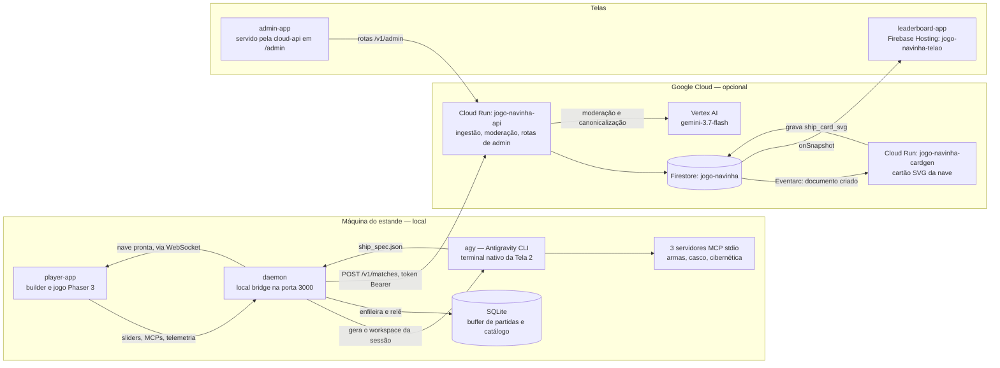

# GRAVIDADE ZERO — powered by Antigravity

Ativação interativa para o estande do **Google Cloud Summit 2026**: um *shoot 'em up* vertical
retrô cuja nave não vem pronta — ela é **forjada na frente do visitante pelo Antigravity CLI
(`agy`)**, a partir de um orçamento de energia, de servidores MCP e de uma conversa curta com o
agente num terminal de verdade. Depois de forjada, o visitante pilota a própria nave por 90
segundos contra ondas de inimigos e um chefe, e vê a pontuação subir num placar corporativo exibido
numa TV do estande.

Isto **não é um produto** — nem um produto Google oficialmente suportado (ver
[§9](#9-aviso)). É uma ativação de evento, com prazo, hardware específico e um ciclo-alvo de 2m30s
por visitante. O repositório é dirigido por especificação: as decisões de projeto, os números de
balanceamento e a topologia de nuvem moram em [`specs/`](./specs/), e o código é a execução delas.

---

## 1. A experiência do visitante

São sete etapas, em três superfícies: a **Tela 1** (o cockpit, um navegador em modo quiosque), a
**Tela 2** (um terminal nativo em tela cheia, onde o `agy` roda) e a **TV** (o placar público).

1. **Atração.** A Tela 1 fica num loop de atração até alguém chegar.
2. **Registro.** O visitante informa um *callsign* e a empresa. O nome passa por moderação, e a
   empresa é casada contra o catálogo de [`config/companies.json`](./config/companies.json) para
   que o placar não rache "Itaú", "Itau" e "Banco Itaú" em três linhas.
3. **Briefing.** Instruções visuais e exemplos de prompt: o que o `agy` consegue construir.
4. **Forja — parte 1, o builder.** O visitante distribui **100 unidades de energia** entre ataque,
   velocidade, defesa e tecnologia, e escolhe quais dos três servidores MCP entram na sessão. O
   orçamento é o que impede "escolher tudo": toda nave boa é uma nave com uma renúncia.
5. **Forja — parte 2, o `agy`.** O daemon gera um workspace de sessão descartável em
   `/tmp/booth_session` — sub-agentes, configuração dos MCPs e o prompt de abertura — e a Tela 2
   sobe o `agy` nele. O agente conduz um **Fast Grill-Me** de quatro perguntas rápidas (arma
   primária, secundária, tema visual, cor de destaque), chama as ferramentas MCP para resolver os
   números da nave e grava um `ship_spec.json`. A Tela 1 mostra a telemetria das chamadas MCP
   acontecendo ao vivo, enquanto isso.
6. **A partida.** Um *file watcher* no daemon valida o `ship_spec.json` contra o schema e avisa a
   Tela 1, que troca para o modo jogo. A nave — visual e estatísticas — é exatamente a que o agente
   acabou de construir. Noventa segundos, ondas e o chefe **Cyber Overlord**.
7. **Debrief e placar.** A pontuação é calculada, enfileirada localmente em SQLite e sincronizada
   com a nuvem quando houver rede. A TV atualiza sozinha. O estande se reseta e volta à tela de
   atração para o próximo da fila.

O ponto da experiência é o passo 5: o visitante não escolhe uma nave de um menu, ele **vê um agente
construir a nave dele**. Todo o resto do repositório existe para que esse passo funcione em dois
minutos, com uma fila esperando, e sem depender do Wi-Fi do centro de convenções.

---

## 2. Arquitetura

Três camadas. A regra que organiza tudo está na
[Spec 08](./specs/08_DEPLOYMENT_TOPOLOGY_AND_CLOUD_SPLIT.md): **o `agy` e o bridge de sessão são
locais; todo o resto vai para a nuvem.** O `agy` é o único componente que não degrada com
elegância — se ele cai, o estande para —, então ele não depende da rede do evento. A nuvem inteira
é opcional: sem ela, o estande roda 100% local, com o placar servido pelo próprio daemon e as
partidas enfileiradas até haver conexão.



Notas que valem mais que o diagrama:

- **O daemon serve o jogo.** O `player-app` não tem servidor próprio em produção: o bundle é
  servido pelo mesmo processo do daemon, na porta 3000. O Vite na 5173 é só desenvolvimento.
- **O estande nunca fala com o Firestore.** A única credencial privilegiada existe dentro do Cloud
  Run. A máquina do estande tem apenas um token Bearer de ingestão.
- **O Gemini é consumido exclusivamente pelo flavor Vertex AI**, com identidade de conta de
  serviço. Não existe chave de API de modelo neste projeto, em nenhum ambiente.
- **Os IDs de infraestrutura são fixos e não-padrão de propósito**: banco Firestore `jogo-navinha`
  (nunca o `(default)`), site de Hosting `jogo-navinha-telao`, serviços Cloud Run
  `jogo-navinha-api` e `jogo-navinha-cardgen`. O projeto GCP usado no desenvolvimento é
  `vibe-cabral`, o sandbox **compartilhado** do autor — é o default dos scripts, não um requisito:
  `PROJECT_ID=outro-projeto ./scripts/deploy.sh` funciona.

---

## 3. Diretório de arquivos

```text
.
├── packages/               Monorepo de 8 workspaces npm (ver §4)
├── specs/                  Especificações numeradas 00–15 — a fonte de verdade do projeto
├── scripts/                Operação do estande e da nuvem: subir, matar, deployar, semear
├── config/                 Catálogo de empresas do evento (dado, não código)
│   ├── companies.json      Lista em uso; editar e reiniciar o daemon, sem rebuild
│   └── companies.example.json  Modelo do formato, versionado como referência
├── .github/workflows/      CI: build, o portão de balanceamento e a suíte completa
├── firebase.json           Firestore nomeado + Hosting do telão, com as regras de cache
├── firebase.emulator.json  Config separada do emulador, usada só por `npm run test:cloud-api`
├── firestore.rules         Leitura pública do placar, escrita negada a todo cliente
├── firestore.indexes.json  Índices e exclusões de indexação dos campos grandes do SVG
├── .firebaserc.example     Modelo do `.firebaserc` — o arquivo real não é versionado
├── package.json            Workspaces e todos os scripts npm (ver §6)
├── USER_GUIDE.md           Guia operacional do estande, com o desenho físico das telas
├── LICENSE                 Apache License 2.0
└── NOTICE                  Aviso de copyright no formato Apache
```

## 4. Os oito pacotes

| Pacote | O que é |
| :--- | :--- |
| [`packages/shared`](./packages/shared) | A biblioteca comum, e o lugar onde as decisões numéricas moram: tipos de `ship_spec`, o schema JSON e seu gerador, o validador, as constantes de balanceamento, o catálogo de MCPs e sub-agentes, a matriz de sinergias, o cálculo de score, a moderação local, o normalizador de nomes de empresa e o renderizador do cartão SVG da nave. Todo build começa por aqui. |
| [`packages/mcps`](./packages/mcps) | Os três servidores MCP stdio que o `agy` inicia na sessão: `weapons-arsenal` (canhão primário e armamento secundário), `hull-propulsion` (propulsores e blindagem) e `cybernetics-shields` (barreira de energia e módulo de sinergia). Cada ferramenta escreve no log de auditoria que a Tela 1 mostra ao vivo. As descrições vêm do mesmo catálogo que alimenta o builder, para as duas não divergirem. |
| [`packages/daemon`](./packages/daemon) | O *local bridge*, na porta 3000 — o coração do estande. Serve o `player-app`, expõe a API HTTP da sessão e um WebSocket de eventos, gera e destrói o workspace do `agy`, observa o `ship_spec.json` com um *file watcher*, guarda as partidas num SQLite, modera callsigns e sincroniza com a nuvem com *backoff*. |
| [`packages/player-app`](./packages/player-app) | A Tela 1: React para o fluxo de atração, registro, briefing, builder de 100 PU, tela de handoff e debrief; Phaser 3 para os 90 segundos de jogo. Tem também um harness isolado em `dev.html` que roda a engine sem daemon e sem `agy`. |
| [`packages/leaderboard-app`](./packages/leaderboard-app) | O telão. Lê o Firestore por `onSnapshot` — ou o daemon, quando não há nuvem —, e roda sozinho: Hall da Fama, disputa entre empresas, ticker de partidas recentes, rotação automática de visões e um modal de celebração quando entra um recorde. Publicado no Firebase Hosting. |
| [`packages/admin-app`](./packages/admin-app) | O painel do operador: partidas, empresas, saúde e rankings. Quatro telas sem tema e sem animação, de propósito — é ferramenta de quem está com pressa. É *vendorizado* dentro da imagem da `cloud-api` e servido em `/admin`. |
| [`packages/cloud-api`](./packages/cloud-api) | O serviço Cloud Run, e o único lugar do sistema com credencial privilegiada. Faz a ingestão de partidas, a segunda camada de moderação e a canonicalização de empresas via Vertex AI, as rotas de admin, e — na mesma imagem, com outra variável de ambiente e outra conta de serviço — a geração do cartão SVG disparada por Eventarc. |
| [`packages/sim`](./packages/sim) | O simulador headless de combate: uma reimplementação em tempo discreto das regras da engine, dirigida pelas mesmas constantes de `shared`. Existe para trocar "balanceamento por sensação" por balanceamento medido — roda milhares de seeds por arquétipo e transforma a meta de dificuldade num teste. |

---

## 5. As especificações

Comece pela [Spec 00](./specs/00_AUDIT_AND_DRIFT_REPORT.md) se quiser entender por que o código é
como é: ela audita, com evidência em `arquivo:linha`, cada divergência entre as especificações
01–07 e a implementação, e dá um ID estável a cada achado. O índice comentado completo está em
[`specs/README.md`](./specs/README.md).

| # | Documento | O que resolve |
| :--- | :--- | :--- |
| 00 | [Auditoria e Deriva](./specs/00_AUDIT_AND_DRIFT_REPORT.md) | Cataloga toda divergência entre especificação e código, com IDs estáveis que o resto da documentação referencia |
| 01 | [Estande e Experiência](./specs/01_BOOTH_AND_EXPERIENCE_SPEC.md) | As três superfícies, o fluxo de sete etapas, o SLA de ciclo, o handoff para o terminal e o reset |
| 02 | [Builder e Orçamento](./specs/02_BUILDER_AND_BUDGET_MECHANICS_SPEC.md) | Os 100 PU, a seleção de MCPs e sub-agentes e a matriz de sinergias entre eles |
| 03 | [Harness do AGY](./specs/03_AGY_HARNESS_AND_INTEGRATION_SPEC.md) | Como o `agy` roda no estande: geração do workspace, contrato do `ship_spec.json`, contenção de processos |
| 04 | [Engine e Mecânicas](./specs/04_GAME_ENGINE_AND_MECHANICS_SPEC.md) | Phaser 3 tal como construído: pipeline de textura, física, balística, pacing, chefe e score |
| 05 | [Placar e Nuvem](./specs/05_LEADERBOARD_AND_CLOUD_SPEC.md) | O modelo de dados no Firestore, a ingestão, a normalização de empresas e o telão |
| 06 | [Resiliência e Segurança](./specs/06_RELIABILITY_FAILOVER_AND_SECURITY_SPEC.md) | Fallbacks, presets de emergência, buffer offline, moderação e contenção |
| 07 | [Stack e Validação](./specs/07_IMPLEMENTATION_ROADMAP_AND_TASKS_SPEC.md) | A stack efetivamente adotada, o ferramental de build e teste, e a Definition of Done |
| 08 | [Topologia de Implantação](./specs/08_DEPLOYMENT_TOPOLOGY_AND_CLOUD_SPLIT.md) | O que roda local e o que roda em GCP, o modelo de credenciais e o comportamento sem rede |
| 09 | [Balanceamento e Dev Mode](./specs/09_GAME_BALANCE_AND_DEV_MODE.md) | A fonte única de tuning, o determinismo por seed, o harness isolado e o simulador |
| 10 | [Plano de Implementação](./specs/10_IMPLEMENTATION_PLAN.md) | O sequenciamento em fases A–D, tarefa a tarefa, com gates de ensaio manual |
| 11 | [Lacunas Conhecidas](./specs/11_KNOWN_GAPS_AND_OPEN_ITEMS.md) | A lista honesta do que está quebrado, não verificado ou deliberadamente adiado |
| 12 | [Plano de Teste Manual](./specs/12_MANUAL_TEST_PLAN_MAC.md) | O roteiro dos gates que nenhuma máquina fecha sozinha, bloco a bloco |
| 13 | [Chromebook e Crostini](./specs/13_CHROMEBOOK_AND_CROSTINI_SPEC.md) | O que muda se o hardware do estande for um Chromebook: bloqueadores, instalação e testes |
| 14 | [Guia de Instalação](./specs/14_INSTALLATION_GUIDE.md) | Do zero ao ar, local e em GCP: pré-requisitos, segredos e conferências pós-instalação |
| 15 | [Runbook do Evento](./specs/15_EVENT_RUNBOOK_TWO_BOOTHS.md) | Execução pura para os dois estandes: montagem, pre-flight diário, operação e virada de dia |
| — | [Ideia Inicial](./specs/INITIAL_IDEA.md) | O texto original que originou o projeto, preservado sem edição |

---

## 6. Como rodar

> **A instalação de verdade está na [Spec 14 — Guia de Instalação](./specs/14_INSTALLATION_GUIDE.md).**
> Ela cobre pré-requisitos, a conta do `agy`, os segredos, o deploy em GCP e as conferências
> pós-instalação, e é o único lugar onde essa sequência é mantida. Esta seção é só o mapa dos
> scripts. Para a operação física do estande, veja também o [`USER_GUIDE.md`](./USER_GUIDE.md) e a
> [Spec 15](./specs/15_EVENT_RUNBOOK_TWO_BOOTHS.md).

Um caminho mínimo, depois de `npm install`:

```bash
npm run build          # constrói todos os pacotes, começando por shared
npm run start:daemon   # sobe o bridge na porta 3000, já servindo o jogo
npm run start:terminal # em outro terminal: o supervisor da Tela 2, que hospeda o agy
```

**Construir**

| Script | Para quê |
| :--- | :--- |
| `npm run build` | Constrói tudo na ordem certa: `shared`, depois MCPs, daemon e as três apps |
| `npm run build:shared` | Só a biblioteca comum. Todo outro build depende dela e a reconstrói antes |
| `npm run build:mcps`, `build:daemon`, `build:player`, `build:leaderboard`, `build:admin` | Um pacote de cada vez, sempre precedido do `shared` |
| `npm run gen:schema` | Regenera `ship_spec.schema.json` a partir das constantes de balanceamento |

**Desenvolver**

| Script | Para quê |
| :--- | :--- |
| `npm run start:daemon` | Mata a porta 3000, reconstrói e sobe o daemon servindo o jogo — o modo mais próximo do estande |
| `npm run dev:daemon` | O daemon em modo watch |
| `npm run dev:player` / `start:player` | O `player-app` no Vite, porta 5173 |
| `npm run dev:game` | Abre o harness isolado `dev.html`: a engine sem daemon e sem `agy`, com arquétipos prontos |
| `npm run dev:leaderboard` / `start:leaderboard` | O telão, porta 5174 |
| `npm run dev:admin` / `start:admin` | O painel de admin, porta 5175 |
| `npm run start:terminal` | O supervisor da Tela 2, que ignora Ctrl+C para o visitante não derrubá-lo |

**Testar** — veja a §7.

| Script | Para quê |
| :--- | :--- |
| `npm test` | A suíte de todos os workspaces que têm testes |
| `npm run test:cloud-api` | **O único jeito correto de testar o `cloud-api`** |
| `npm run sim:balance` | Roda a matriz de dificuldade completa e grava `sim-results.json` — diagnóstico, não teste |

**Semear e corrigir dados**

| Comando | Para quê |
| :--- | :--- |
| `npm run seed:demo-matches` | Cria partidas de demonstração na nuvem para conseguir testar o telão com o placar cheio. Aceita `--n=25`, `--seco`, `--devagar=3000`, `--recorde` |
| `node scripts/seed-company-catalog.mjs` | Semeia `companies/catalog` no Firestore a partir de `config/companies.json`, para o painel não abrir com a lista vazia |
| `npm run backfill:cards` | Gera o `ship_card_svg` nas partidas anteriores ao gatilho do `cardgen`, que só enxerga o que nasce depois dele |
| `npm run reset:db` | Apaga o buffer SQLite local e deixa o daemon recriar um banco novo no próximo start |
| `node scripts/moderation-bench.mjs` | Mede a moderação de duas camadas contra uma bateria fixa de 100 codinomes |

**Operar**

| Script | Para quê |
| :--- | :--- |
| `npm run deploy:gcp` | Provisiona e publica a nuvem inteira. Idempotente. Aceita `PROJECT_ID=...` para outro projeto |
| `npm run undeploy:gcp` | Desfaz o que o deploy criou. Nunca desabilita APIs do projeto |
| `npm run rehearse:two-booths` | Ensaia dois estandes contra a mesma nuvem, a partir de uma máquina só |
| `npm run kill:all` | Mata daemon, app, supervisor e qualquer `agy` ou MCP órfão, e limpa `/tmp/booth_session` |
| `npm run kill:daemon` | Só libera a porta 3000 |

---

## 7. Testes

Os testes rodam **workspace a workspace**, e não há um runner único: `shared`, `mcps`, `daemon` e
`sim` usam `node --test` sobre o JavaScript já compilado; `player-app`, `leaderboard-app` e
`admin-app` usam Vitest. O `npm test` da raiz constrói o `shared` e então percorre todos os
workspaces que declaram um script `test`.

Duas coisas precisam ser ditas antes de você rodar qualquer coisa:

**1. O `cloud-api` só se testa por `npm run test:cloud-api`.** Ele precisa do emulador do Firestore,
e o script o sobe pela configuração separada `firebase.emulator.json`, na porta **8085**, com o
`--project` correto. Chamar o emulador na mão é a forma mais rápida de perder uma tarde: a porta
padrão do Firestore no `firebase.json` é a **8080**, que costuma estar ocupada por outra coisa na
máquina de desenvolvimento, e um `--project` diferente faz as regras de segurança carregarem para o
banco errado. As duas falhas se disfarçam de bug de aplicação.

```bash
npm run test:cloud-api
```

**2. `packages/sim/src/balance-gate.test.ts` falha na `main`, e isso é esperado.** É o portão de
espalhamento de arquétipos: ele mede a distância entre as taxas de vitória dos arquétipos extremos
e falha porque essa distância está acima do alvo. A decisão foi documentar e aceitar, não afrouxar
o limite — a falha é uma medida honesta, e apagá-la apagaria a única coisa que avisa se o
balanceamento piorar. Se você acabou de clonar o repositório e viu essa falha, **não é regressão
sua**. O contexto está na [Spec 09](./specs/09_GAME_BALANCE_AND_DEV_MODE.md) e na
[Spec 11](./specs/11_KNOWN_GAPS_AND_OPEN_ITEMS.md); a Spec 14 §3.2 repete o aviso na instalação.

---

## 8. Licença

Distribuído sob a **Apache License 2.0**. O texto integral está em [`LICENSE`](./LICENSE) e o aviso
de copyright em [`NOTICE`](./NOTICE).

---

## 9. Aviso

Este repositório **não é um produto Google oficialmente suportado**. O código aqui existe para fins
demonstrativos: é a ativação de um estande de evento, construída sob prazo, e não recebe SLA,
suporte, roadmap nem garantia de compatibilidade. Nada aqui deve ser lido como a posição oficial do
Google sobre o Antigravity ou sobre qualquer outro produto citado — a fonte para isso é a
documentação de cada produto.

> This repository itself is not an officially supported Google product. The code in this repository
> is for demonstrative purposes only.
