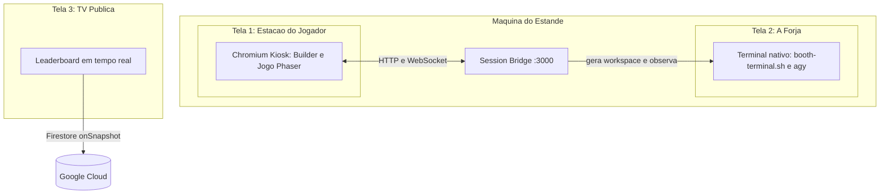
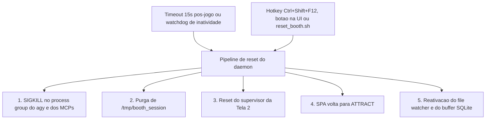

# Spec 01: Booth Setup, Fluxo UX e Operação do Evento

> **Status:** RECONCILIADA COM A IMPLEMENTAÇÃO — 2026-08-10
> **Objetivo:** Definir a jornada do visitante no estande do Google Cloud Summit, o SLA de 2m30s, a
> arquitetura de **três superfícies** de exibição, o handoff para terminal nativo e os pipelines de
> reset.
> **Endereça:** P1, P2, P7, D11 (ver [Spec 00](./00_AUDIT_AND_DRIFT_REPORT.md)).
> **Depende de:** [Spec 08](./08_DEPLOYMENT_TOPOLOGY_AND_CLOUD_SPLIT.md) para a topologia local/nuvem.

---

## 1. Escopo e Objetivos de Experiência

- **SLA por visitante:** meta de **2m30s**, teto rígido de **3m00s**.
- **Perfil:** de desenvolvedores experientes a executivos sem familiaridade com linha de comando. O
  fluxo não pode exigir que ninguém digite um comando.
- **Objetivo da ativação:** o visitante configura na Web, vê um agente de IA real operando com
  sub-agentes e ferramentas MCP, e pilota o resultado num arcade polido.

---

## 2. Jornada do Visitante

O fluxo implementado tem **sete etapas** (`player-app/src/App.tsx:13`). A etapa `INSTRUCTIONS` foi
adicionada durante a implementação e não constava desta especificação (**P7**); está incorporada
abaixo porque cumpre um papel real — dar ao visitante leigo um modelo mental antes dos sliders.

### 2.1. `ATTRACT` — Tela de atração

- Abertura estilo arcade cyberpunk, logo dinâmico e chamada *"PRESSIONE A BARRA DE ESPAÇO PARA
  INICIAR"*.
- Instruções visuais em 3 passos: configure na Web → construa no terminal AGY → pilote no arcade.
- O primeiro `pointerdown`/`keydown` desbloqueia o áudio (`audioManager.unlockAudio()`).

### 2.2. `REGISTER` — Registro e consentimento

- `Callsign`: máximo 15 caracteres alfanuméricos.
- `Company`: com autocomplete e normalização (Spec 05 §2).
- Banner de consentimento sobre exibição de codinome e pontuação na TV pública.
- Moderação em duas camadas: regex local imediata e verificação semântica no backend (Spec 08 §6.2).

### 2.3. `INSTRUCTIONS` — Preparação do prompt *(etapa não especificada originalmente — P7)*

Tela intermediária (`InstructionsPromptScreen.tsx`, 206 linhas) que explica o que vai acontecer no
terminal e oferece prompts de inspiração copiáveis.

> **Lacuna conhecida (L1):** o `INITIAL_IDEA.md` exige que *"melhor prompt, melhor nave"*. Esta tela
> ajuda o visitante a escrever, mas **nada avalia o que ele escreveu** nem converte isso em vantagem.
> Tratado como escopo opcional na Fase E do plano de implementação.

### 2.4. `BUILDER` — Sliders de energia e seleção de componentes

- Quatro sliders somando exatamente **100 Power Units**: *Offense*, *Speed*, *Defense*, *Tech*.
- Seleção de **1 a 3 servidores MCP** e de sub-agentes. Ver [Spec 02](./02_BUILDER_AND_BUDGET_MECHANICS_SPEC.md)
  §1 — o orçamento rígido de 2 MCPs virou tradeoff de pontuação (**P6**).
- Ao confirmar, `POST /api/session/start` faz o daemon gravar em `/tmp/booth_session`:
  `mcp_config.json`, `.agents/agents/*.md` e `GEMINI.md`.

### 2.5. `HANDOFF` — A forja no terminal nativo da Tela 2

> **Substitui a arquitetura anterior.** Esta especificação exigia terminal embutido via `xterm.js` +
> `node-pty` e justificava explicitamente a rejeição da janela nativa. A implementação fez o oposto
> (commits `94d02a2` e `4e1c75e`): não há `xterm.js` nem `node-pty` em nenhum `package.json`. O
> supervisor `scripts/booth-terminal.sh` conduz uma sessão `agy` em um terminal nativo na **Tela 2**,
> coordenando-se com o daemon por arquivos-flag (`.session_active`, `.agy_pid`). Ver **P1**.
>
> **Este pivô é condicional.** Se o hardware do estande não puder rodar o `agy` localmente, a Spec 08
> §7 reintroduz o terminal embutido sobre WSS. A decisão depende do hardware confirmado.

- A Tela 1 exibe a `HandoffTerminalScreen`: o que está acontecendo na Tela 2, progresso dos
  sub-agentes e das tools MCP, recebidos por WebSocket.
- **Abertura sem digitação.** `scripts/booth-terminal.sh` injeta a frase única
  `BOOTH_KICKOFF_PROMPT` (`packages/shared/src/constants/branding.ts`) via
  `agy --prompt-interactive`, de modo que o visitante encontra o Fast Grill-Me já na tela. A Tela 1
  mantém a mesma frase num bloco de contingência com botão **Copiar**, para o caso de um `agy` sem
  a flag — o script sonda `agy --help` antes de usá-la.
- **Fast Grill-Me:** quatro perguntas entregues numa **única chamada** da ferramenta builtin
  `ask_question` do `agy`. O CLI apresenta uma de cada vez (`Question 1/4` até `4/4`), numera as
  opções e desenha o cursor: o piloto **escolhe com as setas e Enter**, sem digitar nada:
  1. *Canhão primário:* Laser Contínuo / Canhão de Plasma / Vulcan em Leque.
  2. *Arma secundária:* Mísseis Teleguiados / Pulso EMP — o menu diz que o EMP **não fere o boss**.
  3. *Estilo do casco:* Synthwave 80s / Dark Void Stealth / Cyberpunk Gold.
  4. *Cor de destaque:* as seis cores curadas de `ACCENT_COLORS`, cada uma com hex definido.

  As três primeiras trazem uma frase de descrição por opção — o que a arma faz em partida, que
  forma o casco tem. A cor não traz: o rótulo já é a descrição.

  Duas revisões chegaram aqui em dois dias, e as duas importam para entender o formato. Até
  2026-08-30 as quatro perguntas vinham num único turno respondido com quatro dígitos (`2 1 3 5`):
  cabia na tela, mas só a secundária tinha espaço para explicar a própria escolha. Em 2026-08-31
  viraram quatro cartões de texto, um por turno, o que comprou espaço para as descrições ao custo
  de quatro idas e voltas ao modelo. Em 2026-09-01 o texto deu lugar ao `ask_question`: as
  descrições continuam, a digitação some, e as quatro idas e voltas voltam a ser **uma** — o CLI
  caminha entre as perguntas localmente. É o formato mais rápido dos três e o único em que o
  visitante não digita.

  O CLI acrescenta sozinho uma opção final de texto livre (`Write-in...`) que o prompt não declara
  e não menciona. Se o piloto a usar com um texto fora da lista, o agente repergunta **só as
  inválidas**, todas numa chamada só, e preserva o que já foi respondido — nunca adivinha a
  intenção, porque uma escolha errada silenciosa é pior que um segundo a mais. Validado em sessão
  real em 2026-09-01 com `picanha` na primária e `lazanha` no casco: as duas voltaram juntas numa
  reperguntada, a secundária e a cor ficaram como estavam, e o `ship_spec.json` gravou as escolhas
  corrigidas. Quatro inválidas de uma vez reperguntam as quatro, e texto livre que **acerta** a
  opção é aceito com folga — `Plasma`, `EMP`, `Rosa Choque` e o rótulo inteiro com descrição
  passaram todos.

  **O Esc é o buraco conhecido, e a mitigação é parcial por escolha.** Ele cancela o turno do agente
  **sem encerrar a sessão**: o seletor some e sobra o prompt do `agy` aberto, num terminal público.
  O daemon não enxerga isso — ele só lê `mcp_audit.log` e `ship_spec.json` —, então quem recupera é
  o próprio `AGENTS.md`, com uma regra que manda reemitir `ask_question` diante de qualquer mensagem
  que não seja resposta do seletor, preservando as respostas já válidas. Isso cobre o caso comum, o
  do reflexo; **não** cobre quem quer explorar o prompt aberto de propósito. A rede final continua
  sendo o orçamento pré-MCP de 135s, que expira e entrega o preset de emergência. Uma restrição de
  verdade exigiria `agy --sandbox`, ainda não adotada porque o `agy` grava o `ship_spec.json` via
  heredoc de shell quando o `Create(...)` falha, e restringir o terminal mataria esse caminho em
  silêncio.

  As opções do menu são **geradas** a partir dos catálogos de `@jogo/shared`, nunca digitadas no
  template: o prompt não pode anunciar uma opção que o schema rejeita, nem descrevê-la de um jeito
  que os números do MCP desmintam. As respostas viram
  `build_metadata.fast_grill_me_choices` com quatro chaves — `primary_weapon`, `secondary_weapon`,
  `visual_theme`, `accent_color` — e os dois tipos de arma são exatamente os que entram em
  `weapons.primary.type` e `weapons.secondary.type`, sem tradução no meio.
- **Dicas de pilotagem.** Os sub-agentes táticos (`combat-strategist`, `systems-engineer`) devolvem
  duas frases no imperativo derivadas do build; o Orquestrador as grava em
  `build_metadata.pilot_tips` na **mesma escrita** do `ship_spec.json`, e a Tela 1 as mostra no
  pré-voo. Campo opcional: nave sem dica é nave válida e não renderiza painel algum.
- O AGY grava `ship_spec.json` em menos de 8 segundos.

**Requisitos de qualidade ainda em aberto nesta etapa** — permanecem obrigatórios:

- **D1:** o `ship_spec.json` deve passar por validação Draft-07 estrita antes de virar nave.
- **D2:** timeout rígido de 15s com injeção automática de preset de fallback. Hoje só existe um botão
  de emergência que depende de o visitante perceber a falha.
- **D3:** gate de auditoria — sem chamadas de tool registradas em `mcp_audit.log`, a nave não decola.

### 2.6. `GAMEPLAY` — Partida no teclado físico

- O daemon detecta o `ship_spec.json`, valida e emite `EVENT_SHIP_READY`; a Tela 1 troca para o canvas
  Phaser.
- Controles: setas / WASD (voo), Espaço (tiro), Shift (arma secundária).
- Partida de **90 segundos**. Waves contínuas até 45s, quando entra o boss *The Cyber Overlord*
  (aviso aos 42s).

> Os números de balanceamento desta etapa vivem na [Spec 09](./09_GAME_BALANCE_AND_DEV_MODE.md), que é
> a fonte de verdade de tuning. **Atenção:** a auditoria (§2.11) demonstrou que, com os valores atuais,
> **nenhuma nave derrota o boss** (**D12**). Corrigir isso é P0.

### 2.7. `DEBRIEF` — Resultado, gravação e reset

- Score detalhado com breakdown, combo e sinergias.
- A telemetria é enviada ao daemon, que grava no buffer SQLite e sincroniza com o Firestore via a API
  Cloud Run (Spec 08 §2.2).
- Contagem regressiva de 15s para auto-reset.

> **D5:** hoje `handleMatchComplete` (`App.tsx:112-133`) envia apenas score e identificação. Toda a
> telemetria calculada é descartada. Corrigir isso é pré-requisito da Spec 09 §6.

---

## 3. Arquitetura de Hardware: Três Superfícies

> **Correção (P2):** esta especificação descrevia duas telas. A implementação usa **três**, porque o
> terminal nativo do AGY ocupa uma superfície própria — e é justamente a que dá credibilidade à
> ativação: o público vê o agente trabalhando.

### 3.1. Topologia

| Superfície | Hardware | Conteúdo |
| :--- | :--- | :--- |
| **Tela 1** | Monitor 1080p+ voltado ao visitante | Chromium kiosk com a SPA do jogador |
| **Tela 2** | Monitor secundário, visível ao público | Terminal nativo rodando `agy` |
| **Tela 3** | TV grande no corredor | Leaderboard público |

A Tela 3 **não precisa sair da máquina do estande**: sendo o leaderboard hospedado em GCP (Spec 08
§2.2), qualquer dispositivo com navegador serve, inclusive um Chromebook. Isso reduz a exigência de
saídas de vídeo do host de três para duas.

### 3.2. Inicialização e áudio

- `setup_monitors.sh` configura `xrandr` com resoluções nativas e posicionamento.
- Chromium em kiosk: `--kiosk --noerrdialogs --disable-infobars --autoplay-policy=no-user-gesture-required --user-data-dir=/tmp/player_kiosk`.
- Desbloqueio de áudio via `audioManager.unlockAudio()` no primeiro `pointerdown`/`keydown`.

> **Correções:** o desbloqueio de áudio usa o `AudioManager` próprio, não `Howler.ctx.resume()` —
> `howler` é dependência declarada e nunca importada (**P8**, **D10**). E os scripts `setup_monitors.sh`
> e `launch_kiosks.sh` **não existem** (**U4**); só `booth-terminal.sh` foi escrito. A Spec 06 §3 os
> mantém como requisito.
>
> As instruções acima são específicas de Linux. O caminho de desenvolvimento e ensaio é **macOS**
> (ver os gates M0–M5 da Spec 10), onde `xrandr` não existe. Os scripts precisam detectar a plataforma
> ou ter equivalente documentado para o Mac.

---

## 4. Arquitetura de Reset

### 4.1. Gatilhos automáticos

- **Pós-partida:** 15s após o debrief.
- **Watchdogs anti-abandono** — registro 30s (com aviso de 10s), builder 45s, forja 30s (auto-conclusão
  com preset e handoff), gameplay 15s sem input (game over imediato).

> **D11: nenhum dos quatro watchdogs existe.** Um visitante que desiste no meio congela a estação até
> intervenção humana. Requisito mantido.

### 4.2. Gatilhos manuais

- **Hotkey `Ctrl+Shift+F12`** — implementada apenas como listener de `window` na SPA
  (`App.tsx:53-62`). **Inoperante quando o foco está na Tela 2**, que é exatamente quando o staff mais
  precisa dela. Precisa subir para o nível do SO (**D11**).
- **Botão de reset na UI** — implementado (`App.tsx:155-164`), visível em todas as etapas exceto
  `ATTRACT`. Substitui o "gatilho oculto por triplo clique" originalmente especificado, que nunca foi
  construído; o botão explícito é preferível, já que quem o usa é o staff.
- **`./reset_booth.sh` no host** — não existe (**U4**).

### 4.3. Integridade do encerramento

O reset atual (`daemon/src/index.ts:194-209`) envia `SIGINT` e depois `SIGKILL` para **um único PID**.
Como os 3 servidores MCP são processos-filho stdio do AGY, eles podem sobreviver. A Spec 03 §5.1 exige
`process.kill(-pgid, 'SIGKILL')` com `{ detached: true }` (**D4**). Com ≈150 sessões por dia, o
vazamento é cumulativo e ataca diretamente o critério de 8 horas contínuas.

---

## 5. Critérios de Aceitação

- [ ] O fluxo completo roda sem que o visitante precise trocar de janela ou digitar comandos.
- [ ] A permanência total fica entre 2m00s e 2m45s.
- [ ] O reset restaura ambiente limpo em menos de 1 segundo e **não deixa nenhum processo Node.js de
      MCP ativo** (verificável por `pgrep -f mcps/dist` retornando vazio).
- [ ] Os quatro watchdogs disparam nos tempos definidos em §4.1.
- [ ] `Ctrl+Shift+F12` funciona com o foco em qualquer uma das três superfícies.
- [ ] Após 20 ciclos consecutivos, a contagem de processos do host permanece estável.
