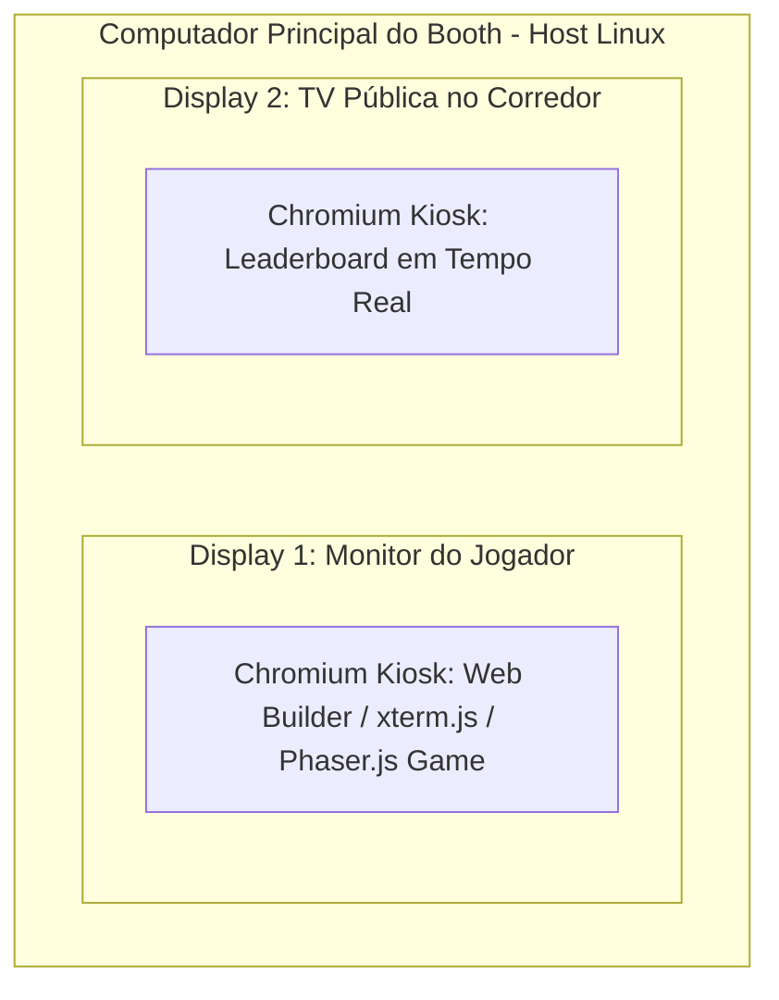

# Spec 01: Booth Setup, UX Flow & Event Operations

> **Status:** ESPECIFICAÇÃO REFINADA & BLINDADA  
> **Objetivo:** Definir a jornada completa do visitante no estande do Google Cloud Summit, tempos de ciclo (SLA de 2m30s), arquitetura de terminal embutido (`xterm.js`), setup Dual-Head, recuperação de foco de tela, políticas de áudio Kiosk e pipelines de Reset Automático e Manual.

---

## 1. Escopo & Objetivos de Experiência
- [ ] **SLA de Tempo por Visitante:** Meta de **2m30s** no total (teto máximo rígido de **3m00s**).
- [ ] **Perfil do Visitante:** Desde desenvolvedores experientes até executivos e arquitetos sem familiaridade prévia com linha de comando.
- [ ] **Objetivo de Ativação:** Proporcionar uma experiência altamente fluida onde o usuário configura na Web, experimenta a sensação autêntica de um terminal de IA com sub-agentes e ferramentas MCP atuando visualmente, e joga um arcade super polido com a nave gerada.

---

## 2. Jornada do Visitante Passo a Passo (User Journey Map)

### 2.1. Etapa 1: Attract & Welcome Screen (Web UI - Idle State)
- [ ] **Visual de Atração:** Tela de abertura estilo arcade anos 80/cyberpunk com loop de gameplay gravado, logo dinâmico e chamada luminosa: "*PRESSIONE A BARRA DE ESPAÇO PARA INICIAR*".
- [ ] **Instruções Visuais em 3 Passos:**
  1. *Configure na Web:* Escolha MCPs, Agentes e distribua 100 Power Units nos Sliders.
  2. *Construa no Terminal AGY:* Responda ao Fast Grill-Me com 1 toque no teclado.
  3. *Pilote no Arcade:* Destrua as waves e derrote o Boss em 90 segundos.

### 2.2. Etapa 2: Registro Obrigatório & Termo de Consentimento
- [ ] **Campos de Entrada:**
  - `Callsign` (Nome de guerra do piloto - max 15 caracteres alfanuméricos).
  - `Company` (Empresa do participante - com autocomplete e normalização inteligente).
- [ ] **Termo de Consentimento:** Banner visível informando sobre a exibição do codinome e da pontuação na TV pública do evento.
- [ ] **Moderação de Entrada:** Validação assíncrona local por Regex e verificação instantânea no backend antes de prosseguir.

### 2.3. Etapa 3: Seleção de Componentes & Sliders de Energia (Web Builder)
- [ ] **Interface de Sliders:** 4 controles deslizantes balanceados (Soma estrita = 100 Power Units):
  - *Offense* (Armamento), *Speed* (Velocidade/Esquiva), *Defense* (Escudo/Blindagem), *Tech* (Cybernetics/Sinergias).
- [ ] **Seleção de Componentes:** Escolha de até 2 Servidores MCP e até 2 Sub-Agentes.
- [ ] **Disparo do Workspace:** Ao clicar em "*Construir Nave*", a Web UI envia os dados para o daemon local, que grava:
  - `mcp_config.json` (apontando para os mocks MCP locais Stdio).
  - `.agents/agents.md` (definindo papéis dos sub-agentes selecionados).
  - `GEMINI.md` (com instruções estritas de formatação visual, Fast Grill-Me e gravação do `ship_spec.json`).

### 2.4. Etapa 4: Terminal Embutido na SPA (`xterm.js` + Fast Grill-Me)
- [ ] **Arquitetura de Terminal Embutido:** Em vez de abrir uma janela nativa do SO (que causaria problemas de foco e conflito com o modo Kiosk do Chrome), a SPA transiciona suavemente para uma tela de terminal embutida via **`xterm.js`**, conectada por WebSocket com uma sessão `node-pty` no host.
- [ ] **Boot Automático do Fast Grill-Me:** O terminal inicia automaticamente sem necessidade de digitação de comandos pelo visitante, exibindo de imediato as 2 perguntas táticas:
  1. *Foco de Armamento:* (1) Laser Perfurante, (2) Mísseis Teleguiados, (3) Vulcan Spread.
  2. *Tema Estético:* (1) Synthwave 80s, (2) Dark Void Stealth, (3) Cyberpunk Gold.
- [ ] **Interação em 1 Toque:** O usuário pressiona apenas `1`, `2` ou `3` no teclado físico.
- [ ] **Logs Visuais & Artefato Final:**
  - O terminal exibe caixas ANSI coloridas, progresso dos sub-agentes e MCP tools executando em paralelo.
  - Ao concluir, renderiza um relatório técnico formatado em Markdown e grava o `ship_spec.json` em $< 8$ segundos.

### 2.5. Etapa 5: Handoff de Prontidão & Foco Automático no Jogo
- [ ] **Detecção pelo File Watcher:** O Local Bridge detecta a gravação de `ship_spec.json`, valida o schema e emite `EVENT_SHIP_READY`.
- [ ] **Transição de Tela:** A SPA troca a visão do terminal pelo canvas da Game Engine (Phaser.js 3), exibindo a nave montada com iluminação neon e a mensagem: "*SISTEMAS ONLINE! Pressione Barra de Espaço para Decolar*".
- [ ] **Recuperação de Foco no Canvas:** O listener global `window.addEventListener('keydown', ...)` força programaticamente `canvas.focus()` no primeiro toque de tecla, garantindo que o teclado físico responda instantaneamente aos comandos de voo.

### 2.6. Etapa 6: Gameplay Arcade no Teclado Físico (60s a 90s)
- [ ] **Mapeamento de Controles:** Setas / WASD (Voo), Barra de Espaço (Tiro Contínuo / Autofire), Tecla Shift (Arma Secundária / Especial).
- [ ] **Progressão da Partida:** Wave 1 (Drones) $\rightarrow$ Wave 2 (Cruisers) $\rightarrow$ Mini-Wave $\rightarrow$ Final Boss (*The Cyber Overlord* - 2.000 HP).
- [ ] **Condições de Término:** Derrota do Boss, destruição da nave do jogador ou esgotamento do tempo limite de 90 segundos.

### 2.7. Etapa 7: Debrief, Gravação Segura de Score & Auto-Reset (15s)
- [ ] **Exibição de Resultados:** Score final detalhado, medalhas de precisão, combo e sinergias desbloqueadas.
- [ ] **Gravação via Daemon:** A telemetria é enviada ao daemon local, que grava no Firestore via **Firebase Admin SDK** (garantindo segurança contra adulterações).
- [ ] **Contagem Regressiva de Reset:** Timer de 15 segundos para auto-reset total da sessão.

---

## 3. Arquitetura de Hardware & Setup Dual-Head



### 3.1. Topologia de Monitores (Dual-Head na Mesma Máquina)
- [ ] **Display 1 (Estação do Jogador):**
  - Monitor gamer (1080p ou 1440p @ 144Hz+) conectado via DisplayPort/HDMI 1.
  - Janela Chromium em modo Kiosk fullscreen executando a SPA do jogador.
- [ ] **Display 2 (TV Pública do Leaderboard):**
  - TV 4K grande conectada via HDMI 2.
  - Janela Chromium independente em modo Kiosk fullscreen exibindo o placar público em tempo real.

### 3.2. Configuração de Inicialização e Áudio no Linux Kiosk
- [ ] **Script de Inicialização dos Monitores (`setup_monitors.sh`):** Configura `xrandr` com resoluções nativas e posicionamento lado a lado (`--output DP-1 --mode 1920x1080 --primary --output HDMI-1 --mode 3840x2160 --right-of DP-1`).
- [ ] **Políticas de Autoplay de Áudio:** O Chromium é lançado com as flags:
  `--kiosk --noerrdialogs --disable-infobars --autoplay-policy=no-user-gesture-required --user-data-dir=/tmp/player_kiosk`.
- [ ] **Desbloqueio de Áudio:** O evento `pointerdown` / `keydown` na tela de atração executa `Howler.ctx.resume()`.

---

## 4. Arquitetura de Reset do Harness (Automático & Manual)

```mermaid
graph TD
    TRIG_AUTO[Timeout 15s Pós-Jogo / Inatividade] --> PIPELINE[Pipeline de Reset do Daemon]
    TRIG_MANUAL[Hotkey Ctrl+Shift+F12 / Script ./reset_booth.sh / Botão Oculto] --> PIPELINE

    subgraph Pipeline de Reset em Menos de 1s
        PIPELINE --> S1[1. SIGKILL -PGID no Process Group do AGY/node-pty]
        PIPELINE --> S2[2. Purge de Arquivos: rm -rf /tmp/booth_session/*]
        PIPELINE --> S3[3. Limpeza do xterm.js: terminal.reset()]
        PIPELINE --> S4[4. Reset de Estado SPA: Redirecionamento para /welcome]
        PIPELINE --> S5[5. Reativação dos File Watchers e Buffer SQLite]
    end
```

### 4.1. Gatilhos de Reset Automático
- [ ] **Pós-Partida:** 15s após exibição da tela de debrief/score.
- [ ] **Watchdog Anti-Abandono:**
  - Registro: 30s sem digitação $\rightarrow$ aviso de 10s $\rightarrow$ reset.
  - Builder: 45s sem interação $\rightarrow$ reset.
  - Terminal `xterm.js`: 30s sem resposta $\rightarrow$ auto-conclusão com preset fallback e handoff.
  - Gameplay: 15s sem toque de teclado $\rightarrow$ Game Over imediato $\rightarrow$ reset.

### 4.2. Gatilhos de Reset Manual (Equipe do Estande)
- [ ] **Hotkey Global do Teclado:** `Ctrl + Shift + F12` (ou `Ctrl + Shift + R`) interceptada pelo daemon local para restauração imediata.
- [ ] **Gatilho Oculto na UI:** Triplo clique no logotipo superior esquerdo da tela para abrir modal protegido de reset imediato.
- [ ] **Script de Manutenção no Host:** Script executável `./reset_booth.sh` no desktop para restaurar o ambiente limpo.

---

## 5. Critérios de Aceitação Deste Módulo
- [ ] O fluxo completo (Registro $\rightarrow$ Sliders $\rightarrow$ `xterm.js` $\rightarrow$ Phaser.js $\rightarrow$ Firestore $\rightarrow$ Reset) roda sem nenhuma troca de janelas no SO.
- [ ] O tempo total de permanência do visitante respeita a janela de 2m00s a 2m45s.
- [ ] O reset (automático ou manual) restaura o ambiente limpo em menos de 1 segundo.
