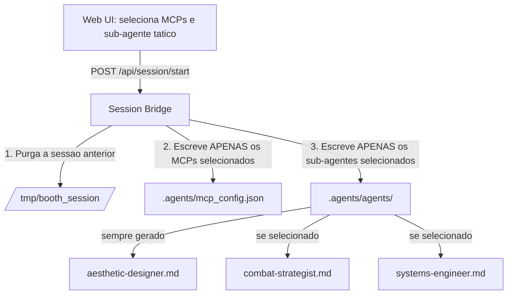
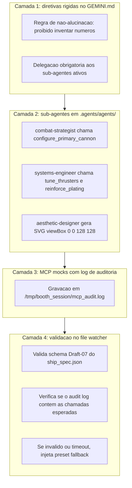

# Spec 02: Ship Builder, MCPs, Sub-agentes e Sistema de Energia

> **Status:** RECONCILIADA COM A IMPLEMENTAÇÃO — 2026-08-10
> **Objetivo:** Definir as regras de customização da nave, a geração dinâmica de sub-agentes e MCPs por
> sessão (`.agents/agents/*.md`), o papel do `aesthetic-designer` como baseline visual e o protocolo de
> garantia de execução de tools no CLI.
> **Endereça:** P6, D3, D13, D15 (ver [Spec 00](./00_AUDIT_AND_DRIFT_REPORT.md)).

---

## 1. Sistema de Energia (100 Power Units)

### 1.1. Os quatro sliders

Soma estrita de **100 PU**, cada um entre **10 e 50**. O ajuste de um slider redistribui a diferença
entre os outros três (`EnergySlidersBuilder.tsx:64-78`).

| Slider | Governa |
| :--- | :--- |
| `offense` | Dano base do canhão, cadência e poder da arma secundária |
| `speed` | Velocidade de deslocamento e raio da hitbox circular |
| `defense` | Pontos de vida e camadas de escudo |
| `tech` | Cooldown do módulo secundário e multiplicadores de sinergia |

As faixas numéricas resultantes (velocidade, HP, hitbox etc.) são definidas em
[Spec 09](./09_GAME_BALANCE_AND_DEV_MODE.md) §2.3, que é a fonte única de contrato numérico. Esta
especificação **não** repete valores — foi a duplicação deles em três camadas que produziu **D14**.

### 1.2. Seleção de componentes

> **Correção (P6).** Esta especificação limitava a **2 MCPs** e **1 sub-agente tático**, tratando a
> escolha como orçamento. A implementação (`EnergySlidersBuilder.tsx:80-87`) permite **1 a 3 MCPs**,
> com mínimo de 1, e recompensa a especialização com multiplicador de score. É uma mecânica melhor:
> preserva a intenção de escolha significativa do `INITIAL_IDEA` por **incentivo** em vez de proibição.
> O código é a verdade; a regra abaixo é a vigente.

- **Servidores MCP:** de **1 a 3**, dentre `weapons-arsenal`, `hull-propulsion` e
  `cybernetics-shields`. O padrão da UI são os três selecionados.
- **Sub-agentes:** `aesthetic-designer` é **sempre ativo** (garante o SVG da nave). O visitante escolhe
  **exatamente um** sub-agente tático: `combat-strategist` **ou** `systems-engineer`.

### 1.3. O tradeoff de especialização

Menos MCPs significa uma nave mais afiada e uma pontuação maior; mais MCPs significa uma nave completa
e pontuação base:

| MCPs selecionados | Multiplicador de score | Efeito nos atributos |
| :--- | :--- | :--- |
| 1 | **1,25×** | Overclock no eixo correspondente |
| 2 | **1,10×** | Overclock reduzido |
| 3 | 1,00× | Nave equilibrada, sem bônus |

O multiplicador de score é aplicado de fato (`ScoreCalculator.ts:55-57`).

> **Pendência conhecida.** O *overclock* de atributos que o builder exibe
> (`EnergySlidersBuilder.tsx:32-42`: DPS projetado, velocidade projetada, escudo extra) é **apenas
> visual**. O payload enviado ao daemon contém somente `energy_sliders`, `selected_mcps` e
> `selected_subagents` — nenhum valor projetado atravessa a fronteira. Quem decide os atributos finais
> é o AGY, a partir dos sliders. Os números da tela são, portanto, uma **promessa não verificada**: se
> o AGY produzir algo diferente, o visitante recebe uma nave que não corresponde ao que viu.
> Reconciliar a projeção com o resultado é item da Spec 09.

---

## 2. Disponibilidade Dinâmica de Sub-Agentes por Sessão

A disponibilidade **não é estática**: depende inteiramente da seleção na Web UI.



- **Isolamento de sessão:** se o visitante não escolheu `systems-engineer`, o arquivo
  `.agents/agents/systems-engineer.md` **não existe** no workspace.
- **Transparência no CLI:** `/agents` e `/mcp` listam estritamente os componentes daquela sessão. Esse
  é um dos momentos de maior valor demonstrativo da ativação — o público vê que a configuração feita
  na Web produziu um ambiente de agente real.

---

## 3. Protocolo de Garantia de Execução (4 Camadas)



### 3.1. Regra de não-alucinação no `GEMINI.md`

> *"VOCÊ NÃO DEVE calcular ou inventar os parâmetros físicos ou gráficos da nave. Você DEVE
> obrigatoriamente delegar a criação aos sub-agentes presentes em `.agents/agents/`, e esses
> sub-agentes DEVEM executar as ferramentas dos servidores MCP correspondentes."*

### 3.2. Log de auditoria MCP

Os mocks stdio gravam cada execução em `/tmp/booth_session/mcp_audit.log`. O daemon deve verificar que
houve **pelo menos uma chamada a cada tool dos MCPs selecionados** antes de liberar a decolagem.

> **D3 — a camada 4 opera pela metade.** `checkAndProcessAuditLog` (`file-watcher.ts:86`) apenas lê o
> log e retransmite eventos para a UI; **nada é verificado**. Combinado com **D1** (o schema nunca é
> validado), o protocolo de 4 camadas roda com 3: se o modelo alucinar o `ship_spec.json` inteiro sem
> chamar nenhuma tool, a nave decola normalmente e ninguém percebe. Requisito mantido, prioridade P0.

---

## 4. Sub-Agentes Oficiais

### 4.1. `aesthetic-designer.md` — baseline visual obrigatório

```markdown
---
name: aesthetic-designer
description: "Visagista e Especialista em Arte Vetorial Procedural para fuselagens espaciais retrô e cyberpunk."
kind: local
enable_mcp_tools: true
enable_write_tools: true
---
Você é o **Aesthetic Designer**, responsável exclusivo pela arte vetorial da nave.
Você DEVE gerar o SVG estruturado em `viewBox="0 0 128 128"` e definir a paleta de cores primária,
secundária e de rastro do propulsor com base na escolha estética do Fast Grill-Me.
```

### 4.2. `combat-strategist.md` — otimizador tático

```markdown
---
name: combat-strategist
description: "Especialista Tático de Combate e Otimização Balística para o confronto contra as waves e o Boss final."
kind: local
enable_mcp_tools: true
enable_write_tools: true
---
Você é o **Combat Strategist**, responsável pelo poder de fogo da nave.
Você DEVE chamar as ferramentas do MCP `weapons-arsenal` (`configure_primary_cannon` e
`attach_secondary_ordnance`) para calcular dano, cadência e velocidade dos tiros com base no slider
`offense` e na escolha do Fast Grill-Me.
```

### 4.3. `systems-engineer.md` — energia e sinergias

```markdown
---
name: systems-engineer
description: "Engenheiro Chefe de Sistemas, Distribuição de Energia, Escudos e Cálculo de Sinergias."
kind: local
enable_mcp_tools: true
enable_write_tools: true
---
Você é o **Systems Engineer**, responsável pela integridade estrutural e escudos.
Você DEVE chamar as ferramentas dos MCPs `hull-propulsion` (`tune_thrusters`, `reinforce_plating`) e
`cybernetics-shields` (`calibrate_energy_barrier`), calculando as sinergias ativadas.
```

---

## 5. Taxonomia de Armamentos

- **Primárias (Espaço):** `plasma` (frontal concentrado), `laser` (feixe focado), `vulcan_spread`
  (cone triplo).
- **Secundárias (Shift):** `homing_missiles`, `emp_burst`, `none`.

> **Correção (D13).** `drone_escort` constava desta taxonomia, está no enum do schema e é retornável
> pelo MCP `weapons-arsenal` (`weapons-arsenal.ts:86`) — mas **não tem nenhum tratamento na engine**.
> `emp_burst` também não causa dano: `triggerEmpBurst` (`WeaponSystem.ts:157`) apenas desenha um anel
> animado. E mísseis nunca colidem com inimigos comuns, porque o overlap
> `secondaryMissiles × enemies` jamais é registrado.
>
> Decisão: **`drone_escort` sai da taxonomia** até que exista implementação (Spec 09 §2.4, item 5).
> `emp_burst` permanece, com o requisito de causar dano em área de fato. Manter na UI uma opção que
> não faz nada é pior do que não oferecê-la.

---

## 6. Matriz de Sinergias

| Sinergia | Condição de ativação | Modificador |
| :--- | :--- | :--- |
| **Glass Cannon** | `offense` ≥ 40 + `weapons-arsenal` + `combat-strategist` | Dano primário +30% / HP base travado em 2 |
| **Titan Fortress** | `defense` ≥ 40 + `cybernetics-shields` + `systems-engineer` | HP base 5 + 2 escudos + regeneração após 20s |
| **Ghost Interceptor** | `speed` ≥ 40 + `hull-propulsion` + `aesthetic-designer` | Velocidade máxima / hitbox mínima |
| **Balanced Ace** | Todos os sliders entre 20 e 30 PU | +15% em todos os atributos + bônus de score |

> **D15 — nada disso é aplicado.** A cadeia existe quase inteira: o builder detecta e exibe a sinergia
> (`EnergySlidersBuilder.tsx:45-56`), o MCP `cybernetics-shields` a calcula (`:80-96`), e ela é gravada
> em `build_metadata.synergies_unlocked`. **E então nenhum arquivo em `game/` lê esse campo.** O único
> uso do conceito é `synergyBonusUnlocked: this.isVictory` (`MainGameScene.ts:598`), que não consulta a
> sinergia — apenas repete se o jogador venceu, transformando os 2.000 pontos de "bônus de sinergia" em
> um segundo bônus de vitória.
>
> O visitante escolhe componentes, vê uma sinergia ser anunciada e vê o agente calculá-la — e ela não
> muda nada na nave. Junto com **D14**, é o segundo mecanismo pelo qual a escolha deixa de importar.
> Requisito mantido: os modificadores acima devem ser aplicados em `PlayerShip` na construção, com os
> valores finais calibrados pelo simulador da Spec 09.
>
> As condições de ativação também divergem entre camadas: o builder considera apenas os sliders
> (`:45-52`), enquanto esta matriz exige também MCP e sub-agente específicos. A condição desta tabela
> é a vigente; o builder precisa se alinhar a ela.

---

## 7. Critérios de Aceitação

- [ ] O daemon gera apenas os `.agents/agents/*.md` e o `mcp_config.json` correspondentes à seleção.
- [ ] `/agents` e `/mcp` no CLI listam estritamente os componentes daquela sessão.
- [ ] O log de auditoria comprova execução das tools **e o daemon verifica isso** antes da decolagem
      (D3 fechado).
- [ ] Se o AGY alucinar valores sem chamar tools, o arquivo é rejeitado e o preset é injetado.
- [ ] Cada sinergia produz diferença mensurável de atributos e de taxa de vitória (D15 fechado).
- [ ] Nenhuma opção oferecida na UI é inerte no jogo (D13 fechado).
- [ ] Os números projetados no builder correspondem, dentro de uma tolerância declarada, aos atributos
      da nave efetivamente gerada.
