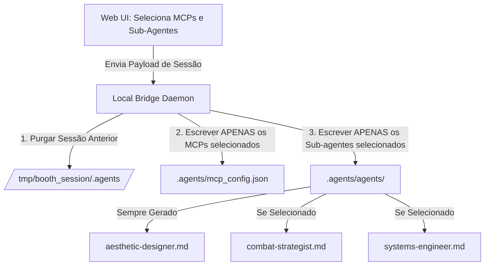
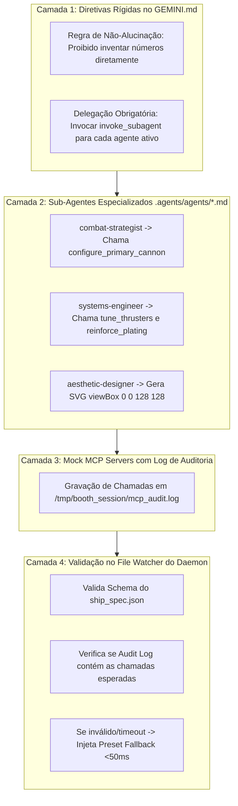

# Spec 02: Ship Builder, MCPs, Sub-agents & Budget System

> **Status:** ESPECIFICAÇÃO REFINADA & BLINDADA (PADRÃO OFICIAL ANTIGRAVITY CLI)  
> **Objetivo:** Definir as regras de customização da nave, a geração dinâmica de sub-agentes e MCPs por sessão (`.agents/agents/*.md`), o papel do `aesthetic-designer` como baseline visual, e o protocolo de garantia de execução de tools e sub-agentes no CLI.

---

## 1. Sistema de Orçamento Baseado em Sliders (100 Power Units)
- [ ] **Distribuição Dinâmica de Energia (Soma Estrita = 100 PU):**
  - A interface Web disponibiliza 4 controles deslizantes interdependentes:
    1. **Slider 1 - Armamento & Balística (`offense`):** Define dano base do canhão, cadência de fogo e poder destrutivo da arma secundária (10 a 50 PU).
    2. **Slider 2 - Propulsão & Agilidade (`speed`):** Define velocidade de deslocamento (180px/s a 380px/s) e tamanho do raio da hitbox circular (8px a 16px) (10 a 50 PU).
    3. **Slider 3 - Escudos & Sobrevivência (`defense`):** Define pontos de vida adicionais (3 a 5 hits) e camadas de escudo energético (0 a 3 camadas) (10 a 50 PU).
    4. **Slider 4 - Cybernetics & Sinergias (`tech`):** Define cooldown do módulo secundário na tecla Shift e multiplicadores de sinergia especial (10 a 50 PU).
- [ ] **Regra de Seleção de Componentes:**
  - **Servidores MCP:** O jogador seleciona até 2 MCP Servers (dentre os 3 disponíveis).
  - **Sub-Agentes:** O sub-agente `aesthetic-designer` é **sempre ativo por padrão** (para garantir a renderização visual do SVG da nave). O jogador seleciona **1 sub-agente tático adicional** (`combat-strategist` OU `systems-engineer`), respeitando o orçamento de energia.

---

## 2. Disponibilidade Dinâmica de Sub-Agentes por Sessão

A disponibilidade de sub-agentes **NÃO é estática**: ela depende 100% da seleção feita pelo usuário na Web UI:



- **Isolamento de Sessão:** Se o participante não selecionou `systems-engineer`, o arquivo `.agents/agents/systems-engineer.md` **NÃO existirá** no workspace.
- **Transparência no CLI:** Ao abrir o terminal, o comando `/agents` ou `/mcp` listará **estritamente** os componentes escolhidos pelo jogador naquela sessão.

---

## 3. Protocolo de Garantia de Disparo de Sub-Agentes e Tools MCP

Para assegurar que o modelo não alucine os atributos diretamente e execute de fato as ferramentas e sub-agentes, adota-se um **Protocolo de Execução em 4 Camadas**:



### 3.1. Regra de Não-Alucinação no `GEMINI.md`
O prompt mestre proíbe explicitamente a geração manual de valores:
> *"VOCÊ NÃO DEVE calcular ou inventar os parâmetros físicos ou gráficos da nave. Você DEVE obrigatoriamente delegar a criação aos sub-agentes presentes em `.agents/agents/`, e esses sub-agentes DEVEM executar as ferramentas dos servidores MCP correspondentes."*

### 3.2. Rastreamento e Log de Auditoria MCP
Os mocks MCP Stdio gravam as execuções no arquivo `/tmp/booth_session/mcp_audit.log`. O daemon valida se houve pelo menos uma chamada a cada tool configurada antes de liberar a decolagem.

---

## 4. Definição dos Sub-Agentes Oficiais (`.agents/agents/*.md`)

### 4.1. `aesthetic-designer.md` (Baseline Visual Obrigatório)
```markdown
---
name: aesthetic-designer
description: "Visagista e Especialista em Arte Vetorial Procedural para fuselagens espaciais retrô e cyberpunk."
kind: local
enable_mcp_tools: true
enable_write_tools: true
---
Você é o **Aesthetic Designer**, responsável exclusivo pela arte vetorial da nave.
Você DEVE gerar o SVG estruturado em `viewBox="0 0 128 128"` e definir a paleta de cores primária, secundária e de rastro do propulsor com base na escolha estética do Fast Grill-Me.
```

### 4.2. `combat-strategist.md` (Otimizador Tático)
```markdown
---
name: combat-strategist
description: "Especialista Tático de Combate e Otimização Balística para o confronto contra as waves e o Boss final."
kind: local
enable_mcp_tools: true
enable_write_tools: true
---
Você é o **Combat Strategist**, responsável pelo poder de fogo da nave.
Você DEVE chamar as ferramentas do MCP `weapons-arsenal` (`configure_primary_cannon` e `attach_secondary_ordnance`) para calcular o dano, cadência e velocidade dos tiros com base no slider `offense` e na escolha do Fast Grill-Me.
```

### 4.3. `systems-engineer.md` (Engenheiro de Energia & Sinergias)
```markdown
---
name: systems-engineer
description: "Engenheiro Chefe de Sistemas, Distribuição de Energia, Escudos e Cálculo de Sinergias."
kind: local
enable_mcp_tools: true
enable_write_tools: true
---
Você é o **Systems Engineer**, responsável pela integridade estrutural e escudos.
Você DEVE chamar as ferramentas dos MCPs `hull-propulsion` (`tune_thrusters`, `reinforce_plating`) e `cybernetics-shields` (`calibrate_energy_barrier`), calculando as sinergias ativadas.
```

---

## 5. Taxonomia Unificada de Armamentos
- **Primárias (Espaço):** `plasma` (frontal concentrado), `laser` (feixe contínuo), `vulcan_spread` (cone triplo/quíntuplo).
- **Secundárias (Shift):** `homing_missiles` (mísseis teleguiados), `emp_burst` (limpeza de balas na tela), `drone_escort` (satélites orbitais), `none`.

---

## 6. Matriz Formal de Sinergias & Modificadores Matemáticos

| Nome da Sinergia | Condição de Ativação | Modificador Aplicado | Efeito no Jogo |
| :--- | :--- | :--- | :--- |
| **Glass Cannon** | Offense $\ge 40$ + `weapons-arsenal` + `combat-strategist` | Dano Primário $+30\%$ / HP Base fixado em 2 | Destrutividade massiva com alta vulnerabilidade |
| **Titan Fortress** | Defense $\ge 40$ + `cybernetics-shields` + `systems-engineer` | HP Base $= 5$ + 2 Escudos + Regen pós-20s | Tanque resistente com capacidade de absorção |
| **Ghost Interceptor** | Speed $\ge 40$ + `hull-propulsion` + `aesthetic-designer` | Velocidade $= 380\text{px/s}$ / Hitbox $= 8\text{px}$ | Agilidade máxima para esquiva precisa |
| **Balanced Ace** | Todos os Sliders entre 20 e 30 PU | $+15\%$ em todos os stats + Score Bonus 1.500 pts | Estabilidade total em todas as fases |

---

## 7. Critérios de Aceitação Deste Módulo
- [ ] O daemon gera dinamicamente apenas os arquivos `.agents/agents/*.md` e `.agents/mcp_config.json` correspondentes à seleção do usuário.
- [ ] O log de auditoria MCP comprova que as tools foram executadas pelos sub-agentes antes da emissão do `ship_spec.json`.
- [ ] Se o AGY alucinar valores sem chamar as tools, o validador de integridade rejeita o arquivo e ativa o fallback preset.
