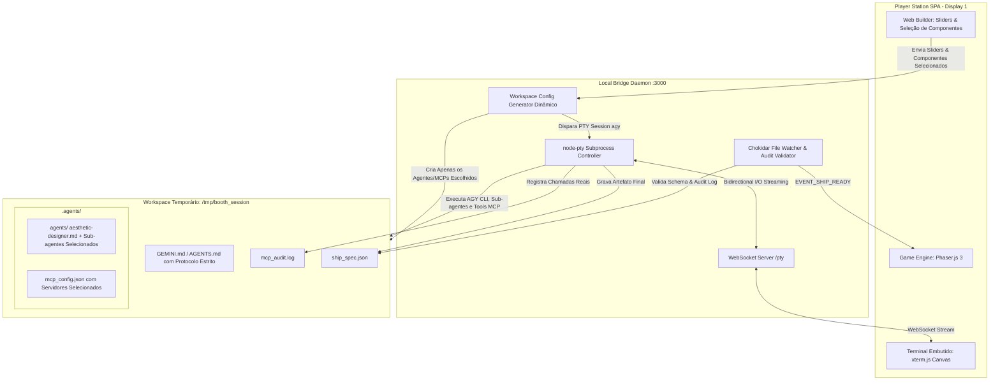
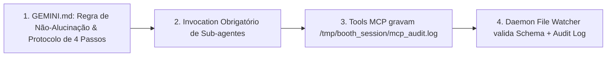

# Spec 03: Antigravity CLI Harness, Automation & Hardening

> **Status:** ESPECIFICAÇÃO REFINADA & BLINDADA (PADRÃO OFICIAL ANTIGRAVITY CLI)  
> **Objetivo:** Definir a arquitetura do terminal embutido (`xterm.js` + `node-pty`), a geração dinâmica de configurações (`.agents/agents/*.md`, `.agents/mcp_config.json`, `GEMINI.md`), o protocolo de garantia de execução das tools MCP e sub-agentes, o contrato de dados estrito Draft-07 de `ship_spec.json`, a contenção de processos (`SIGKILL -PGID`), e a validação de integridade pelo File Watcher.

---

## 1. Arquitetura do Terminal Embutido & Local Bridge Daemon



---

## 2. Geração Dinâmica e Isolada do Workspace por Sessão

A pasta `/tmp/booth_session` é limpa a cada novo participante e populada **dinamicamente** com base exclusiva no que o usuário selecionou na Web UI:

1. **`aesthetic-designer.md`:** Sempre incluído em `.agents/agents/` (baseline obrigatório para arte vetorial SVG).
2. **Sub-Agentes Táticos:** Apenas o sub-agente tático escolhido (`combat-strategist.md` ou `systems-engineer.md`) é gravado em `.agents/agents/`.
3. **`mcp_config.json`:** Contém apenas as entradas dos servidores MCP selecionados pelo jogador (ex: `weapons-arsenal` e `hull-propulsion`).
4. **`GEMINI.md`:** Contém o template com a injeção dos dados do piloto (Callsign, Empresa) e os valores fixados nos sliders de energia (100 PU).

---

## 3. Protocolo de Garantia de Disparo de Sub-Agentes e Tools MCP

Para assegurar que o modelo de linguagem no CLI execute de fato as ferramentas e delegue aos sub-agentes (em vez de inventar números diretamente no JSON), o sistema implementa 4 salvaguardas:



### 3.1. Diretivas Estritas no `GEMINI.md`
```markdown
# PROTOCOLO OBRIGATÓRIO DE CONSTRUÇÃO DE NAVE

Você é o Orquestrador Chefe da Forja Espacial no Antigravity CLI.

### REGRAS CRÍTICAS DE EXECUÇÃO:
1. **PROIBIDO INVENTAR VALORES:** Você NÃO tem permissão para gerar parâmetros numéricos ou SVG diretamente.
2. **PASSO 1 - FAST GRILL-ME:** Apresente de imediato o menu com as 2 perguntas de armamento e estilo estético.
3. **PASSO 2 - DELEGAÇÃO AOS SUB-AGENTES:**
   - Delegue a arte visual ao sub-agente `aesthetic-designer`.
   - Delegue as armas e DPS ao sub-agente `combat-strategist` (se presente).
   - Delegue a fuselagem, escudos e sinergias ao sub-agente `systems-engineer` (se presente).
4. **PASSO 3 - EXECUÇÃO DE TOOLS MCP:** Os sub-agentes DEVEM invocar as ferramentas dos MCPs ativos para calcular os dados físicos reais.
5. **PASSO 4 - EMISSÃO FINAL:** Consolide os retornos reais das ferramentas, exiba o relatório formatado em Markdown e grave o arquivo `ship_spec.json`.
```

### 3.2. Rastreamento e Log de Auditoria dos MCPs (`mcp_audit.log`)
Cada tool mockada executada no host grava uma linha de auditoria com timestamp, parâmetros e status de execução em `/tmp/booth_session/mcp_audit.log`.

### 3.3. Validação Dupla no File Watcher (Schema + Auditoria)
Quando o `Chokidar` detecta a gravação de `ship_spec.json`, o daemon:
1. Valida o JSON contra o schema Draft-07 via `Ajv`/`Zod`.
2. Verifica se o `mcp_audit.log` contém pelo menos uma execução registrada das ferramentas dos MCPs ativos.
3. Se o arquivo estiver inválido ou sem registro de execução de tools após 15s de timeout, o daemon injeta automaticamente o preset fallback correspondente.

---

## 4. Contrato de Dados Estrito: Ship Specification (`ship_spec.json`)

```json
{
  "$schema": "http://json-schema.org/draft-07/schema#",
  "title": "ShipSpecification",
  "type": "object",
  "additionalProperties": false,
  "required": ["pilot", "build_metadata", "attributes", "weapons", "visuals"],
  "properties": {
    "pilot": {
      "type": "object",
      "additionalProperties": false,
      "required": ["callsign", "company_raw", "company_canonical"],
      "properties": {
        "callsign": { "type": "string", "minLength": 1, "maxLength": 15 },
        "company_raw": { "type": "string", "minLength": 1, "maxLength": 40 },
        "company_canonical": { "type": "string", "minLength": 1, "maxLength": 40 }
      }
    },
    "build_metadata": {
      "type": "object",
      "additionalProperties": false,
      "required": ["selected_mcps", "selected_subagents", "energy_sliders", "fast_grill_me_choices", "synergies_unlocked"],
      "properties": {
        "selected_mcps": {
          "type": "array",
          "items": { "type": "string", "enum": ["weapons-arsenal", "hull-propulsion", "cybernetics-shields"] }
        },
        "selected_subagents": {
          "type": "array",
          "items": { "type": "string", "enum": ["aesthetic-designer", "combat-strategist", "systems-engineer"] }
        },
        "energy_sliders": {
          "type": "object",
          "additionalProperties": false,
          "required": ["offense", "speed", "defense", "tech"],
          "properties": {
            "offense": { "type": "integer", "minimum": 10, "maximum": 50 },
            "speed": { "type": "integer", "minimum": 10, "maximum": 50 },
            "defense": { "type": "integer", "minimum": 10, "maximum": 50 },
            "tech": { "type": "integer", "minimum": 10, "maximum": 50 }
          }
        },
        "fast_grill_me_choices": {
          "type": "object",
          "additionalProperties": false,
          "required": ["weapon_focus", "visual_theme"],
          "properties": {
            "weapon_focus": { "type": "string", "enum": ["laser_piercing", "missile_barrage", "vulcan_spread"] },
            "visual_theme": { "type": "string", "enum": ["synthwave_80s", "dark_void_stealth", "cyberpunk_gold"] }
          }
        },
        "synergies_unlocked": {
          "type": "array",
          "items": { "type": "string" }
        }
      }
    },
    "attributes": {
      "type": "object",
      "additionalProperties": false,
      "required": ["max_hp", "shield_capacity", "speed_px_s", "hitbox_radius"],
      "properties": {
        "max_hp": { "type": "integer", "minimum": 2, "maximum": 5 },
        "shield_capacity": { "type": "integer", "minimum": 0, "maximum": 3 },
        "speed_px_s": { "type": "number", "minimum": 180, "maximum": 380 },
        "hitbox_radius": { "type": "number", "minimum": 8, "maximum": 16 }
      }
    },
    "weapons": {
      "type": "object",
      "additionalProperties": false,
      "required": ["primary", "secondary"],
      "properties": {
        "primary": {
          "type": "object",
          "additionalProperties": false,
          "required": ["type", "damage", "fire_rate", "bullet_speed", "spread_angle"],
          "properties": {
            "type": { "type": "string", "enum": ["plasma", "laser", "vulcan_spread"] },
            "damage": { "type": "number", "minimum": 10, "maximum": 60 },
            "fire_rate": { "type": "number", "minimum": 2, "maximum": 60 },
            "bullet_speed": { "type": "number", "minimum": 400, "maximum": 800 },
            "spread_angle": { "type": "number", "minimum": 0, "maximum": 30 }
          }
        },
        "secondary": {
          "type": "object",
          "additionalProperties": false,
          "required": ["type", "damage", "cooldown_seconds"],
          "properties": {
            "type": { "type": "string", "enum": ["homing_missiles", "emp_burst", "drone_escort", "none"] },
            "damage": { "type": "number", "minimum": 0, "maximum": 150 },
            "cooldown_seconds": { "type": "number", "minimum": 0, "maximum": 20 }
          }
        }
      }
    },
    "visuals": {
      "type": "object",
      "additionalProperties": false,
      "required": ["style_name", "primary_color", "secondary_color", "engine_trail_color", "svg_path_data"],
      "properties": {
        "style_name": { "type": "string" },
        "primary_color": { "type": "string", "pattern": "^#[0-9a-fA-F]{6}$" },
        "secondary_color": { "type": "string", "pattern": "^#[0-9a-fA-F]{6}$" },
        "engine_trail_color": { "type": "string", "pattern": "^#[0-9a-fA-F]{6}$" },
        "svg_path_data": { "type": "string", "minLength": 10 }
      }
    }
  }
}
```

---

## 5. Contenção de Processos & File Watcher Handoff

### 5.1. Gestão de Processo via Process Group (`-PGID`)
- [ ] O daemon inicia a sessão PTY com `{ detached: true }`.
- [ ] No término ou em caso de timeout/reset, o daemon executa:
  `process.kill(-subprocess.pid, 'SIGKILL')` para garantir que o processo do AGY CLI e os subprocessos dos servidores MCP sejam eliminados sem deixar órfãos no host.

### 5.2. File Watcher & Validação Zod/Ajv
- [ ] O `Chokidar` monitora `/tmp/booth_session/ship_spec.json`.
- [ ] Ao detectar a gravação completa (`atomic rename` ou evento `change`), o daemon valida com `Ajv.validate()` e checa o `mcp_audit.log`.
- [ ] Se válido, dispara `EVENT_SHIP_READY` via WebSocket com latência $< 200$ms.

---

## 6. Pipeline de Reset do Harness
- [ ] **Ação 1:** Morte forçada do grupo de processos (`kill -9 -PGID`).
- [ ] **Ação 2:** Exclusão do diretório temporário (`rm -rf /tmp/booth_session/*`).
- [ ] **Ação 3:** Reset da instância do terminal no frontend (`xterm.reset()`).
- [ ] **Ação 4:** Navegação da SPA de volta para a rota `/welcome`.

---

## 7. Critérios de Aceitação Deste Módulo
- [ ] A pasta `.agents/` é descoberta e validada com sucesso pelo comando `agy inspect` / `/agents`.
- [ ] O `ship_spec.json` gerado pelo AGY passa 100% das vezes na validação de schema estrito e auditoria MCP.
- [ ] Em nenhuma circunstância o encerramento do terminal deixa processos Node.js de MCPs ativos no host.
- [ ] A troca do terminal para a Game Engine ocorre em menos de 500ms com foco automático no canvas.
