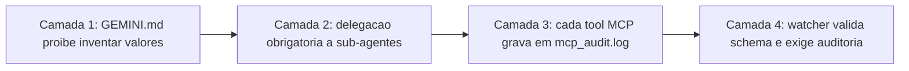
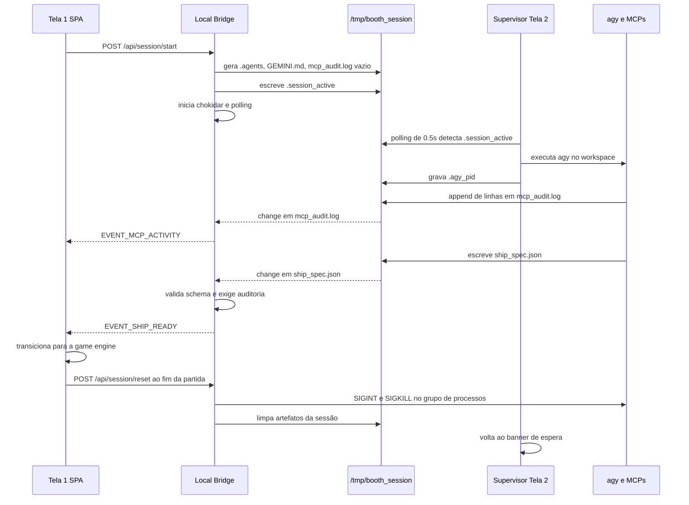

# Spec 03: Harness do Antigravity CLI, Automação e Contenção

> **Status:** RECONCILIADA COM A IMPLEMENTAÇÃO — 2026-08-10
> **Objetivo:** Definir como o `agy` é executado no estande, como o workspace de sessão é gerado e
> destruído, qual é o contrato de dados de `ship_spec.json`, e quais garantias de integridade
> precisam existir entre o CLI e a game engine.
> **Endereça:** P1, D1, D2, D3, D4, D14, D16 (ver [Spec 00](./00_AUDIT_AND_DRIFT_REPORT.md)).
> **Depende de:** [Spec 08](./08_DEPLOYMENT_TOPOLOGY_AND_CLOUD_SPLIT.md) para a decisão de onde o
> `agy` executa, e de [Spec 09](./09_GAME_BALANCE_AND_DEV_MODE.md) §2.3 para as faixas numéricas.

---

## 1. Arquitetura real: terminal nativo + Local Bridge

> **Correção (P1).** Esta especificação descrevia um terminal **embutido** no browser
> — `xterm.js` no frontend, `node-pty` no daemon, streaming bidirecional pelo WebSocket `/pty`.
> Nada disso existe. A implementação usa o **terminal nativo do sistema operacional** na Tela 2,
> supervisionado por `scripts/booth-terminal.sh`, e o daemon nunca cria um PTY.
>
> A troca foi deliberada e é melhor para o estande: o visitante vê o `agy` real, no terminal real,
> com todo o rendering de TUI que o CLI espera — em vez de uma reimplementação parcial dentro de um
> canvas. O custo é que a Tela 2 deixa de ser uma superfície web e passa a exigir uma máquina com
> shell de verdade.
>
> **A pivotagem é condicional.** Se o hardware do evento não permitir instalar e autenticar o `agy`
> localmente, [Spec 08](./08_DEPLOYMENT_TOPOLOGY_AND_CLOUD_SPLIT.md) §7 reintroduz o terminal
> embutido sobre WSS contra uma VM por estação. O desenho `xterm.js` não está errado; está
> **arquivado como contingência**.

```mermaid
graph TD
    subgraph Tela1 [Tela 1: Player Station SPA]
        UI_BUILDER[Web Builder: sliders, MCPs, sub-agentes]
        UI_HANDOFF[Tela de handoff: aguardando a forja]
        PHASER[Game Engine Phaser 3]
    end

    subgraph Tela2 [Tela 2: Terminal nativo do SO]
        SUPERVISOR[booth-terminal.sh: loop supervisor]
        AGY[Processo agy]
        MCP_PROCS[Servidores MCP stdio: filhos do agy]
    end

    subgraph Daemon [Local Bridge Daemon :3000]
        REST[API REST Express]
        WS[WebSocket de eventos]
        GEN[WorkspaceGeneratorService]
        WATCH[FileWatcherService com chokidar]
    end

    subgraph Workspace [/tmp/booth_session]
        FLAG[.session_active]
        PIDF[.agy_pid]
        DOTAGENTS[.agents/ com mcp_config.json e agents/*.md]
        GEMINI[GEMINI.md e AGENTS.md]
        AUDIT[mcp_audit.log]
        SPEC[ship_spec.json]
    end

    UI_BUILDER -->|POST /api/session/start| REST
    REST --> GEN
    GEN -->|escreve workspace| Workspace
    REST -->|escreve .session_active| FLAG
    SUPERVISOR -->|polling de 0.5s no flag| FLAG
    SUPERVISOR -->|cd e exec| AGY
    SUPERVISOR -->|grava PID| PIDF
    AGY --> MCP_PROCS
    MCP_PROCS -->|append por tool| AUDIT
    AGY -->|write tool| SPEC
    WATCH -->|chokidar e polling| Workspace
    WATCH -->|EVENT_SHIP_READY| WS
    WATCH -->|EVENT_MCP_ACTIVITY| WS
    WS --> UI_HANDOFF
    WS --> PHASER
```

**A observação central:** o daemon **não inicia o `agy`**. Ele apenas escreve o arquivo-bandeira
`.session_active`; o supervisor, que já está rodando em loop no terminal nativo, detecta o arquivo
por polling e sobe o CLI. O acoplamento entre as duas telas é o sistema de arquivos, não um socket.
Isso é simples e robusto, mas tem duas consequências que a §6 trata: o daemon só consegue matar o
`agy` através do PID que o supervisor deixou em `.agy_pid`, e não existe canal de erro do supervisor
de volta para a UI.

---

## 2. Superfície real do Local Bridge

### 2.1. REST

| Método e rota | Efeito |
| :--- | :--- |
| `GET /api/health` | Liveness. |
| `GET /api/companies` | Lista canônica de empresas para o autocomplete. |
| `GET /api/leaderboard` | Snapshot do SQLite local. |
| `GET /api/session/status` | Metadados da sessão corrente ou `null`. |
| `GET /api/session/spec` | Último `ship_spec.json` normalizado. |
| `GET /api/session/activity` | Histórico de execuções de tools MCP da sessão. |
| `POST /api/session/start` | Gera o workspace, escreve `.session_active`, inicia o watcher. |
| `POST /api/matches` | Persiste o resultado da partida no buffer SQLite. |
| `POST /api/session/reset` | Encerra a sessão. Ver §6. |

### 2.2. WebSocket

| Evento | Origem |
| :--- | :--- |
| `EVENT_SHIP_READY` | Watcher processou um `ship_spec.json` novo. Também é reenviado no `connection` se já houver spec. |
| `EVENT_MCP_ACTIVITY` | Uma linha nova em `mcp_audit.log`. O histórico completo é reenviado no `connection`. |
| `EVENT_LEADERBOARD_UPDATE` | Snapshot do SQLite enviado no `connection`. |

> **Débito de nomenclatura.** O servidor WebSocket ainda escuta em `path: '/pty'`
> (`packages/daemon/src/index.ts:22`) — resíduo do desenho abandonado. Nenhum byte de PTY trafega
> ali; o canal só carrega os três eventos acima. Renomear para `/events` e ajustar os clientes é
> item da Fase A do plano de implementação: um nome errado no protocolo é a semente da próxima
> confusão de arquitetura.

---

## 3. Geração do workspace por sessão

`WorkspaceGeneratorService.generateWorkspace()` (`packages/daemon/src/services/workspace-generator.ts`)
produz `/tmp/booth_session` do zero a cada visitante:

1. **Limpeza preservando o inode.** O diretório-raiz **não** é removido; apenas seu conteúdo é
   apagado entrada por entrada. Isso é intencional e importante: um `rm -rf` do diretório inteiro
   invalida o `cwd` do shell aberto na Tela 2 e o supervisor passa a falhar com `uv_cwd ENOENT`.
2. **`.agents/mcp_config.json`** com exatamente os servidores MCP escolhidos, cada um apontando para
   `node <mcpsDistDir>/<nome>.js`. Um MCP não escolhido não aparece no arquivo e portanto não existe
   para o `agy`.
3. **`.agents/agents/*.md`** com `aesthetic-designer` sempre presente
   (`enable_mcp_tools: false`, só arte vetorial) mais o sub-agente tático escolhido —
   `combat-strategist` e/ou `systems-engineer`, ambos com `enable_mcp_tools: true`.
4. **`GEMINI.md` e `AGENTS.md`**, conteúdo idêntico, com callsign, empresa canônica, os quatro
   sliders e o protocolo de 4 passos. Ver §4.
5. **`run_agy.sh`** com `mode 0o755`. **Está órfão:** o supervisor executa `agy` diretamente e nunca
   chama este script. Ou o supervisor passa a usá-lo, ou ele sai — hoje é uma terceira definição de
   como o CLI sobe.
6. **`mcp_audit.log`** vazio, para que o watcher tenha o que observar desde o instante zero.

Fora do gerador, `POST /api/session/start` escreve **`.session_active`** com o JSON completo dos
metadados da sessão. O supervisor lê `callsign`, `company_canonical` e os quatro sliders desse
arquivo via `jq` para desenhar o banner — com defaults silenciosos se o `jq` não estiver instalado.
**`jq` é dependência não declarada da Tela 2** e entra no `self_test.sh` da [Spec 06](./06_RELIABILITY_FAILOVER_AND_SECURITY_SPEC.md).

---

## 4. Protocolo de garantia de execução

O objetivo é impedir que o modelo escreva um `ship_spec.json` plausível **sem** ter delegado aos
sub-agentes nem executado as tools MCP. São quatro camadas previstas; **duas funcionam**.



| Camada | Estado | Evidência |
| :--- | :--- | :--- |
| 1. Regra de não-alucinação | **Ausente e contraproducente** | Ver D16 abaixo. |
| 2. Delegação obrigatória | Presente como instrução | `workspace-generator.ts`, passo 2 do protocolo. |
| 3. Log de auditoria | **Funciona** | `packages/mcps/src/utils/audit-logger.ts` faz append de uma linha JSON por tool. |
| 4. Validação dupla no watcher | **Ausente** | D1 e D3. |

### 4.1. D16 — O `GEMINI.md` entrega a resposta pronta

A instrução gerada termina com um **exemplo completo e preenchido** de `ship_spec.json`: `damage: 35`,
`fire_rate: 10`, `max_hp: 4`, `shield_capacity: 2`, `speed_px_s: 350`, cores, `svg_path_data` e até
`"synergies_unlocked": ["Glass Cannon 🔥"]`. Pior: os campos `selected_mcps` e `selected_subagents` do
exemplo são **fixos** e ignoram o que o visitante escolheu.

Duas falhas se somam:

- A regra que esta especificação exigia — *"PROIBIDO INVENTAR VALORES: você NÃO tem permissão para
  gerar parâmetros numéricos ou SVG diretamente"* — **não está no template gerado**. Ela existia só
  no papel.
- No lugar dela há um caminho de menor esforço: copiar o exemplo. O modelo cumpre literalmente
  *"grave o arquivo"* sem chamar uma tool sequer, e como a camada 4 não existe (D3), o arquivo voa.

**Requisito.** O exemplo do `GEMINI.md` deve virar um **esqueleto com placeholders** — chaves e tipos,
valores substituídos por marcadores explícitos do tipo `<<valor retornado por configure_primary_cannon>>`
— e a regra de não-alucinação volta como primeira linha do protocolo. `selected_mcps` e
`selected_subagents` são interpolados a partir da sessão, nunca literais.

### 4.2. Formato do `mcp_audit.log`

Uma linha JSON por execução, com `timestamp` ISO-8601, `server`, `tool`, `args` e `result`. O caminho
vem de `BOOTH_SESSION_DIR` com default `/tmp/booth_session`. O logger é deliberadamente não-bloqueante:
uma falha de escrita não derruba a tool.

### 4.3. Validação dupla no watcher — requisito em aberto

Ao detectar gravação de `ship_spec.json`, o daemon **deve**:

1. **[D1]** Validar contra o schema Draft-07 com `validateShipSpecification()`. Hoje a função é
   importada em `packages/daemon/src/services/file-watcher.ts:4` e **nunca chamada**. No lugar dela
   roda `normalizeSpec()` (`:147`), que coage qualquer JSON — inclusive `{}` — em uma nave
   aparentemente válida. O schema é, na prática, código morto fora do seu teste unitário.
2. **[D3]** Exigir pelo menos uma execução registrada por servidor MCP ativo em `mcp_audit.log`. Hoje
   o log é apenas transmitido como telemetria para a UI; nada o consulta como condição.
3. **[D2]** Aplicar um **timeout de 15s** a partir de `.session_active` e, ao estourar, injetar o
   preset de fallback correspondente ao perfil do visitante. Hoje só existe um botão manual em
   `HandoffTerminalScreen.tsx`.

A ordem importa: sem 1 e 2, o fallback de 3 nunca dispara, porque qualquer coisa que o modelo grave
passa. E `normalizeSpec()` **não deve ser removido** — ele continua útil como camada de saneamento
depois da validação, para specs válidas mas com valores fora de faixa.

---

## 5. Contrato de dados: `ship_spec.json`

O contrato canônico é `packages/shared/src/schema/ship_spec.schema.json` (Draft-07,
`additionalProperties: false` em todos os níveis). A estrutura permanece como especificada
originalmente:

```
pilot              callsign, company_raw, company_canonical
build_metadata     selected_mcps, selected_subagents, energy_sliders,
                   fast_grill_me_choices, synergies_unlocked
attributes         max_hp, shield_capacity, speed_px_s, hitbox_radius
weapons.primary    type, damage, fire_rate, bullet_speed, spread_angle
weapons.secondary  type, damage, cooldown_seconds
visuals            style_name, primary_color, secondary_color,
                   engine_trail_color, svg_path_data
```

Duas correções sobre a versão anterior desta especificação:

> **[D14] As faixas numéricas saem daqui.** Esta especificação embutia os `minimum`/`maximum` de cada
> campo. Isso produziu três contratos incompatíveis para os mesmos atributos: o schema, os clamps de
> `normalizeSpec()` e os clamps do `WeaponSystem`. A partir de agora o **schema é gerado** a partir da
> tabela única de [Spec 09](./09_GAME_BALANCE_AND_DEV_MODE.md) §2.3 via `npm run gen:schema`, e as
> três camadas passam a ler a mesma fonte. Nenhum número de faixa é escrito à mão em nenhum dos três
> lugares.

> **[D13] `drone_escort` sai do enum de `weapons.secondary.type`.** O tipo está no schema e no preset
> `striker`, mas não existe implementação alguma no `WeaponSystem`. Uma nave `striker` hoje sobe sem
> arma secundária e sem erro. O enum passa a ser `homing_missiles | emp_burst | none`; o preset
> `striker` migra para `emp_burst`. Reintroduzir `drone_escort` exige implementá-lo primeiro.

O campo `visuals.svg_path_data` continua obrigatório com `minLength: 10`, e a validação de
`^#[0-9a-fA-F]{6}$` nas três cores permanece — é o que impede um valor de cor inválido de quebrar o
rendering do Phaser em pleno estande.

---

## 6. Contenção de processos e reset

### 6.1. O que o reset faz hoje

`POST /api/session/reset` (`packages/daemon/src/index.ts:182-227`): para o watcher, remove
`.session_active`, lê `.agy_pid`, envia `SIGINT` ao PID e `SIGKILL` 600ms depois, e apaga
`ship_spec.json` e `mcp_audit.log`. O supervisor, ao ver o `agy` morrer, volta sozinho para o banner
de espera.

### 6.2. [D4] O problema: um PID não é um grupo de processos

O supervisor sobe o CLI com `agy &`. Em um script não-interativo o job control está desligado, então
o `agy` **herda o grupo de processos do supervisor** em vez de criar o seu. O daemon mata um único
PID; os servidores MCP stdio, que são filhos do `agy`, são reparentados para o `init` e sobrevivem.

Em um evento de oito horas com um ciclo a cada 2min45s, isso acumula. É exatamente o cenário que o
critério de aceitação *"nenhum processo Node.js de MCP ativo após o encerramento"* existia para
impedir.

**Requisito, nas duas pontas:**

- **Supervisor:** subir o CLI com `setsid agy` — ou `set -m` antes do `&` — de modo que ele lidere um
  grupo próprio, e gravar esse PGID em `.agy_pid`.
- **Daemon:** `process.kill(-pgid, 'SIGINT')` e, após o intervalo de graça, `process.kill(-pgid, 'SIGKILL')`,
  tolerando `ESRCH` como sucesso.

A verificação é objetiva e entra no gate M4 da [Spec 10](./10_IMPLEMENTATION_PLAN.md): após 20 ciclos
completos de sessão e reset, `pgrep -f 'mcps/dist'` retorna vazio.

### 6.3. Fronteira do reset

O reset **não** limpa `.agents/`, `GEMINI.md`, `AGENTS.md` nem `run_agy.sh` — esses são recriados na
próxima chamada de `/api/session/start`, que apaga todo o conteúdo do diretório antes de gerar. A
janela entre um reset e o próximo start portanto deixa o workspace do visitante anterior legível no
disco. Para uma sessão de estande com dados de nome e empresa, o aceitável é apagar tudo no reset e
não só os dois artefatos; ver [Spec 06](./06_RELIABILITY_FAILOVER_AND_SECURITY_SPEC.md).

---

## 7. Ciclo de vida de uma sessão



As duas setas tracejadas do watcher representam a detecção por `chokidar` **com** um polling de
respaldo — o watcher roda os dois em paralelo, porque `/tmp` em alguns sistemas de arquivos não
entrega eventos `inotify` de forma confiável. O `awaitWriteFinish` com `stabilityThreshold: 100ms`
evita processar uma escrita parcial, e `checkAndProcessSpecFile` ainda descarta silenciosamente JSON
malformado para tentar de novo no ciclo seguinte.

---

## 8. Critérios de aceitação

- [ ] O `agy` reconhece `.agents/` e lista os sub-agentes gerados; os MCPs escolhidos aparecem como
      conectados.
- [ ] Um `ship_spec.json` que viole o schema é **rejeitado** e substituído pelo preset de fallback —
      verificável corrompendo o arquivo à mão durante o gate M2.
- [ ] Um `ship_spec.json` gravado sem nenhuma linha correspondente em `mcp_audit.log` é rejeitado.
- [ ] O `GEMINI.md` gerado não contém nenhum valor numérico de atributo, dano ou cadência que possa
      ser copiado como resposta final.
- [ ] Passados 15s sem spec válida, o fallback entra automaticamente e a UI avança sem intervenção do
      staff.
- [ ] Após 20 ciclos de sessão e reset, `pgrep -f 'mcps/dist'` retorna vazio.
- [ ] A transição do `EVENT_SHIP_READY` até o canvas do Phaser com foco ocorre em menos de 500ms.
- [ ] O canal WebSocket se chama `/events`, e `grep -rn "'/pty'" packages/` não retorna nada.
