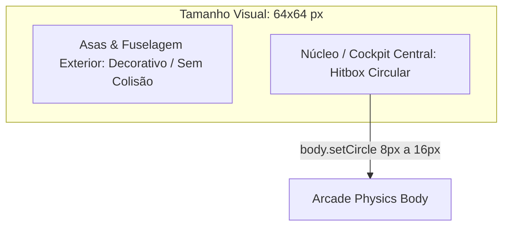
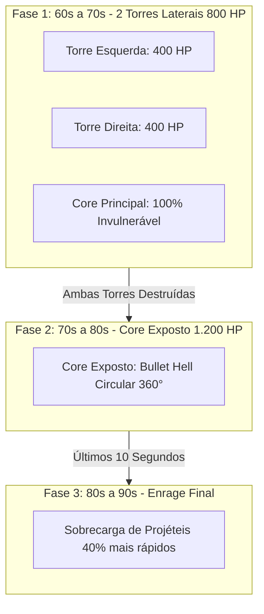

# Spec 04: Web Game Engine, Gameplay & Boss Fight

> **Status:** ESPECIFICAÇÃO REFINADA & BLINDADA  
> **Objetivo:** Definir a engine Phaser.js 3, a conversão do SVG da nave em textura WebGL, a colisão circular Arcade Physics, o balanceamento matemático do Boss de 2.000 HP, a balística das armas e a fórmula de score à prova de exploits.

---

## 1. Engine Gráfica & Pipeline de Textura SVG
- [ ] **Engine Web:** Phaser.js 3 com renderizador WebGL a 60 FPS fixos.
- [ ] **Conversão do SVG em Textura em Tempo de Execução (`ShipTextureFactory`):**
  1. O SVG recebido no `ship_spec.json` possui `viewBox="0 0 128 128"`.
  2. É criado um `Blob` SVG $\rightarrow$ `Image` $\rightarrow$ rasterizado em um `HTMLCanvasElement` em resolução retina 2x ($256\times 256$px).
  3. Inserido no cache do Phaser via `this.textures.addCanvas('player_ship', canvas)`.
  4. Sprite instanciado no jogo com escala $0.5$ (tamanho visual na tela: $64\times 64$px).

---

## 2. Física de Voo & Colisão Circular no Cockpit (*Graze Box*)

- [ ] **Corpo de Colisão:** Utiliza **Arcade Physics** com corpo circular no núcleo:
  `player.body.setCircle(hitbox_radius, offsetX, offsetY)` com raio variando de 8px (builds ágeis) a 16px (builds pesadas).
- [ ] **Offsets Fixos de Hardpoints:**
  - Canhão Frontal Primário: $(x + 0, y - 28)$
  - Asas de Dispersão Vulcan: $(x - 20, y - 10)$ e $(x + 20, y - 10)$
  - Exaustão dos Propulsores (Partículas): $(x + 0, y + 26)$

---

## 3. Balística das Armas Primárias e Secundárias

### 3.1. Armas Primárias (Disparo Contínuo na Barra de Espaço)
- `plasma`: Disparo de esferas com rastro luminoso. Dano: $35$ / Cadência: $4\text{ tiros/s}$ / Vel: $650\text{px/s}$.
- `laser`: Feixe contínuo instantâneo com colisão raycast. Dano: $12\text{ por tick}$ ($60\text{ ticks/s} = 720\text{ DPS}$) com aquecimento/cooldown.
- `vulcan_spread`: 3 a 5 projéteis balísticos cônicos. Dano: $15\text{ cada}$ / Cadência: $5\text{ tiros/s}$ / Ângulo: $\pm 12^\circ, \pm 24^\circ$.

### 3.2. Armas Secundárias (Tecla Shift com Cooldown)
- `homing_missiles`: Salva de 2 mísseis que aceleram em direção ao alvo de maior HP. Dano: $120\text{ cada}$ / Cooldown: $6\text{s}$.
- `emp_burst`: Onda expansiva azul que destrói todos os projéteis inimigos na tela e causa $50\text{ de dano}$. Cooldown: $10\text{s}$.
- `drone_escort`: 2 satélites orbitais que atiram continuamente por $12\text{s}$. Dano: $10\text{/tiro}$. Cooldown: $15\text{s}$.

---

## 4. Pacing da Partida & Waves Determinísticas (90 Segundos)

| Janela de Tempo | Fase da Partida | Inimigos & Comportamento | HP & Quantidade |
| :--- | :--- | :--- | :--- |
| **00s - 03s** | Launch & Warp In | Efeito visual de entrada no hiperespaço | - |
| **03s - 25s** | Wave 1: Drone Swarm | Caças rápidos em formações em V e ziguezague | 30 HP cada (32 drones finitos) |
| **25s - 50s** | Wave 2: Elite Cruisers | Naves blindadas com disparos teleguiados | 350 HP cada (6 cruisers finitos) |
| **50s - 60s** | Mini-Wave / Respiro | Drones de energia rápida (Powerups / Score boost) | 50 HP cada (10 drones de bônus) |
| **60s - 90s** | Final Boss Fight | **"The Cyber Overlord / Cloud Dreadnought"** | **2.000 HP Total (3 Fases)** |

---

## 5. Balanceamento do Boss Final (*The Cyber Overlord* - 2.000 HP)

- [ ] **Calibração de Dificuldade (~20% Taxa de Vitória):**
  - Jogador Médio (DPS 70): Causa ~980 de dano nos 14s sob mira e é derrotado pelo enrage/tempo.
  - Jogador com Build Otimizada e Boa Mira (DPS 130): Causa ~2.340 de dano e derrota o Boss entre os 82s e 86s de jogo.

---

## 6. Fórmula de Pontuação Blindada (Anti-Exploit)

$$\text{Score Total} = \sum_{k=1}^{N_{\text{kills}}} \left( \text{BasePts}_k \times \text{Combo}_k \right) + \text{BossDefeated} \cdot 5000 + \text{BossDefeated} \cdot \left[ (90 - T_{\text{final}}) \times 50 \right] + \left( \text{HP}_{\text{restante}} \times 1000 \right) + \text{SynergyBonus}$$

- [ ] **Regras Estritas:**
  - `BasePts`: Drones = 100 pts / Cruisers = 500 pts / Boss = 5.000 pts.
  - `Combo Multiplier`: Incrementa +0.1x a cada abate consecutivo (limite 3.0x). Volta para 1.0x caso o jogador sofra dano.
  - `Time Bonus`: Concedido **exclusivamente se `BossDefeated === true`** (impede que mortes precoces recebam bônus de tempo).
  - `HP Restante`: 1.000 pts por ponto de vida preservado.
  - `Synergy Bonus`: 1.500 pts se o participante ativou uma sinergia especial no AGY.

---

## 7. Critérios de Aceitação Deste Módulo
- [ ] A engine mantém 60 FPS estáveis mesmo na fase de Bullet Hell com centenas de projéteis na tela.
- [ ] A textura da nave customizada é gerada a partir do SVG em menos de 100ms.
- [ ] A taxa de vitória sobre o Boss fica calibrada em torno de 15% a 25% dos jogadores.
