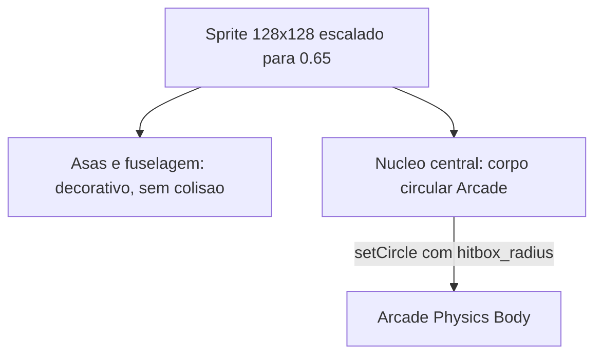

# Spec 04: Game Engine, Gameplay e Boss Fight

> **Status:** RECONCILIADA COM A IMPLEMENTAÇÃO — 2026-08-10
> **Objetivo:** Descrever a engine Phaser 3 tal como construída: pipeline de textura, física de voo,
> balística, pacing da partida de 90s, o boss e a fórmula de score.
> **Endereça:** P3, P4, P5, D12, D13, D15, D17 (ver [Spec 00](./00_AUDIT_AND_DRIFT_REPORT.md)).
> **Fonte de verdade numérica:** esta especificação **descreve** o comportamento; todo valor de tuning
> é governado por [Spec 09](./09_GAME_BALANCE_AND_DEV_MODE.md). Onde os dois divergirem, vale a 09.

---

## 1. Pipeline de textura

### 1.1. O que existe

`ShipTextureFactory` (`packages/player-app/src/game/factories/ShipTextureFactory.ts`) gera todas as
texturas em tempo de execução com Canvas2D e as registra via `scene.textures.addCanvas()`. Não há
nenhum asset de imagem no bundle — nave do jogador, drones e boss são desenhados por código. Para uma
ativação de estande isso é uma boa decisão: zero requisições de rede, zero tempo de carregamento, zero
risco de asset faltando.

A nave do jogador é um canvas de **128×128** renderizado com `setScale(0.65)`, ou seja ≈83px na tela.

### 1.2. [D17] O SVG do agente não é renderizado

> **Correção.** Esta especificação definia: `svg_path_data` → `Blob` → `Image` → rasterização em canvas
> retina 256×256 → `addCanvas`. **Esse pipeline não existe.** A fábrica desenha **três silhuetas fixas
> no código**, escolhidas por substring de `visuals.style_name`:
>
> | `style_name` contém | Silhueta |
> | :--- | :--- |
> | `interceptor` | Agulha aerodinâmica |
> | `fortress` ou `vanguard` | Casco pesado |
> | qualquer outra coisa | Asa invertida |
>
> Do `ship_spec.json`, a aparência consome apenas `primary_color`, `secondary_color` e
> `engine_trail_color`. O `svg_path_data` — produzido pelo `aesthetic-designer`, o único sub-agente
> sempre ativo, validado pelo schema com `minLength: 10` e transportado até o browser — é descartado.
>
> E como os `style_name` gerados na prática (`<callsign>-01 Swarmstrike` no `normalizeSpec`,
> `<callsign>-01 Custom` no exemplo do `GEMINI.md`) não casam com nenhuma das duas primeiras condições,
> **quase toda nave do evento cai no mesmo terceiro desenho**.

**Requisito.** O visitante precisa pilotar a nave que viu o agente desenhar. O pipeline a construir:

1. `Path2D(svg_path_data)` desenhado em um canvas 256×256 com transformação de `viewBox 0 0 128 128`,
   preenchido com `primary_color` e contornado com `secondary_color`.
2. **Validação prévia de sanidade** antes de aceitar o path: comprimento máximo, conjunto de comandos
   permitido (`M L C Q A Z` e minúsculas), e bounding box resultante dentro do viewBox. Um path
   degenerado — uma linha, um ponto, ou algo que renderize fora da caixa — cai para a silhueta padrão.
   Isso não é paranoia: é o mesmo argumento de D16, um modelo pode devolver qualquer string.
3. As três silhuetas atuais permanecem como **fallback**, usadas quando o path é inválido ou quando a
   nave veio de um preset de fallback.
4. Os propulsores, o brilho e o `shadowBlur` continuam aplicados por código sobre o path recebido.

O gate objetivo: com dois `svg_path_data` visivelmente diferentes no mesmo `style_name`, as duas naves
renderizadas devem ser visivelmente diferentes. Hoje são idênticas.

---

## 2. Física de voo e colisão

- **Corpo circular.** `PlayerShip` aplica `body.setCircle(hitbox_radius, offsetX, offsetY)` com o raio
  vindo do spec e o offset centralizando o círculo no sprite (`PlayerShip.ts:48-49`). O corpo é menor
  que a arte: asas e fuselagem externa não colidem. É a *graze box* pretendida, e funciona.
- **Movimento.** Oito direções por teclado, WASD e setas, velocidade `attributes.speed_px_s` aplicada
  diretamente como velocidade do corpo, sem aceleração nem inércia (`PlayerShip.ts:104-118`).
- **Dano ao jogador.** Bala inimiga e colisão por aríete removem exatamente um ponto de casco.
  `shield_capacity` absorve os primeiros impactos antes do casco — e absorve o impacto **inteiro**,
  1 pip por acerto, independentemente do dano do projétil.

  > **Correção (2026-08-15).** A bala do boss deixou de valer 1. `BALANCE.boss.bullet_damage` escala
  > por fase (1 na fase 1, 2 nas fases 2 e 3); o valor é congelado no projétil no disparo, não lido na
  > colisão. Passa a existir, portanto, dano variável contra o jogador — só que exclusivo do boss.
  > Motivação e medições em [Spec 09](./09_GAME_BALANCE_AND_DEV_MODE.md) §5.4.
- **Invulnerabilidade de 1,5s** após cada impacto (`PlayerShip.ts:158`).



---

## 3. Balística

### 3.1. Arma primária

Disparo contínuo com a barra de espaço. O `WeaponSystem` **reescreve** os valores do spec antes de
usá-los (`WeaponSystem.ts:64-74`):

- `fire_rate` é grampeado em **5 a 12** tiros/s.
- `damage` é grampeado em **15 a 45**.
- `vulcan_spread` dispara três projéteis com dano de `round(damage × 0,65)` cada.
- `laser` e `plasma` disparam um projétil por ciclo com o dano cheio.

Esses clamps são o coração de **D14**: o schema aceita `fire_rate` de 2 a 60 e `damage` de 10 a 60,
`normalizeSpec` grampeia em outra faixa, e aqui há uma terceira. Um preset `interceptor` com
`fire_rate: 60` voa como se tivesse 12. A [Spec 09](./09_GAME_BALANCE_AND_DEV_MODE.md) §2.3 unifica as
três em uma tabela gerada; **nenhum número de faixa deve permanecer escrito à mão aqui.**

> **Correção (B2/B8).** Os clamps descritos acima e o fator `0,65` do `vulcan_spread` são os que
> **motivaram** D14; eles não existem mais em `WeaponSystem.ts`. `fire_rate` e `damage` chegam à
> engine já validados exclusivamente pelo `ship_spec.schema.json` (gerado de `BALANCE.ranges`) via
> Ajv — `WeaponSystem` **não reclampa** nenhum dos dois, apenas consome os valores intactos,
> exatamente como o parágrafo acima já pedia. O fator do `vulcan_spread` vigente é
> `BALANCE.weapons.primary.vulcan_pellet_factor: 0,6`, não `0,65`. `spread_angle` é uma exceção
> conhecida e ainda não corrigida: `WeaponSystem.ts` mantém uma heurística legada que interpreta um
> valor `< 1,0` como radianos (convertendo-o) e substitui um valor `0` explícito pelo
> `default_spread_deg` — um achado Menor da revisão final da branch, registrado como trabalho
> futuro, não corrigido aqui. Ver a correção completa, com o processo de medição, na nota da §5.1
> abaixo e em [Spec 09](./09_GAME_BALANCE_AND_DEV_MODE.md) §2.4, que é a fonte numérica autoritativa
> por definição (Restrições Globais #3).

### 3.2. [D13] Arma secundária

Acionada por Shift, com cooldown de `secondary.cooldown_seconds`. Quatro falhas independentes a tornam
quase inexistente — a evidência completa está em [Spec 00](./00_AUDIT_AND_DRIFT_REPORT.md) §2.12. Em
resumo, e como requisitos:

| Falha | Requisito |
| :--- | :--- |
| Mísseis não colidem com inimigos comuns; só o overlap contra o boss existe | Registrar `secondaryMissiles × enemies` em `setupCollisions`. |
| `emp_burst` só desenha um círculo; o parâmetro `damage` é ignorado | Aplicar dano em área e destruir os projéteis inimigos na tela, como a especificação sempre descreveu. |
| `spawnMissile` recebe `targets` e ignora | Implementar perseguição, ou remover o parâmetro e reclassificar a arma como *barrage* não-guiada. Uma das duas — o nome `homing_missiles` não pode continuar mentindo. |
| O pool de 20 mísseis nunca é reciclado; `update()` limpa só `primaryBullets` | Limpar mísseis fora de tela no mesmo laço. |
| `drone_escort` não é tratado em nenhum ramo | Removido do enum. Ver [Spec 03](./03_AGY_HARNESS_AND_INTEGRATION_SPEC.md) §5. |

E uma quinta, que só aparece quando somada ao boss: o dano do míssil é grampeado em 60–120 aqui, e o
`takeDamage` do boss corta qualquer impacto em 45. Um míssil de 120 entrega 45 antes da mitigação. Ver §5.

### 3.3. Ciclo de vida dos objetos de pool (corrigido em 2026-08-15)

Todo projétil, míssil e inimigo é reciclado por um `Phaser.Physics.Arcade.Group`. **Consumir um
desses objetos exige desabilitar o corpo físico, não apenas desativar o game object.** O Arcade
Physics ignora `gameObject.active` por completo: `World.step` integra todo corpo com `body.enable`, e
`World.collideSpriteVsGroup` filtra por `body.enable`/`checkCollision.none`. Nenhum dos dois olha
para `active`.

Até 2026-08-15 os treze pontos de consumo faziam só `setActive(false)` + `setVisible(false)`, então o
projétil sumia da tela e continuava voando e colidindo — contra o corpo de 300x140 px do boss, isso
significava um acerto por frame durante ≈10 a 15 frames, dezenas de acertos por tiro. `pooled-body.ts`
(`despawnPooled`/`respawnPooled`) passou a ser o único caminho de entrada e saída do pool. A história
completa, com os números da captura que expôs o bug, está na
[Spec 09](./09_GAME_BALANCE_AND_DEV_MODE.md) §5.5.

---

## 4. Pacing da partida

> **Correção (P4).** A especificação definia waves **finitas** com contagens exatas — 32 drones, depois
> 6 cruisers, depois 10 drones de bônus — e o boss aos 60s. A implementação usa um **spawner contínuo
> por temporizador** e o boss entra aos 45s. A troca é defensável: waves finitas exigem que o ritmo do
> jogador case com o roteiro, e num estande onde metade dos visitantes nunca jogou um shmup, o spawner
> contínuo mantém a tela ocupada independentemente da perícia. O código é a verdade.

| Janela | O que acontece |
| :--- | :--- |
| 00s–20s | Spawner a cada 750ms. Sorteia entre formação em V de 3 drones de 30 HP e esquadrão kamikaze de 2 drones de 25 HP. |
| 20s–45s | O mesmo spawner passa a sortear também o esquadrão *Elite Cruiser*: 1 cruiser de **140 HP** com 2 drones de escolta. |
| 42s | Aviso de boss na tela. |
| 45s | Boss entra. **O spawner de inimigos comuns para**, assim como o disparo inimigo. |
| 45s–90s | Luta contra o boss, sozinho. |
| 90s | `triggerTimeoutEnd`. Sem vitória. |

Inimigos disparam a cada 1200ms até os 45s. O **modo hardcore** (`isHardcore`, passado na criação da
instância) comprime tudo: spawn a 550ms, disparo a 800ms, HP inimigo ×1,3, velocidade ×1,2, e boss com
22.000 HP. Não há UI para ativá-lo — é um parâmetro de `createGameInstance`, e é exatamente o tipo de
alavanca que o harness de dev da [Spec 09](./09_GAME_BALANCE_AND_DEV_MODE.md) §4 expõe.

Note que **o cruiser tem 140 HP, não os 350 da especificação original**, e não existe a mini-wave de
respiro dos 50s–60s. A janela de respiro entre a última onda e o boss simplesmente não existe: o
spawner roda até 45s e o boss entra em seguida.

---

## 5. Boss: The Cyber Overlord

> **Correção (P3).** A especificação definia 2.000 HP em três fases **cronometradas**, com duas torres
> laterais destrutíveis e um core invulnerável. A implementação tem **15.000 HP**, um corpo único sem
> torres, e fases por **limiar de HP**. O código é a verdade quanto à estrutura; quanto aos números,
> ver D12 logo abaixo.

| Fase | Entra em | Mitigação de dano | Padrão de tiro |
| :--- | :--- | :--- | :--- |
| 1 | Início, 15.000 HP | **50%** | Salvas duplas miradas a partir dos dois canhões laterais |
| 2 | HP ≤ 66% | **30%** | Leque circular mais denso |
| 3 | HP ≤ 33% | **0%** | Enrage: projéteis mais rápidos, cadência maior |

Cada transição concede **2,0s de invulnerabilidade total** ao boss. O intervalo entre salvas cai de
140ms para 110ms e depois 80ms; a velocidade dos projéteis sobe de 300 para 340 e 380 px/s.

> **Nota (B8, 2026-08-13).** Os números da tabela acima (15.000 HP; mitigação de dano — a fração
> absorvida, `1 - BALANCE.boss.mitigation.phaseN` — de 50%/30%/0%) são os que valiam **antes** desta
> tarefa e produziram D12. Ver a correção completa, com os valores medidos vigentes hoje, no final da
> §5.1.

### 5.1. [D12] O boss é invencível para os três presets, e um penhasco para o resto

`BossOverlord.takeDamage()` (`:305-308`) aplica, nesta ordem:

```ts
const cappedPelletDamage = Math.min(45, amount);
const mitigation = this.phase === 1 ? 0.50 : this.phase === 2 ? 0.70 : 1.0;
const actualDamage = Math.max(5, Math.round(cappedPelletDamage * mitigation));
```

O teto de 45 por impacto é aplicado **antes** da mitigação e vale para qualquer fonte de dano —
inclusive mísseis, cujo dano nominal chega a 120 e que entregam 45 antes da mitigação. Os 15.000 HP se
repartem em 5.100 na fase 1, 4.950 na fase 2 e 4.950 na fase 3, e das 45s disponíveis 4,0s são de
invulnerabilidade nas transições.

Aplicando isso aos três presets de fallback, o TTK do boss fica entre ≈115s e ≈130s contra uma janela
de 45s: **taxa de vitória exatamente 0%**, por um fator de ≈2,7×. E como o `interceptor` é também a base
de `normalizeSpec` (**D1**), toda nave malformada herda esse perfil. A tabela completa está em
[Spec 00](./00_AUDIT_AND_DRIFT_REPORT.md) §2.11.

Uma nave gerada pelo AGY pode escapar disso, mas de forma binária e não intencional. No melhor caso que
as travas permitem — dano 45, cadência 12/s:

- `vulcan_spread` com os três projéteis acertando entrega 87 por ciclo, porque cada projétil de 29
  passa **abaixo** do teto de 45. TTK ≈ 21s: vence com folga.
- `laser` e `plasma`, de projétil único, batem no teto de 45 e chegam a TTK ≈ 44,6s contra 45s
  disponíveis — vitória por 0,4s, exigindo 100% de precisão e uptime.

Ou seja, o que decide a partida hoje não é a build do visitante: é se a arma primária dispara um
projétil ou três. Isso é o oposto de uma curva de dificuldade de 15–25%.

O ajuste não é escolher outro número por intuição — foi assim que se chegou aqui. É o que a
[Spec 09](./09_GAME_BALANCE_AND_DEV_MODE.md) resolve: extrair o tuning para uma fonte única, simular, e
travar a taxa de vitória em CI. Enquanto isso não existir, qualquer número novo é outro palpite.

> **Correção (B8, medido em 2026-08-13, números revisados após revisão externa no mesmo dia).** Os
> números de `mitigation`/`max_hp` acima e na tabela da §5 são os que **produziram** D12; eles não
> valem mais em `balance.ts`. Os valores finais medidos — `boss.max_hp: 1.150` (`max_hp_hardcore:
> 1.687`), `boss.mitigation: { phase1: 0.65, phase2: 0.70, phase3: 1.0 }`,
> `weapons.primary.vulcan_pellet_factor: 0.6`, `match.boss_spawn_s: 40`, `match.boss_warning_s: 37`
> — e o processo que chegou a eles (cinco hipóteses aplicadas uma de cada vez, efeito medido a cada
> passo, incluindo duas correções de medição feitas depois de uma revisão externa apontar que a
> contagem original de 200 seeds não tinha poder estatístico suficiente) estão registrados na
> [Spec 09](./09_GAME_BALANCE_AND_DEV_MODE.md) §2.4, que é a fonte numérica autoritativa por
> definição (Restrições Globais #3). Resultado líquido, medido com 2.000–10.000 seeds (não 200,
> insuficiente para taxas abaixo de ≈1%): os três presets de fallback saem de uma taxa de vitória
> **média** de 0% para ≈20,6% em habilidade mediana (`interceptor` 9,2%, `vanguard` 51,6%, `striker`
> 1,0% a 2.000 seeds) — dentro da banda de 15–25% **para essa métrica específica**, que é o achado
> literal de D12 corrigido. `striker` continua o mais fraco dos três por uma característica
> pré-existente de `fallback-presets.ts` (fora de escopo aqui), não por falta de tuning.
>
> A banda de 15–25% do critério abaixo, porém, usa o `aggregateWinRate` de **8** arquétipos do
> simulador (3 fallbacks reais + 5 sondas sintéticas de limite), não a média dos 3 reais — e essa
> métrica de 8 arquétipos fica em 33,8%, fora da banda. Confirmado por uma varredura própria e,
> independentemente, por uma revisão externa que testou uma grade de 5.760 combinações cobrindo todo
> o espaço autorizado: **não existe nenhum ponto nos 5 campos de `balance.ts` autorizados por esta
> tarefa onde as 4 condições do portão de CI fecham simultaneamente.** Causa raiz: `maximo` e
> `vulcan_max` empilham todo atributo de `BALANCE.ranges` no máximo simultaneamente — uma alocação de
> energia (equivalente a ≈200 dos 100 pontos que o builder realmente distribui) que nenhuma nave
> orçamentada pelo forge alcança — e permanecem perto de 100% em qualquer `boss.max_hp` fraco o
> bastante para dar aos 3 fallbacks reais uma chance; `minimo`/`tanque` (ofensiva no piso de
> `BALANCE.ranges`) permanecem perto de 0% na mesma faixa. Ver Spec 09 §2.4.1 para a prova completa,
> a tabela de retune de `boss.max_hp`, e a recomendação de próximo passo (revisar o elenco de
> arquétipos do portão de CI ou a própria banda-alvo — nenhuma das duas no escopo dos cinco campos de
> `balance.ts` autorizados nesta tarefa).
>
> **Follow-up (B8, 2026-08-14, aprovado pelo dono do projeto).** O dono do projeto aprovou excluir
> `minimo`, `maximo` e `vulcan_max` das 4 condições de aprovação/reprovação do portão de CI —
> mantendo-os no diagnóstico `npm run sim:balance` — por serem provadamente inatingíveis por
> qualquer nave real orçamentada pelo forge (o slider de energia soma exatamente 100 pontos;
> `maximo`/`vulcan_max` exigem ≈200, `minimo` exige ≈40). Implementado em
> `packages/sim/src/balance-gate.test.ts` apenas (filtro `GATE_ARCHETYPES`, sem tocar
> `archetypes.ts`/`combat-model.ts`/`balance.ts`). **Resultado: o portão continua falhando em 3 das
> 4 condições**, agora ancorado por `tanque` (0,0% em habilidade mediana, 0 vitórias em 2.000 seeds)
> — um quarto arquétipo sintético (ofensiva no piso do schema, defesa no teto) que a falha, ainda
> maior, de `maximo`/`vulcan_max` mascarava. `aggregateWinRate` dos 5 arquétipos restantes
> (`interceptor`, `vanguard`, `striker`, `glass_cannon`, `tanque`) é 14,1% (abaixo da banda de
> 15–25% por 0,9pp); o espalhamento `vanguard` (51,6%) − `tanque` (0,0%) é 51,6pp (acima do teto de
> 35pp). Ver Spec 09 §2.4.2 para os números completos e a recomendação de próximo passo.
>
> **Segundo follow-up (B8, mesmo dia, 2026-08-14, aprovado pelo dono do projeto).** Perguntado
> especificamente sobre `tanque`, o dono do projeto aprovou excluí-lo do portão pelo mesmo
> princípio: `max_hp`/`shield_capacity` no teto do schema (`defense: 50` + `tech: 50`) e toda a
> ofensiva no piso (`offense: 10`, com `speed: 10` implícito) somam 120 pontos de energia, 20 acima
> do orçamento fixo de 100. Com os quatro arquétipos sintéticos fora do portão, a matriz de
> `balance-gate.test.ts` passa a ter apenas `interceptor`/`vanguard`/`striker`/`glass_cannon`.
> **Resultado: o portão passa a falhar em apenas 1 das 4 condições** (antes desta exclusão, 3 das
> 4) — `aggregateWinRate` = 17,59% (dentro da banda de 15–25%) e nenhum arquétipo em 0%/100% em
> habilidade mediana (mínimo `striker` 0,95%, máximo `vanguard` 51,60%) já passam; o espalhamento
> entre esses dois — 50,7pp — continua acima do teto de 35pp. Ver Spec 09 §2.4.3 para os números
> completos e a recomendação de próximo passo.
>
> **Atualização (2026-08-15).** Os números acima são os de 2026-08-14 e ficam como registro daquela
> decisão. O aumento de dificuldade do boss (Spec 09 §5.4) mudou as medições sem mudar a conclusão:
> ainda é 1 das 4 condições falhando, e ainda é o espalhamento — agora 41,6pp, com `vanguard` 43,0%
> e `striker` 1,3%.

### 5.2. [D15] As sinergias não afetam o boss nem nada

Nenhum modificador de `build_metadata.synergies_unlocked` é aplicado em `PlayerShip`, `WeaponSystem` ou
`MainGameScene`. A sinergia é anunciada no builder, calculada pelo MCP, gravada no spec — e ignorada
pela engine. Ver [Spec 02](./02_BUILDER_AND_BUDGET_MECHANICS_SPEC.md) §6 para a matriz que precisa
passar a ter efeito.

---

## 6. Fórmula de pontuação

> **Correção (P5).** Todas as constantes mudaram em relação à especificação original, e foi adicionado
> um **multiplicador de especialização por MCP** que nenhuma especificação previa. O código é a verdade.

```
combatScore     soma de basePts × combo, acumulada por abate
bossBonus       10.000, apenas se o boss foi derrotado
timeBonus       segundos restantes × 80, apenas se o boss foi derrotado
survivalBonus   HP restante × 1.200
synergyBonus    2.000
mcpMultiplier   1 MCP = 1,25x | 2 MCPs = 1,10x | 3 MCPs = 1,00x

finalScore = round( (combatScore + bossBonus + timeBonus + survivalBonus + synergyBonus) × mcpMultiplier )
```

- `basePts`: drone 100, cruiser 500, boss **10.000**.
- Combo: +0,1× por abate consecutivo, teto de 3,0×, zerado ao sofrer dano. A proteção anti-exploit
  original — bônus de tempo só com boss derrotado — **foi preservada**, e é a razão pela qual o
  `timeBonus` hoje é sempre zero: ninguém derrota o boss (D12).
- O `synergyBonus` **não consulta a sinergia**: a chamada passa `synergyBonusUnlocked: this.isVictory`
  (`MainGameScene.ts:598`). São 2.000 pontos que funcionam como um segundo bônus de vitória. Parte de
  D15; quando as sinergias passarem a ter efeito, este campo precisa passar a consultá-las.
- O multiplicador de MCP é o contrapeso de score da mecânica de 1–3 MCPs descrita em
  [Spec 02](./02_BUILDER_AND_BUDGET_MECHANICS_SPEC.md) §1.2.

> **[D8] O teste desta fórmula está vermelho e silenciado.** `ScoreCalculator.test.ts` ainda afirma
> `bossBonus: 5000`, `timeBonus: 15 × 50`, `survivalBonus: 3000` e `synergyBonus: 1500` — as quatro
> constantes antigas. O arquivo não falha o build porque o `npm test` da raiz não alcança o `player-app`.
> Corrigir o runner **antes** de corrigir as asserções: é o gate M0, e é o que prova que o teste voltou
> a ter valor.

---

## 7. Critérios de aceitação

- [ ] 60 FPS estáveis com o boss na fase 3 e o pool de 300 projéteis próximo da saturação.
- [ ] Duas naves com `svg_path_data` diferentes renderizam silhuetas diferentes; um path inválido cai
      para a silhueta de fallback sem exceção no console.
- [ ] A arma secundária causa dano mensurável contra inimigos comuns e contra o boss, e continua
      funcionando após 20 disparos.
- [ ] Uma sinergia ativa produz diferença mensurável em atributo ou dano, verificável no harness de dev.
- [ ] A taxa de vitória sobre o boss, medida pelo simulador da
      [Spec 09](./09_GAME_BALANCE_AND_DEV_MODE.md) — **parcialmente cumprido, medido em 2026-08-13,
      atualizado em 2026-08-14** via `npm run sim:balance` e `npm run test --workspace=packages/sim`
      (2.000 seeds — elevado de 200 depois que uma revisão externa mostrou que 200 não tem poder
      estatístico para taxas abaixo de ≈1%; a medição que decidiu `boss.max_hp` usou 10.000 seeds por
      arquétipo, ver Spec 09 §2.4.1): a **média** de vitória dos três presets de fallback
      (`interceptor`/`vanguard`/`striker`) sobe de 0% para ≈20,6% em habilidade mediana (`interceptor`
      9,2%, `vanguard` 51,6%, `striker` 1,0%) — dentro da banda-alvo de 15–25% para essa métrica,
      fechando o achado literal de D12.
      Follow-up de 2026-08-14 (aprovado pelo dono do projeto, Spec 09 §2.4.2): `minimo`, `maximo` e
      `vulcan_max` — provadamente inatingíveis por qualquer nave real orçamentada pelo forge (o
      slider de energia soma exatamente 100 pontos; esses três exigem ≈40/≈200/≈200) — foram
      excluídos das 4 condições de aprovação/reprovação do portão de CI em
      `packages/sim/src/balance-gate.test.ts`, permanecendo apenas no diagnóstico `npm run
      sim:balance` (`archetypes.ts` inalterado, ainda reporta os 8). O `aggregateWinRate` do portão
      passa a ser calculado sobre os 5 arquétipos restantes (`interceptor`, `vanguard`, `striker`,
      `glass_cannon`, `tanque`): 14,1% em habilidade mediana — **ainda fora** da banda de 15–25% por
      0,9pp. O teste de CI **ainda falha em 3 das 4 condições**, mas agora ancorado por `tanque`
      (0,0% em habilidade mediana, 0 vitórias em 2.000 seeds — um quarto arquétipo sintético,
      ofensiva no piso do schema e defesa no teto, que a falha maior de `maximo`/`vulcan_max`
      mascarava) em vez de pelos três arquétipos excluídos: espalhamento `vanguard` (51,6%) −
      `tanque` (0,0%) = 51,6pp, acima do teto de 35pp.
      **Segundo follow-up, mesmo dia (Spec 09 §2.4.3):** perguntado especificamente sobre `tanque`,
      o dono do projeto aprovou excluí-lo também, pelo mesmo princípio (`defense: 50` + `tech: 50` +
      `offense: 10` + `speed: 10` = 120 pontos de energia, 20 acima do orçamento fixo de 100). Com
      os quatro sintéticos fora, a matriz do portão passa a ter apenas `interceptor`/`vanguard`/
      `striker`/`glass_cannon`. **O portão passa a falhar em apenas 1 das 4 condições:**
      `aggregateWinRate` = 17,59% (dentro da banda de 15–25%, **passa**) e nenhum arquétipo em
      0%/100% em habilidade mediana (mínimo `striker` 0,95%, máximo `vanguard` 51,60%, **passa**),
      mas o espalhamento entre `vanguard` e `striker` — 50,7pp — continua acima do teto de 35pp
      (**falha**). Números de 2026-08-14; após o aumento de dificuldade do boss de 2026-08-15
      (Spec 09 §5.4) o espalhamento caiu para 41,6pp, ainda acima do teto.
      Fechar essa última condição segue sendo decisão de uma tarefa futura — nem
      retunar `balance.ts` nem excluir arquétipos adicionais está autorizado por esta mudança. Ver a
      prova completa em Spec 09 §2.4.1–§2.4.3. Números simulador-somente: o Passo 4 (cinco partidas
      jogadas à mão) **não foi executado** — nenhuma tarefa desta fase teve acesso a navegador — e
      continua pendente antes do Gate M1, junto com a captura de conformidade ainda pendente da
      Tarefa B7.
- [ ] `ScoreCalculator.test.ts` executa no `npm test` da raiz e passa.
