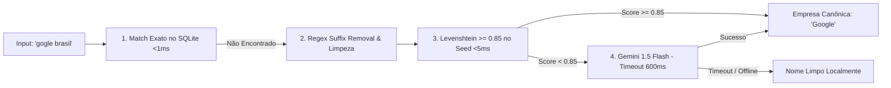

# Spec 05: Firestore, Cloud Architecture & TV Dashboard

> **Status:** ESPECIFICAÇÃO REFINADA & BLINDADA  
> **Objetivo:** Definir a infraestrutura em Google Cloud Platform (Firestore), a gravação segura exclusiva via Firebase Admin SDK no Daemon, o pipeline híbrido de normalização de empresas (SQLite Seed + Levenshtein + Gemini Flash 600ms), e a aplicação de Leaderboard em tempo real para a TV do estande.

---

## 1. Arquitetura de Nuvem e Gravação Segura

```mermaid
graph TD
    subgraph Host_Machine [Mesma Máquina Host - Dual Head]
        subgraph Display_1 [Display 1: Jogador]
            GAME_CLIENT[Phaser.js Game App]
        end
        subgraph Local_Daemon [Local Bridge Daemon :3000]
            BRIDGE_API[Daemon API Endpoint: /api/match/submit]
            SQLITE_BUFFER[(SQLite: matches_buffer & seed_companies)]
            FIREBASE_ADMIN[Firebase Admin SDK Service]
        end
        subgraph Display_2 [Display 2: TV Pública]
            LEAD_WEB[Leaderboard Web App em Kiosk Mode]
        end
    end

    subgraph GCP_Cloud [Google Cloud Platform]
        GEMINI_API[Gemini 1.5 Flash API]
        FIRESTORE[(Cloud Firestore Native Mode)]
    end

    GAME_CLIENT -->|1. Envia Telemetria via localhost| BRIDGE_API
    BRIDGE_API -->|2. Grava no Buffer Local| SQLITE_BUFFER
    BRIDGE_API -->|3. Normaliza Empresa (Fuzzy / Gemini)| GEMINI_API
    BRIDGE_API -->|4. Gravação Segura via Admin SDK| FIREBASE_ADMIN
    FIREBASE_ADMIN -->|5. Grava Documento match_id| FIRESTORE
    FIRESTORE -->|6. onSnapshot Realtime Stream| LEAD_WEB
```

---

## 2. Pipeline Híbrido de Normalização de Empresas

Para garantir que variações de digitação (ex: `"Google"`, `"google"`, `"Google Brasil"`, `"Gooogle"`) sejam unificadas no placar corporativo:



### 2.1. Componentes do Pipeline
1. **`seed_companies.json` & Cache SQLite:** O banco local inicia populado com as 40 maiores empresas patrocinadoras e participantes do Google Cloud Summit Brasil.
2. **Sanitização Regex:** Remoção de pontuações e sufixos (`Ltda`, `S.A.`, `Inc`, `Corp`, `Brasil`, `Group`).
3. **Fuzzy Matching Local:** Comparação por distância de Levenshtein contra o catálogo de canônicas com limiar de similaridade $\ge 0.85$.
4. **Gemini 1.5 Flash Disambiguation:** Caso não atinja o limiar, dispara chamada assíncrona ao Gemini com timeout estrito de **600ms**. Se o Gemini demorar ou estiver offline, utiliza o nome limpo localmente sem bloquear o fluxo.

---

## 3. Modelagem de Dados no Cloud Firestore

### 3.1. Coleção `pilots` (`/pilots/{pilot_id}`)
```json
{
  "pilot_id": "uuid-v4",
  "callsign": "NeonFalcon",
  "company_raw": "Google Brasil",
  "company_canonical": "Google",
  "created_at": "Timestamp",
  "best_score": 18450,
  "matches_played": 1
}
```

### 3.2. Coleção `matches` (`/matches/{match_id}`)
- `match_id` gerado no início da partida e usado como chave primária determinística (garante idempotência contra duplicação).
```json
{
  "match_id": "match_uuid_12345",
  "pilot_id": "uuid-v4",
  "callsign": "NeonFalcon",
  "company_canonical": "Google",
  "final_score": 18450,
  "telemetry": {
    "duration_s": 84.2,
    "enemies_killed": 38,
    "boss_defeated": true,
    "damage_taken": 1,
    "accuracy_pct": 78.4
  },
  "ship_spec_snapshot": {},
  "created_at": "Timestamp"
}
```

### 3.3. Coleção `company_rankings` (`/company_rankings/{company_canonical}`)
Atualizado atomicamente via transação no Admin SDK:
```json
{
  "company_canonical": "Google",
  "total_score": 54200,
  "pilots_count": 4,
  "top_individual_score": 18450,
  "last_updated": "Timestamp"
}
```

---

## 4. Interface do Leaderboard na TV (Display 2)
- [ ] **Colunas Dinâmicas:**
  - **Hall da Fama (Top 10 Individual):** Posição, Troféu Arcade, Callsign, Empresa Canônica, Pontuação e ícone da nave gerada.
  - **Batalha Corporativa (Top 5 Empresas):** Ranking por pontuação total acumulada com barras neon proporcionais.
  - **Ticker Inferior (Recent Flights):** Feed deslizante em tempo real com os últimos participantes que concluíram o voo.
- [ ] **Efeitos de Novo Recorde:**
  - Animação de celebração em tela cheia com partículas neon e efeito sonoro sutil quando alguém assume o Top 3 do dia.
- [ ] **Sincronização em Tempo Real:** Conexão direta via listener `onSnapshot` com latência $< 500$ms.

---

## 5. Critérios de Aceitação Deste Módulo
- [ ] O cliente Web NUNCA grava diretamente no Firestore (todas as escritas passam pelo Admin SDK com validação de assinatura).
- [ ] A normalização de empresas resolve 95%+ dos typos comuns em menos de 5ms localmente.
- [ ] O placar na TV reflete novas pontuações em menos de 1 segundo após o término da partida.
