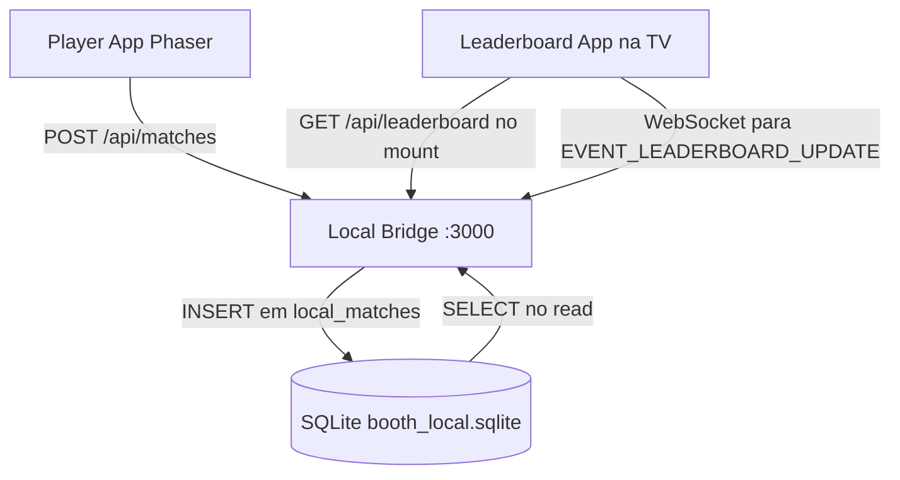
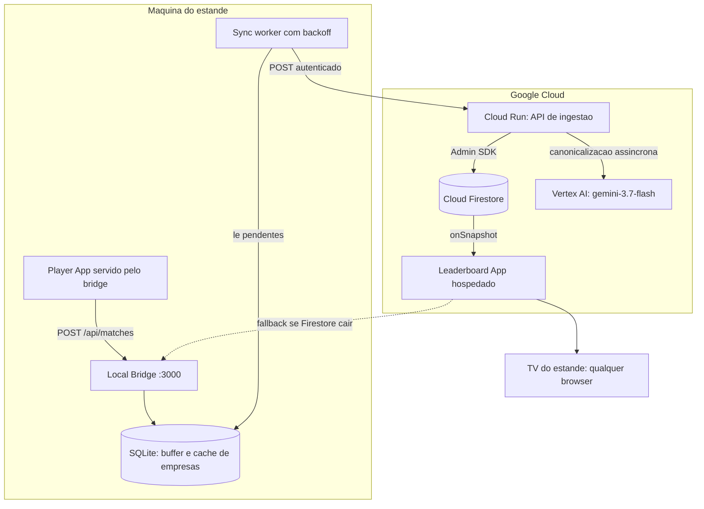

# Spec 05: Firestore, Nuvem e Placar da TV

> **Status:** RECONCILIADA COM A IMPLEMENTAÇÃO — 2026-08-22 (revisão de entrada da Fase C)
> **Objetivo:** Definir a persistência em nuvem, o pipeline de normalização de empresas e o placar
> público da TV, sobre a topologia decidida na [Spec 08](./08_DEPLOYMENT_TOPOLOGY_AND_CLOUD_SPLIT.md).
> **Endereça:** U1, U2, D5, D6, D7 (ver [Spec 00](./00_AUDIT_AND_DRIFT_REPORT.md)).
> **Estado do subsistema:** o Firestore, o Firebase Admin SDK e todas as chamadas de modelo **não
> existem no repositório**. Esta especificação descreve o que existe hoje, e define o que construir.

---

## 1. Estado atual: tudo é local



O placar da TV consulta o mesmo daemon local, por `http://localhost:3000` fixo no código
(`packages/leaderboard-app/src/App.tsx:42,65`). Não há Firestore, não há `onSnapshot`, não há
credencial de nuvem em lugar nenhum. **U1** e **U2** são o subsistema inteiro.

> **Correção da topologia.** A versão anterior desta especificação colocava a TV na mesma máquina host
> em um arranjo *dual head*. A implementação usa **três superfícies** (**P2**) e a
> [Spec 08](./08_DEPLOYMENT_TOPOLOGY_AND_CLOUD_SPLIT.md) decide que o placar é **hospedado na nuvem**:
> é o componente com menos motivo para ser local e o que mais se beneficia de rodar em qualquer
> dispositivo com browser, inclusive um Chromecast ou a smart TV do estande.

---

## 2. Arquitetura-alvo



**Por que a escrita não vai direto do browser para o Firestore:** a regra de segurança da §6 nega toda
escrita de cliente. O score é calculado no cliente e portanto não é confiável; a API de ingestão no
Cloud Run é o ponto onde se aplica idempotência por `match_id`, validação de faixa de score e o
carimbo de tempo do servidor. É também onde vive a única credencial privilegiada do sistema — nunca no
estande.

**Por que o buffer SQLite permanece:** Wi-Fi de centro de convenções. O jogo nunca deve esperar pela
nuvem para exibir o resultado da partida. O caminho de escrita local é síncrono e imediato; a
sincronização é assíncrona e tolerante a falha. Ver §5.

---

## 3. Normalização de empresas

### 3.1. O que existe e funciona

O pipeline local está implementado e é melhor do que a especificação original descrevia:

1. **Cache de alias em SQLite** (`company_aliases`): resolução em uma consulta para qualquer entrada já
   vista. Todo resultado é gravado, então o segundo visitante da mesma empresa é instantâneo.
2. **`resolveCompanyFromCatalog`** (`packages/shared/src/utils/company-normalizer.ts:78`) faz quatro
   camadas em memória: match exato, remoção de sufixos corporativos por regex, containment, e
   Levenshtein com limiar de **0,80**.
3. **Autocomplete proativo** em `GET /api/companies`, que resolve a maior parte dos casos **antes** da
   digitação terminar — a melhor correção de typo é a que evita o typo.

O catálogo semeado tem **25 empresas**, não as 40 que a especificação afirmava
(`sqlite-buffer.ts:86-93`). Ampliá-lo com a lista real de patrocinadores e inscritos do evento é uma
tarefa de conteúdo, não de código, e deve acontecer na véspera.

> **Mudança da Tarefa C0b, 2026-08-22 — o catálogo sai do código-fonte.** Enquanto as 25 empresas
> forem um array literal dentro de `seedCanonicalCompanies()`, "tarefa de conteúdo" é mentira:
> mexer na lista na véspera do evento exige editar TypeScript, recompilar e reinstalar. A Tarefa C0b
> move a lista para **`config/companies.json`**, lida no boot do daemon, com override por
> `BOOTH_COMPANIES_FILE`. O array no código permanece apenas como fallback embutido para o caso de o
> arquivo não existir; um arquivo **malformado** é erro fatal de boot, não fallback silencioso —
> senão o operador edita o JSON, erra uma vírgula e joga o evento inteiro com o catálogo antigo sem
> perceber. A partir da Tarefa C7 o mesmo arquivo é editável pelo painel de administração.

**Endurecimento pequeno mas necessário — AINDA ABERTO em 2026-08-22:** `resolveCompany('')` retorna
`'Google'` (`sqlite-buffer.ts:222`). O formulário exige empresa preenchida, então o caminho só é
alcançável por chamada direta à API — mas o efeito, num evento do Google, é inflar o ranking
corporativo do próprio anfitrião. O default correto é `'Independente'` ou rejeitar a requisição.
Alocado à **Tarefa C0** do [plano](./10_IMPLEMENTATION_PLAN.md).

### 3.2. O que falta: desambiguação por modelo

> **Correção.** A especificação original previa **Gemini 1.5 Flash com timeout de 600ms** no caminho
> síncrono de registro. Duas mudanças:
>
> - O modelo é **`gemini-3.7-flash`**, consumido exclusivamente via **Vertex AI / Gemini Enterprise
>   Agent Platform**, com autenticação por ADC ou conta de serviço. Não existe chave de API de modelo
>   em nenhum ponto deste sistema.
> - A chamada **sai do caminho síncrono**. Um orçamento de 600ms para uma ida e volta de LLM em Wi-Fi
>   de evento é otimista a ponto de ser inútil: ou o timeout dispara quase sempre e a chamada é
>   decorativa, ou ele não dispara e o visitante espera na tela de registro.

**Desenho adotado — canonicalização assíncrona com backfill:**

1. O registro grava `company_raw` e a melhor resolução **local** como `company_canonical`. O visitante
   nunca espera. Esse é o caminho crítico, e ele já resolve a grande maioria dos casos.
2. Quando a resolução local tem confiança baixa, o registro é marcado para revisão e enfileirado.
3. Na nuvem, um handler chama `gemini-3.7-flash` para desambiguar o lote, com o catálogo canônico no
   prompt e resposta em JSON estruturado.
4. Se o modelo devolver uma canônica diferente e com confiança suficiente, o documento em `matches` é
   atualizado, o agregado em `company_rankings` é corrigido por transação, e o alias volta para o
   catálogo — de modo que o próximo visitante da mesma empresa resolve localmente em 1ms.

O placar na TV corrige o nome alguns segundos depois. É aceitável, e é a única forma de ter tanto
resposta instantânea quanto desambiguação por modelo.

**Moderação de conteúdo é o caso oposto** e permanece **bloqueante**: um callsign ofensivo no telão é
um incidente, e vale esperar. O filtro determinístico atual roda primeiro e decide sozinho na
maioria dos casos; a chamada ao modelo só entra na dúvida, com **falha fechada** — na dúvida, o
codinome não vai para o telão. Ver [Spec 06](./06_RELIABILITY_FAILOVER_AND_SECURITY_SPEC.md).

> **Correção, 2026-08-24 (Gate M3, contra o projeto real).** Duas afirmações desta seção descreviam
> um desenho que não sobreviveu ao primeiro contato com a nuvem real, e foram substituídas acima.
>
> **"Timeout curto"** era 1500ms, no daemon e na `cloud-api`. Medido ao vivo, o `gemini-3.7-flash`
> no endpoint `global` leva **2,7s a 3,6s** saindo de `southamerica-east1`, mesmo com
> `thinkingLevel: 'low'`. Pior: os dois tetos eram *iguais*, e o cronômetro do daemon começa antes
> do hop até o Cloud Run — o abort local sempre vencia, então o `block` por timeout que a falha
> fechada existe para emitir **nunca chegava ao daemon**. Chegava como abort, virava `unavailable`,
> e caía no fail-open. A política estava invertida no seu exato oposto, e nenhum callsign jamais
> tinha sido visto pelo modelo. Tetos hoje: **8000ms** no servidor, **10000ms** no daemon, nessa
> ordem obrigatória (ver os comentários nos dois `.env.example`).
>
> **"Rejeita e pede outro callsign"** nunca existiu na interface. O `422 callsign_rejected` chegava
> ao `player-app` como um `!res.ok` genérico, virava *"Não foi possível conectar ao servidor da
> Forja. Verifique a conexão"*, e deixava o visitante numa tela onde o codinome nem é editável (ele
> fica duas telas atrás). Por decisão do operador, o `block` da camada 2 agora **sanitiza para
> `PILOTO_###`**, exatamente como a camada 1 já faz com palavrão. O objetivo desta seção — nome
> ofensivo não chega ao telão — continua cumprido; o que muda é que o visitante não trava. Efeito
> colateral bem-vindo: sem o 422, ninguém mapeia por tentativa e erro onde fica a fronteira do
> modelo.

### 3.3. Moderação do campo empresa — lacuna encontrada em 2026-08-22

A moderação descrita acima cobre **só o callsign**. `validateCallsign` é chamada em dois pontos
(`daemon/src/index.ts:194` e `RegistrationForm.tsx:38`) e nenhum deles olha para o campo empresa.

Isso importa porque o campo empresa **não é uma lista fechada**. A quinta camada de
`resolveCompanyFromCatalog` é `matchedBy: 'fallback'`: quando nada casa no catálogo, a resposta é o
texto do visitante em Title Case. O comportamento é intencional e testado
(`packages/shared/src/moderation.test.ts:82` afirma que `'startup do joao'` vira `'Startup Do Joao'`)
— é o que permite a alguém de uma empresa não cadastrada aparecer no placar com o nome certo. Mas o
mesmo caminho leva texto arbitrário ao telão, e ao ranking corporativo, sem passar por filtro nenhum.

**Decisão (Tarefa C0b): reusar a camada 1, e só no caminho `fallback`.** Quando a resolução casou com
o catálogo, o texto exibido é o do catálogo — moderá-lo seria moderar a nossa própria lista. Só o
`fallback` devolve texto do visitante, e só ele precisa de filtro. Da `validateCallsign` aproveita-se
**apenas o motivo `profanity`**: comprimento, charset e repetição rejeitariam `Magazine Luiza`, `CI&T`
e outros nomes legítimos. Reprovado vira `'Independente'` e entra no cache de alias, para não pagar a
checagem duas vezes.

> **Por que reusar e não escrever um segundo filtro.** Duas listas de palavras bloqueadas divergem —
> alguém adiciona um termo numa e esquece a outra, e o termo passa pelo campo que ninguém lembrava
> que existia. Uma lista, dois chamadores.

Estender a camada 2 (semântica, por `gemini-3.7-flash`) também ao campo empresa é **opcional na
Tarefa C4**, não obrigatório: diferente do callsign, aqui o pior caso já tem uma saída segura e
barata — `'Independente'`.

---

## 4. Modelo de dados no Firestore

> **Onde isto vive, decidido em 2026-08-22:** projeto `vibe-cabral`, **banco Firestore nomeado
> `jogo-navinha`**, região `southamerica-east1`. Não o `(default)`. O motivo é a regra catch-all da §6
> (`match /{document=**} { allow read, write: if false }`): publicá-la no `(default)` de um projeto
> que já hospeda outras coisas derrubaria o acesso delas. Um banco nomeado tem ruleset próprio, e a
> região fica perto do evento. Ver [Spec 08](./08_DEPLOYMENT_TOPOLOGY_AND_CLOUD_SPLIT.md) §6.3.

**Os três tipos são declarados uma única vez**, em `packages/shared/src/types/cloud.ts`, e importados
tanto pelo escritor (`cloud-api`) quanto pelo leitor (`leaderboard-app`). Nenhum app declara a própria
cópia — é o que faz o compilador, e não uma revisão humana, pegar deriva de schema.

### 4.1. `/matches/{match_id}`

`match_id` é gerado no início da partida e usado como chave, garantindo idempotência: o sync worker
pode reenviar o mesmo lote sem duplicar linhas no placar. **É um UUID v4**, nunca um timestamp — ver a
nota de `match_id` logo abaixo.

```json
{
  "schema_version": 1,
  "match_id": "3f2504e0-4f89-41d3-9a0c-0305e82c3301",
  "pilot_id": "uuid-v4",
  "callsign": "NeonFalcon",
  "company_raw": "Gooogle Brasil",
  "company_canonical": "Google",
  "company_confidence": 0.82,
  "final_score": 18450,
  "score_breakdown": {
    "combatScore": 4200, "bossBonus": 10000, "timeBonus": 800,
    "survivalBonus": 2400, "bossDamageBonus": 0, "bossPhaseBonus": 0,
    "synergyBonus": 2000, "mcpMultiplier": 1.10
  },
  "telemetry": {
    "duration_s": 84.2, "enemies_killed": 38, "boss_defeated": true,
    "damage_taken": 1, "accuracy_pct": 78.4, "shots_fired": 412, "shots_hit": 323,
    "fallback_used": false, "seed": 998877, "boss_ttk_s": 11.5, "min_fps": 58.7,
    "boss_damage_dealt": 800, "boss_phase_reached": 3
  },
  "ship_spec_snapshot": { },
  "created_at": "Timestamp do servidor"
}
```

> **O JSON acima é ilustrativo; a fonte da verdade são os tipos.** `ScoreBreakdown` e `MatchTelemetry`
> vivem em `packages/shared/src/types/ship.ts` e mudaram duas vezes durante a Fase B — `shots_hit` e
> `accuracy_pct` passaram a ser preenchidos de verdade, e `bossDamageBonus`/`bossPhaseBonus` nasceram
> com o crédito parcial de boss. `MatchDocument` os referencia por tipo, não por cópia, exatamente
> para que esta divergência não possa acontecer em código.

> **`schema_version` existe desde o primeiro documento gravado.** Custa um inteiro por documento e
> compra a capacidade de separar formas antigas das novas depois do evento, sem adivinhação.
> `telemetry` e `ship_spec_snapshot` são blobs aninhados que **ainda vão mudar** entre hoje e o
> evento; a alternativa a este campo é escrever um script de migração adivinhando pela presença de
> chaves. Convenção adotada do `duboc/gemini-com-pe`, que a documenta como a lição de um projeto onde
> ela faltou.

> **`match_id` é UUID v4, não timestamp.** Até 2026-08-22 o `player-app` gerava
> `match_${Date.now()}` (`App.tsx:114`). Como esse valor é a chave primária do SQLite **e** o ID do
> documento Firestore, ele é a idempotência inteira do sistema — e duas estações que terminam uma
> partida no mesmo milissegundo produzem a mesma chave. A escrita é `set()` idempotente por ID, então
> a segunda **sobrescreveria a primeira em silêncio**: sem erro, sem log, um visitante somem do placar.
> A Spec 08 §4 lista "múltiplas estações: consolida" como razão de existir desta topologia, o que
> torna a colisão um cenário previsto, não hipotético. Corrigido na **Tarefa C0**, obrigatoriamente
> antes da C2 — depois disso o ID está gravado no Firestore e trocá-lo vira migração.

> **~~[D5] `telemetry` e `ship_spec_snapshot` chegariam vazios.~~ Corrigido na Tarefa A7
> (Fase A).** O `player-app` calculava o breakdown completo em `MainGameScene` e enviava só score,
> callsign e empresa; `saveMatch` gravava `JSON.stringify(match.telemetry || {})` — literalmente `{}`
> para toda partida. O `pilot_id` era sintetizado como `pilot_${Date.now()}` a cada partida, então a
> coleção `pilots` não teria como existir. Hoje `pilot_id` é um `crypto.randomUUID()` criado uma vez
> no `App` e estável por toda a sessão (`App.tsx:28`), e a telemetria vai completa. Fica registrado
> porque era pré-requisito da Fase C: sincronizar `{}` para o Firestore não teria valor nenhum, e o
> dado é irrecuperável depois do evento.

### 4.2. `/pilots/{pilot_id}`

```json
{
  "schema_version": 1,
  "pilot_id": "uuid-v4",
  "callsign": "NeonFalcon",
  "company_canonical": "Google",
  "created_at": "Timestamp",
  "best_score": 18450,
  "matches_played": 1
}
```

O `pilot_id` é gerado uma vez no registro e propagado por toda a sessão — no `ship_spec`, na partida e
no envio. Sem isso, `matches_played` seria sempre 1. **Feito na Fase A**: `crypto.randomUUID()` no
`useState` inicial do `App` (`App.tsx:28`), estável enquanto a aba viver.

### 4.3. `/company_rankings/{company_canonical}`

```json
{
  "schema_version": 1,
  "company_canonical": "Google",
  "total_score": 54200,
  "pilots_count": 4,
  "top_individual_score": 18450,
  "last_updated": "Timestamp"
}
```

Atualizado por transação do Admin SDK no Cloud Run, junto com a escrita da partida. Nunca recalculado
por varredura da coleção `matches`.

**Corrigido em 2026-08-22 — atomicidade não é idempotência.** A redação anterior desta seção dizia que
"a transação é o que mantém o agregado consistente sob reenvio". Isso confunde duas propriedades
diferentes. Uma transação garante que `set(match)` e `increment(total_score, score)` aconteçam juntas
ou não aconteçam; ela **não** impede que o mesmo par aconteça duas vezes. Rodado duas vezes,
atomicamente, `total_score` conta em dobro — e `pilots_count` também.

E o reenvio não é hipotético, é **garantido pelo desenho**: a §5 manda marcar como sincronizada só a
partida que o servidor confirmou, então toda resposta perdida depois do commit (conexão cortada,
timeout do lado do estande, instância do Cloud Run reciclada) devolve o lote inteiro no ciclo
seguinte. Num soak de 100 partidas sobre Wi-Fi de evento, isso acontece. Como a §4.3 também proíbe
recálculo por varredura, o placar corporativo — o que o pessoal da empresa vai olhar — derivaria para
cima sem ter como ser reconciliado depois.

O mecanismo que de fato dá idempotência é um **pre-read dentro da mesma transação**:

> Ler `matches/{match_id}` **dentro** da transação. Se o documento já existir, gravar/atualizar a
> partida e **pular o incremento dos agregados**. Só incrementa quando a leitura prévia não encontrou
> nada.

Não é preciso uma coleção de reivindicações separada: `matches/{match_id}` **já é** o documento de
reivindicação, o que também é a razão de o `match_id` da §4.1 ter que ser um UUID. Implementado e
testado na **Tarefa C3**, com o teste explícito de enviar a mesma partida duas vezes e afirmar
`total_score` idêntico depois da segunda.

---

## 5. Buffer local e sincronização

A tabela `local_matches` já tem a coluna `synced_to_cloud`, e `getPendingMatches()` e
`markMatchSynced()` já existem (`sqlite-buffer.ts:322,338`). **O worker que os usaria não existe**
(**D10**, **U3**) — hoje são três peças de código morto que sugerem uma funcionalidade ausente.

O worker a construir:

- Roda no daemon, em intervalo fixo, e também logo após cada `POST /api/matches`.
- Lê até 50 pendentes, envia em lote para o Cloud Run com o token de ingestão de escopo único, e marca
  como sincronizadas apenas as que o servidor confirmou por `match_id`.
- Backoff exponencial com **teto no atraso, não na contagem** — uma partida nunca é descartada por
  excesso de tentativas; o que para de crescer é o intervalo entre elas. Log de contagem de pendentes:
  o `self_test.sh` da [Spec 06](./06_RELIABILITY_FAILOVER_AND_SECURITY_SPEC.md) reporta esse número,
  para que o staff perceba um acúmulo antes do fim do evento.
- **Distingue falha de rede de falha de autenticação.** Um `401`/`403` do endpoint de ingestão não é
  transitório: o token de escopo único expirou ou foi rotacionado, e todo retry vai falhar igual, para
  sempre, enquanto o backoff cresce em silêncio até o teto. Nesse caso o worker registra o estado como
  `auth_failed` em vez de `retrying`, e `GET /api/sync/status` o expõe distinguível do caso "sem rede"
  — as duas situações exigem ações opostas do staff (esperar vs. trocar o token). Ver **Tarefa C5**.
- **Nunca bloqueia** o caminho de resposta ao jogador.

> **Por que essas duas linhas estão aqui, 2026-08-22:** vieram do catálogo de defeitos de fila de
> upload do `duboc/gemini-com-pe`, um estande GCP em produção com o mesmo problema de campo. O
> análogo direto do defeito deles — URL assinada com TTL de 600s que expira e faz todo retry falhar
> identicamente — é o nosso token de ingestão. O resto do catálogo deles já estava coberto pelo
> desenho desta seção; estes dois itens não estavam.

> **~~[D9] O caminho do banco é relativo ao diretório de invocação.~~ Corrigido na Fase A.** O default
> era `'./booth_local.sqlite'`, enquanto o `USER_GUIDE.md` documentava
> `packages/daemon/data/booth_buffer.sqlite`. Iniciar o daemon de dois diretórios diferentes produzia
> dois bancos, e o segundo nascia vazio — placar zerado no meio do evento. Hoje `defaultDbPath()`
> resolve a partir da raiz do pacote e aceita `BOOTH_DB_PATH` como override.

> **~~[D6] O placar nasce com três pilotos fictícios.~~ Corrigido na Fase A.**
> `seedInitialLeaderboard()` inseria `CYBER_ACE` e outros dois sempre que a tabela estava vazia — ou
> seja, exatamente na primeira execução no estande, e eles apareciam no telão público. Hoje a semente
> só roda com `BOOTH_SEED_DEMO=1`. O `self_test.sh` ainda deve falhar se qualquer `match_id`
> começando com `seed_` existir no banco — isso continua sendo trabalho da Tarefa D3.

---

## 6. Segurança

- **Nenhum cliente escreve no Firestore.** As regras negam `write` em todas as coleções. `matches`,
  `pilots` e `company_rankings` são legíveis publicamente — o placar precisa disso e os dados são
  callsign, empresa e pontuação, exibidos num telão de qualquer forma.
- **A regra catch-all final é `match /{document=**} { allow read, write: if false; }`** — nega tudo o
  que não foi explicitamente permitido acima. É por causa dela que o banco é **nomeado**
  (`jogo-navinha`) e não o `(default)`: um ruleset é publicado por banco, e publicar este no
  `(default)` de `vibe-cabral` derrubaria o acesso de tudo o mais que já vive lá.
- **A credencial do Admin SDK vive apenas no Cloud Run**, via identidade de serviço. Nenhum arquivo de
  chave é copiado para a máquina do estande.
- **O estande recebe um token de escopo único** para o endpoint de ingestão, rotacionável sem tocar em
  nada além da variável de ambiente do daemon.
- **Nenhuma chave de API de modelo existe.** Todo acesso a `gemini-3.7-flash` é via Vertex AI com
  credencial de serviço, e acontece **somente** no Cloud Run.

Detalhamento completo do modelo de credenciais na
[Spec 08](./08_DEPLOYMENT_TOPOLOGY_AND_CLOUD_SPLIT.md) §6.

---

## 7. Placar da TV

O app existe e está completo em termos de UI: `HallOfFame`, `CompanyDominance`, `LiveTickerFeed`,
`RecordCelebrationModal` e `AttractQrCode`. O que muda é a fonte de dados.

- **Top 10 individual:** posição, troféu, callsign, empresa canônica, pontuação.
- **Top 5 corporativo:** barras neon proporcionais ao `total_score`.
- **Ticker inferior:** últimos voos concluídos, em tempo real.
- **Celebração de recorde:** animação em tela cheia ao entrar no Top 3 do dia.

Mudanças necessárias:

1. **[D7] Remover o `localhost:3000` fixo.** Origem por `import.meta.env`, com build de nuvem apontando
   para o Firestore e build local apontando para o bridge.
2. **Assinatura `onSnapshot`** em `matches` e `company_rankings`, substituindo o `fetch` de montagem
   mais WebSocket.
3. **Fallback para o bridge local** quando o Firestore estiver inacessível por mais de alguns segundos,
   com um indicador discreto de "modo local" na tela. Um telão congelado é pior que um telão
   ligeiramente desatualizado.
4. O canal WebSocket local passa a se chamar `/events` — ver
   [Spec 03](./03_AGY_HARNESS_AND_INTEGRATION_SPEC.md) §2.2.

> **Plano B nomeado para o item 2, caso a leitura pública vire um problema:** trocar o `onSnapshot`
> por *polling* de 1,5s contra um endpoint `GET /v1/rankings` do próprio Cloud Run. Some a leitura
> pública do Firestore e o project ID do bundle do telão, ao custo de latência e de um endpoint a
> mais. Fica registrado porque o `duboc/gemini-com-pe` roda exatamente assim em produção — não é
> especulação, é uma troca de poucas horas com precedente. **Não é o plano A**: `onSnapshot` dá
> latência melhor no telão, o fallback local já está desenhado, e os dados expostos são os mesmos que
> ficam num telão à vista de todos.

---

## 8. Critérios de aceitação

- [ ] Nenhuma escrita de cliente é aceita pelo Firestore; o teste é tentar uma e receber `PERMISSION_DENIED`.
- [ ] Uma partida concluída aparece no telão em menos de 1s com conectividade normal.
- [ ] `telemetry` e `ship_spec_snapshot` chegam ao Firestore **preenchidos**, e `pilot_id` é estável
      entre o registro e a partida.
- [ ] **Reenviar o mesmo `match_id` duas vezes deixa `company_rankings.total_score` e `pilots_count`
      idênticos** — o teste de idempotência da §4.3, na Tarefa C3.
- [ ] **Todo `match_id` gravado casa com o formato UUID v4**, e duas partidas terminadas no mesmo
      milissegundo têm IDs diferentes.
- [ ] **Todo documento gravado tem `schema_version: 1`.**
- [ ] Desligar o Wi-Fi durante uma partida não perde nenhum resultado: ao reconectar, o worker
      sincroniza o pendente e o telão se atualiza. Este é o gate **M3**.
- [ ] **Um token de ingestão inválido produz estado `auth_failed` distinguível em
      `GET /api/sync/status`**, e não um backoff crescendo em silêncio.
- [ ] Nenhum registro `seed_` existe no banco do estande.
- [ ] A normalização resolve os typos comuns em menos de 5ms localmente, sem nenhuma chamada de rede no
      caminho crítico do registro.
- [ ] `resolveCompany('')` não devolve `'Google'` — nem no daemon, nem em
      `resolveCompanyFromCatalog`.
- [ ] **Uma empresa ofensiva digitada à mão vira `'Independente'` no telão**, e um nome legítimo com
      caractere incomum (`CI&T`) ou duas palavras (`Magazine Luiza`) **não** é afetado.
- [ ] **Acrescentar uma empresa a `config/companies.json` e reiniciar o daemon faz o nome aparecer no
      autocomplete**, sem recompilar nada.
- [ ] `grep -rn "localhost:3000" packages/*/src` não retorna nada.
- [ ] `grep -rn "interface MatchDocument" packages/*/src` retorna **exatamente uma** ocorrência, em
      `packages/shared/src/types/cloud.ts`.
