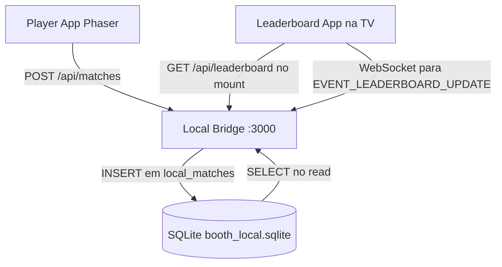

# Spec 05: Firestore, Nuvem e Placar da TV

> **Status:** RECONCILIADA COM A IMPLEMENTAÇÃO — 2026-08-10
> **Objetivo:** Definir a persistência em nuvem, o pipeline de normalização de empresas e o placar
> público da TV, sobre a topologia decidida na [Spec 08](./08_DEPLOYMENT_TOPOLOGY_AND_CLOUD_SPLIT.md).
> **Endereça:** U1, U2, D5, D6, D7 (ver [Spec 00](./00_AUDIT_AND_DRIFT_REPORT.md)).
> **Estado do subsistema:** o Firestore, o Firebase Admin SDK e todas as chamadas de modelo **não
> existem no repositório**. Esta especificação descreve o que existe hoje, e define o que construir.

---

## 1. Estado atual: tudo é local



O placar da TV consulta o mesmo daemon local, por `http://localhost:3000` fixo no código
(`packages/leaderboard-app/src/App.tsx:42,65`). Não há Firestore, não há `onSnapshot`, não há
credencial de nuvem em lugar nenhum. **U1** e **U2** são o subsistema inteiro.

> **Correção da topologia.** A versão anterior desta especificação colocava a TV na mesma máquina host
> em um arranjo *dual head*. A implementação usa **três superfícies** (**P2**) e a
> [Spec 08](./08_DEPLOYMENT_TOPOLOGY_AND_CLOUD_SPLIT.md) decide que o placar é **hospedado na nuvem**:
> é o componente com menos motivo para ser local e o que mais se beneficia de rodar em qualquer
> dispositivo com browser, inclusive um Chromecast ou a smart TV do estande.

---

## 2. Arquitetura-alvo


**Por que a escrita não vai direto do browser para o Firestore:** a regra de segurança da §6 nega toda
escrita de cliente. O score é calculado no cliente e portanto não é confiável; a API de ingestão no
Cloud Run é o ponto onde se aplica idempotência por `match_id`, validação de faixa de score e o
carimbo de tempo do servidor. É também onde vive a única credencial privilegiada do sistema — nunca no
estande.

**Por que o buffer SQLite permanece:** Wi-Fi de centro de convenções. O jogo nunca deve esperar pela
nuvem para exibir o resultado da partida. O caminho de escrita local é síncrono e imediato; a
sincronização é assíncrona e tolerante a falha. Ver §5.

---

## 3. Normalização de empresas

### 3.1. O que existe e funciona

O pipeline local está implementado e é melhor do que a especificação original descrevia:

1. **Cache de alias em SQLite** (`company_aliases`): resolução em uma consulta para qualquer entrada já
   vista. Todo resultado é gravado, então o segundo visitante da mesma empresa é instantâneo.
2. **`resolveCompanyFromCatalog`** (`packages/shared/src/utils/company-normalizer.ts:78`) faz quatro
   camadas em memória: match exato, remoção de sufixos corporativos por regex, containment, e
   Levenshtein com limiar de **0,80**.
3. **Autocomplete proativo** em `GET /api/companies`, que resolve a maior parte dos casos **antes** da
   digitação terminar — a melhor correção de typo é a que evita o typo.

O catálogo semeado tem **25 empresas**, não as 40 que a especificação afirmava
(`sqlite-buffer.ts:86-93`). Ampliá-lo com a lista real de patrocinadores e inscritos do evento é uma
tarefa de conteúdo, não de código, e deve acontecer na véspera.

**Endurecimento pequeno mas necessário:** `resolveCompany('')` retorna `'Google'`
(`sqlite-buffer.ts:208`). O formulário exige empresa preenchida, então o caminho só é alcançável por
chamada direta à API — mas o efeito, num evento do Google, é inflar o ranking corporativo do próprio
anfitrião. O default correto é `'Independente'` ou rejeitar a requisição.

### 3.2. O que falta: desambiguação por modelo

> **Correção.** A especificação original previa **Gemini 1.5 Flash com timeout de 600ms** no caminho
> síncrono de registro. Duas mudanças:
>
> - O modelo é **`gemini-3.6-flash`**, consumido exclusivamente via **Vertex AI / Gemini Enterprise
>   Agent Platform**, com autenticação por ADC ou conta de serviço. Não existe chave de API de modelo
>   em nenhum ponto deste sistema.
> - A chamada **sai do caminho síncrono**. Um orçamento de 600ms para uma ida e volta de LLM em Wi-Fi
>   de evento é otimista a ponto de ser inútil: ou o timeout dispara quase sempre e a chamada é
>   decorativa, ou ele não dispara e o visitante espera na tela de registro.

**Desenho adotado — canonicalização assíncrona com backfill:**

1. O registro grava `company_raw` e a melhor resolução **local** como `company_canonical`. O visitante
   nunca espera. Esse é o caminho crítico, e ele já resolve a grande maioria dos casos.
2. Quando a resolução local tem confiança baixa, o registro é marcado para revisão e enfileirado.
3. Na nuvem, um handler chama `gemini-3.6-flash` para desambiguar o lote, com o catálogo canônico no
   prompt e resposta em JSON estruturado.
4. Se o modelo devolver uma canônica diferente e com confiança suficiente, o documento em `matches` é
   atualizado, o agregado em `company_rankings` é corrigido por transação, e o alias volta para o
   catálogo — de modo que o próximo visitante da mesma empresa resolve localmente em 1ms.

O placar na TV corrige o nome alguns segundos depois. É aceitável, e é a única forma de ter tanto
resposta instantânea quanto desambiguação por modelo.

**Moderação de conteúdo é o caso oposto** e permanece **bloqueante**: um callsign ofensivo no telão é
um incidente, e vale esperar. O filtro determinístico atual roda primeiro e decide sozinho na
maioria dos casos; a chamada ao modelo só entra na dúvida, com timeout curto e **falha fechada** —
na dúvida, rejeita e pede outro callsign. Ver [Spec 06](./06_RELIABILITY_FAILOVER_AND_SECURITY_SPEC.md).

---

## 4. Modelo de dados no Firestore

### 4.1. `/matches/{match_id}`

`match_id` é gerado no início da partida e usado como chave, garantindo idempotência: o sync worker
pode reenviar o mesmo lote sem duplicar linhas no placar.

```json
{
  "match_id": "match_uuid_12345",
  "pilot_id": "uuid-v4",
  "callsign": "NeonFalcon",
  "company_raw": "Gooogle Brasil",
  "company_canonical": "Google",
  "company_confidence": 0.82,
  "final_score": 18450,
  "score_breakdown": {
    "combatScore": 4200, "bossBonus": 10000, "timeBonus": 800,
    "survivalBonus": 2400, "synergyBonus": 2000, "mcpMultiplier": 1.10
  },
  "telemetry": {
    "duration_s": 84.2, "enemies_killed": 38, "boss_defeated": true,
    "damage_taken": 1, "accuracy_pct": 78.4, "shots_fired": 412
  },
  "ship_spec_snapshot": { },
  "created_at": "Timestamp do servidor"
}
```

> **[D5] Hoje `telemetry` e `ship_spec_snapshot` chegariam vazios.** O `player-app` calcula o
> breakdown completo e a telemetria em `MainGameScene`, e então `handleMatchComplete`
> (`packages/player-app/src/App.tsx:112-133`) envia apenas score, callsign e empresa. O `saveMatch`
> grava `JSON.stringify(match.telemetry || {})` — literalmente `{}` para toda partida
> (`sqlite-buffer.ts:245-246`). O `pilot_id` é sintetizado como `pilot_${Date.now()}` a cada partida,
> então a coleção `pilots` não tem como existir.
>
> Isso é irrecuperável depois do evento: os dados não estão em lugar nenhum de onde possam ser
> reconstruídos. Corrigir **antes** de qualquer trabalho de nuvem — sincronizar `{}` para o Firestore
> não tem valor. É a mesma correção que a [Spec 09](./09_GAME_BALANCE_AND_DEV_MODE.md) §6 precisa para
> alimentar o modelo de balanceamento com partidas reais.

### 4.2. `/pilots/{pilot_id}`

```json
{
  "pilot_id": "uuid-v4",
  "callsign": "NeonFalcon",
  "company_canonical": "Google",
  "created_at": "Timestamp",
  "best_score": 18450,
  "matches_played": 1
}
```

O `pilot_id` passa a ser gerado uma vez no registro e propagado por toda a sessão — no `ship_spec`, na
partida e no envio. Sem isso, `matches_played` é sempre 1.

### 4.3. `/company_rankings/{company_canonical}`

```json
{
  "company_canonical": "Google",
  "total_score": 54200,
  "pilots_count": 4,
  "top_individual_score": 18450,
  "last_updated": "Timestamp"
}
```

Atualizado por transação do Admin SDK no Cloud Run, junto com a escrita da partida. Nunca recalculado
por varredura da coleção `matches` — a transação é o que mantém o agregado consistente sob reenvio.

---

## 5. Buffer local e sincronização

A tabela `local_matches` já tem a coluna `synced_to_cloud`, e `getPendingMatches()` e
`markMatchSynced()` já existem (`sqlite-buffer.ts:322,338`). **O worker que os usaria não existe**
(**D10**, **U3**) — hoje são três peças de código morto que sugerem uma funcionalidade ausente.

O worker a construir:

- Roda no daemon, em intervalo fixo, e também logo após cada `POST /api/matches`.
- Lê até 50 pendentes, envia em lote para o Cloud Run com o token de ingestão de escopo único, e marca
  como sincronizadas apenas as que o servidor confirmou por `match_id`.
- Backoff exponencial com teto, e log de contagem de pendentes — o `self_test.sh` da
  [Spec 06](./06_RELIABILITY_FAILOVER_AND_SECURITY_SPEC.md) reporta esse número, para que o staff perceba um
  acúmulo antes do fim do evento.
- **Nunca bloqueia** o caminho de resposta ao jogador.

> **[D9] O caminho do banco é relativo ao diretório de invocação.** O default é `'./booth_local.sqlite'`
> (`sqlite-buffer.ts:46`), enquanto o `USER_GUIDE.md` documenta
> `packages/daemon/data/booth_buffer.sqlite`. Iniciar o daemon de dois diretórios diferentes produz dois
> bancos, e o segundo nasce vazio — com o placar zerado no meio do evento. O caminho passa a ser
> absoluto, derivado da raiz do pacote e sobrescrevível por variável de ambiente.

> **[D6] O placar nasce com três pilotos fictícios.** `seedInitialLeaderboard()`
> (`sqlite-buffer.ts:102`) insere `CYBER_ACE` e outros dois sempre que a tabela está vazia — ou seja,
> exatamente na primeira execução no estande. Eles aparecem no telão público. A semente deve ficar
> atrás de uma variável de ambiente de desenvolvimento, e o `self_test.sh` deve falhar se qualquer
> `match_id` começando com `seed_` existir no banco.

---

## 6. Segurança

- **Nenhum cliente escreve no Firestore.** As regras negam `write` em todas as coleções. `matches`,
  `pilots` e `company_rankings` são legíveis publicamente — o placar precisa disso e os dados são
  callsign, empresa e pontuação, exibidos num telão de qualquer forma.
- **A credencial do Admin SDK vive apenas no Cloud Run**, via identidade de serviço. Nenhum arquivo de
  chave é copiado para a máquina do estande.
- **O estande recebe um token de escopo único** para o endpoint de ingestão, rotacionável sem tocar em
  nada além da variável de ambiente do daemon.
- **Nenhuma chave de API de modelo existe.** Todo acesso a `gemini-3.6-flash` é via Vertex AI com
  credencial de serviço, e acontece **somente** no Cloud Run.

Detalhamento completo do modelo de credenciais na
[Spec 08](./08_DEPLOYMENT_TOPOLOGY_AND_CLOUD_SPLIT.md) §6.

---

## 7. Placar da TV

O app existe e está completo em termos de UI: `HallOfFame`, `CompanyDominance`, `LiveTickerFeed`,
`RecordCelebrationModal` e `AttractQrCode`. O que muda é a fonte de dados.

- **Top 10 individual:** posição, troféu, callsign, empresa canônica, pontuação.
- **Top 5 corporativo:** barras neon proporcionais ao `total_score`.
- **Ticker inferior:** últimos voos concluídos, em tempo real.
- **Celebração de recorde:** animação em tela cheia ao entrar no Top 3 do dia.

Mudanças necessárias:

1. **[D7] Remover o `localhost:3000` fixo.** Origem por `import.meta.env`, com build de nuvem apontando
   para o Firestore e build local apontando para o bridge.
2. **Assinatura `onSnapshot`** em `matches` e `company_rankings`, substituindo o `fetch` de montagem
   mais WebSocket.
3. **Fallback para o bridge local** quando o Firestore estiver inacessível por mais de alguns segundos,
   com um indicador discreto de "modo local" na tela. Um telão congelado é pior que um telão
   ligeiramente desatualizado.
4. O canal WebSocket local passa a se chamar `/events` — ver
   [Spec 03](./03_AGY_HARNESS_AND_INTEGRATION_SPEC.md) §2.2.

---

## 8. Critérios de aceitação

- [ ] Nenhuma escrita de cliente é aceita pelo Firestore; o teste é tentar uma e receber `PERMISSION_DENIED`.
- [ ] Uma partida concluída aparece no telão em menos de 1s com conectividade normal.
- [ ] `telemetry` e `ship_spec_snapshot` chegam ao Firestore **preenchidos**, e `pilot_id` é estável
      entre o registro e a partida.
- [ ] Desligar o Wi-Fi durante uma partida não perde nenhum resultado: ao reconectar, o worker
      sincroniza o pendente e o telão se atualiza. Este é o gate **M3**.
- [ ] Nenhum registro `seed_` existe no banco do estande.
- [ ] A normalização resolve os typos comuns em menos de 5ms localmente, sem nenhuma chamada de rede no
      caminho crítico do registro.
- [ ] `grep -rn "localhost:3000" packages/*/src` não retorna nada.
