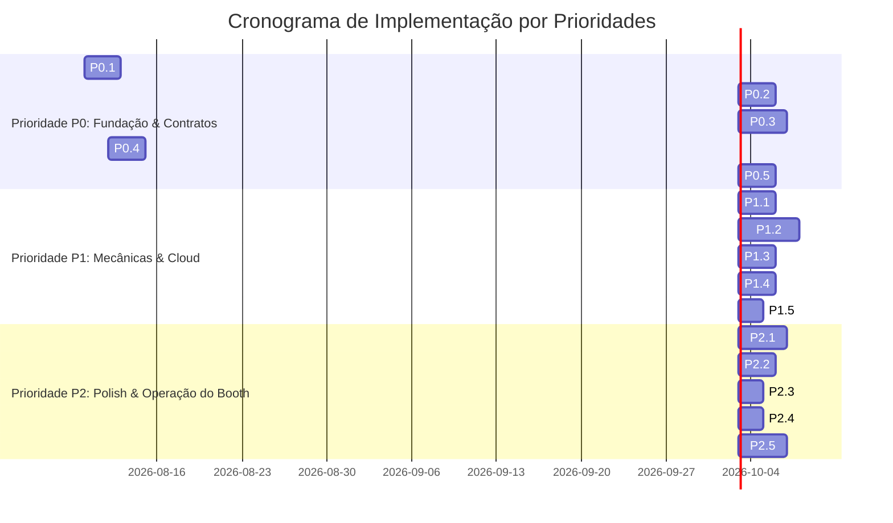

# Spec 07: Tech Stack, Implementation Roadmap & Validation Strategy

> **Status:** ESPECIFICAÇÃO REFINADA & BLINDADA  
> **Objetivo:** Definir a stack tecnológica oficial do projeto, o cronograma de implementação dividido por prioridades (P0, P1, P2), a estratégia de testes e simulações, e os critérios formais de aceitação (Definition of Done).

---

## 1. Stack Tecnológica Oficial

| Camada | Tecnologia | Justificativa Técnica |
| :--- | :--- | :--- |
| **Frontend (Player & Leaderboard)** | React 18 + TypeScript + Vite | Inicialização instantânea (<1s), tipagem estrita e reatividade. |
| **Estilização** | TailwindCSS + CRT/Neon Design System | Estética retrô-futurista responsiva com shaders arcade. |
| **Terminal Embutido** | `xterm.js` + `@xterm/addon-fit` | Renderização nativa de terminal no navegador sem troca de janelas do SO. |
| **Game Engine** | Phaser.js 3 (WebGL / Canvas 2D) | 60 FPS estáveis, física Arcade Physics e texturas dinâmicas em memória. |
| **Áudio** | Howler.js (Sound Sprites Atlas) | Latência zero, consumo mínimo de CPU e áudio pré-carregado. |
| **Local Bridge Daemon** | Node.js (TypeScript) + Express + `node-pty` | Gestão de sessão PTY, File Watcher com Chokidar e mocks MCP. |
| **Servidores MCP Mockados** | `@modelcontextprotocol/sdk` (Stdio) | Resposta local em $< 10$ms por tool sem chamadas externas. |
| **Persistência Local** | SQLite (`better-sqlite3`) | Buffer offline idempotente e catálogo canônico de empresas. |
| **Nuvem & Banco de Dados** | Google Cloud Firestore (Modo Nativo) | Sincronização em tempo real via listeners `onSnapshot`. |
| **Backend Cloud SDK** | Firebase Admin SDK (Node.js) | Gravações com assinatura segura exclusivas pelo daemon. |
| **Inteligência Artificial** | Gemini 1.5 Flash API | Moderação semântica e normalização de empresas em $< 600$ms. |

---

## 2. Roadmap de Implementação por Prioridades

---

## 3. Detalhamento dos Pacotes de Trabalho

### Prioridade P0: Fundação, Contratos & Bloqueadores
- [ ] **P0.1 Contrato Estrito:** Implementação do schema `ship_spec.json` e exportação dos tipos TypeScript compartilhados.
- [ ] **P0.2 Servidores MCP:** Implementação dos 3 mocks locais Stdio (`weapons-arsenal`, `hull-propulsion`, `cybernetics-shields`).
- [ ] **P0.3 Terminal Embutido:** Criação do endpoint WebSocket `/pty` e componente React com `xterm.js`.
- [ ] **P0.4 SQLite Local:** Setup das tabelas `canonical_companies`, `company_aliases_cache` e `local_matches_buffer`.
- [ ] **P0.5 ShipTextureFactory:** Pipeline de rasterização SVG $\rightarrow$ textura Phaser.js e colisão circular no cockpit.

### Prioridade P1: Mecânicas de Jogo, IA & Cloud
- [ ] **P1.1 Fast Grill-Me:** Configuração do prompt do `GEMINI.md` com caixas ANSI e 2 perguntas em 1 turno.
- [ ] **P1.2 Shmup Core & Boss:** Implementação dos 3 tipos de armas, 32 Drones, 6 Cruisers e o Boss com 2.000 HP em 3 fases.
- [ ] **P1.3 Normalizador de Empresas:** Pipeline de 3 etapas (SQLite Seed $\rightarrow$ Levenshtein $\rightarrow$ Gemini Flash 600ms).
- [ ] **P1.4 Firestore & Admin SDK:** Gravação assíncrona segura no Firestore e transações atômicas de score corporativo.
- [ ] **P1.5 Áudio:** Montagem do atlas de áudio no Howler.js e desbloqueio do `AudioContext` no primeiro clique.

### Prioridade P2: Telão TV, Scripts de Estande & Validação
- [ ] **P2.1 Leaderboard TV:** Visões Hall da Fama (Top 10), Batalha Corporativa e Recent Runs Ticker com `onSnapshot`.
- [ ] **P2.2 Scripts do Host Linux:** `setup_monitors.sh`, `launch_kiosks.sh` e `reset_booth.sh`.
- [ ] **P2.3 Reset Instantâneo:** Interceptação global de `Ctrl+Shift+F12` e limpeza de processos residuais.
- [ ] **P2.4 Autoteste:** Script `./self_test.sh` para diagnóstico automático matinal.
- [ ] **P2.5 Validação de SLA:** Simulação de 100 partidas consecutivas para validar estabilidade e tempo de ciclo $< 2\text{m}30\text{s}$.

---

## 4. Critérios de Aceitação para o Evento (Definition of Done)
1. **SLA Rígido:** Ciclo completo do participante entre 2m00s e 2m45s.
2. **Zero Janelas no SO:** 100% da experiência roda dentro do Chromium Kiosk com terminal `xterm.js` integrado.
3. **Determinismo:** 100% das naves geradas pelo AGY passam na validação do schema e são renderizadas sem erros visuais.
4. **Resiliência Offline:** Nenhuma perda de score em caso de queda de Wi-Fi durante o evento.
5. **Estabilidade Contínua:** Capacidade de operar 8 horas ininterruptas sem intervenção técnica manual.
