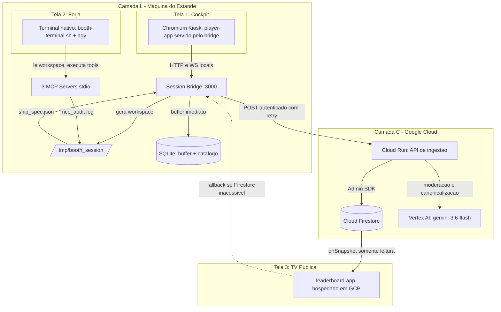

# Spec 08: Topologia de Implantação — Divisão Local vs. Google Cloud

> **Status:** ESPECIFICAÇÃO NOVA — decisão arquitetural
> **Objetivo:** Decidir o que roda na máquina do estande e o que roda em GCP, sob a restrição de que o
> hardware do evento **não está confirmado** e pode ser um Chromebook simples. Define o modelo de
> credenciais, o consumo de Gemini via Vertex AI, o comportamento sob queda de rede e a contingência
> caso o AGY não possa rodar localmente.
> **Endereça:** D7, U1, U2, e a reversibilidade de P1 (ver [Spec 00](./00_AUDIT_AND_DRIFT_REPORT.md)).

---

## 1. A Restrição Que Governa Tudo

A diretriz é **favorecer a nuvem**. Mas existe um limite físico: o Antigravity CLI é um binário de
linha de comando autenticado, que gera processos-filho stdio (os 3 servidores MCP) e escreve em um
sistema de arquivos compartilhado com eles. Nada disso existe dentro de um navegador.

Portanto a pergunta que define a topologia inteira não é "o que vai para a nuvem?", e sim:

> **Onde o `agy` executa?**

Todo o resto decorre dessa resposta, porque o daemon existe unicamente para gerar o workspace,
observar arquivos e matar o grupo de processos do AGY. **O daemon segue o AGY**; não é uma escolha
independente.

### 1.1. O argumento decisivo: degradação graciosa

Sob a política cloud-first, é tentador mover o AGY também. O contra-argumento é assimétrico:

| Componente na nuvem | Wi-Fi cai durante o evento |
| :--- | :--- |
| Leaderboard, Firestore, Gemini | Estande **continua jogável**; scores acumulam no buffer local e sincronizam depois. |
| **AGY / a Forja** | Estande **morre**. Ninguém constrói nave. Não há degradação possível — a forja É a experiência. |

Wi-Fi de centro de convenções é notoriamente instável. Manter o AGY local não contradiz a política
cloud-first: é o que permite que a política seja segura em todo o resto.

**Decisão: AGY permanece local (Topologia C, §4).** A contingência para hardware incapaz está em §7.

---

## 2. Classificação por Camada

### 2.1. Camada L — Obrigatoriamente local

| Componente | Por quê |
| :--- | :--- |
| Binário `agy` + autenticação | CLI de desktop; precisa de shell real e credencial de usuário. |
| 3 servidores MCP stdio | São processos-filho do AGY e compartilham seu sistema de arquivos. |
| `/tmp/booth_session` + file watcher | O AGY grava nele; observação remota exigiria sincronizar um sistema de arquivos. |
| Session bridge (o daemon atual) | Gera o workspace, observa, e mata o process group. Precisa estar no mesmo host. |
| Navegador Chromium em kiosk + teclado físico | Superfície de interação do visitante. |
| Buffer SQLite | Garantia de que nenhum score se perde offline. |
| **Servir o `player-app`** | Ver §5 — decisão derivada da restrição de rede local do Chrome. |

### 2.2. Camada C — Deve ir para GCP

| Componente | Serviço | Por quê |
| :--- | :--- | :--- |
| Persistência de partidas | Cloud Firestore (Native) | Fonte única entre estações e após o evento. |
| API de gravação | Cloud Run + Firebase Admin SDK | Mantém a credencial privilegiada fora do estande. |
| Moderação semântica de callsign | Cloud Run → Vertex AI | Sem chave de modelo na máquina do estande. |
| Canonicalização de empresa | Cloud Run → Vertex AI | Idem; assíncrona (§6.2). |
| `leaderboard-app` | Firebase Hosting ou Cloud Run | Pode ser aberto de qualquer tela, inclusive um Chromebook puro. |
| Painel de administração | Cloud Run | Milestone 3 do `USER_GUIDE`; naturalmente remoto. |

### 2.3. Diagrama da topologia recomendada

---

## 3. Requisito Mínimo da Máquina do Estande

Se a Camada L é local, o hardware precisa suportá-la. Este é o pedido a fazer aos organizadores:

- Arquitetura x86_64 ou Apple Silicon, **não ChromeOS puro**.
- 8 GB de RAM ou mais; GPU capaz de WebGL a 60 FPS em 1080p.
- Node.js 20.x ou 22.x LTS e shell real (bash/zsh).
- Permissão para instalar e **autenticar** o `agy`.
- Duas saídas de vídeo (Tela 1 do jogador + Tela 2 da forja). A TV pública **não** precisa sair desta
  máquina — sendo o leaderboard hospedado em GCP, qualquer dispositivo com navegador serve, inclusive
  um Chromebook.

> Um Chromebook sem ambiente Linux (Crostini) habilitado **não atende** a Camada L. Um Chromebook com
> Crostini é tecnicamente possível, mas não recomendado: o container adiciona uma camada de falha e
> desempenho de WebGL sob Crostini é irregular. Se essa for a única opção disponível, aplicar §7.

---

## 4. Alternativas Consideradas

| | **A — Tudo local** | **C — AGY local, resto na nuvem** ✅ | **B — AGY na nuvem** |
| :--- | :--- | :--- | :--- |
| Estado hoje | É o que existe | Alvo | Contingência |
| Hardware exigido | Máquina capaz | Máquina capaz | Só navegador |
| Sobrevive à queda de Wi-Fi | Sim, totalmente | Sim, joga e sincroniza depois | **Não** |
| Dados após o evento | Presos em um SQLite | Firestore | Firestore |
| Credencial sensível no estande | — | Nenhuma | Nenhuma |
| Múltiplas estações | Placar não consolida | Consolida | Consolida |
| Custo de infraestrutura | Zero | Desprezível (§8) | 1 VM por estação |
| Exige reverter P1 | Não | Não | **Sim** |

A Topologia A é o estado atual e falha no requisito de consolidação e de sobrevivência dos dados. A B
é analisada em §7. A **C** é a recomendada.

---

## 5. A Restrição de Rede Local do Chrome (bloqueio a verificar)

Uma página servida por HTTPS a partir da nuvem que faz `fetch` para `http://localhost:3000` esbarra em
duas políticas distintas do Chrome:

1. **Mixed content:** `localhost` e `127.0.0.1` são tratados como *potentially trustworthy origins*,
   então esse caso específico normalmente **não** é bloqueado como conteúdo misto.
2. **Private Network Access / Local Network Access:** requisições de um contexto público para um
   endereço local exigem preflight CORS com `Access-Control-Request-Private-Network` e, em versões
   recentes do Chrome, podem disparar **prompt de permissão ao usuário** — inaceitável em modo kiosk,
   onde não há ninguém para clicar.

Essa política vem mudando entre versões do Chrome, e o comportamento de `ws://localhost` a partir de
página HTTPS é ainda menos estável que o de `fetch`.

**Decisão:** não apostar nisso. O `player-app` é **servido pelo próprio session bridge** em
`http://localhost:3000`, tornando a origem local e a questão inexistente. É uma mudança pequena
(servir estáticos com `express.static` a partir do build do Vite) que elimina uma classe inteira de
falha em kiosk e ainda remove a necessidade de rodar o dev server do Vite no dia do evento.

O `leaderboard-app` **não** tem esse problema: ele fala com Firestore e Cloud Run, ambos públicos, e
por isso pode e deve ser hospedado.

**Verificação a executar mesmo assim** (10 minutos, no Gate M3): abrir o `leaderboard-app` hospedado e
confirmar no DevTools que seu fallback para o bridge local, quando acionado, não é bloqueado —
registrando a versão exata do Chrome usada. Se for bloqueado, o fallback passa a ser um snapshot em
cache no próprio Firestore em vez de uma chamada ao bridge.

---

## 6. Modelo de Credenciais e Consumo de Gemini

### 6.1. Regra de credenciais

- **Nenhuma chave de API de modelo, em nenhuma hipótese, na máquina do estande.**
- Gemini é consumido **exclusivamente via Vertex AI / Gemini Enterprise Agent Platform**, autenticado
  por ADC. Nunca a variante `ai.google.dev` com `GEMINI_API_KEY`.
- O Cloud Run roda com service account própria, com `roles/aiplatform.user` e acesso de escrita ao
  Firestore. A credencial do Admin SDK nunca sai da nuvem.
- O bridge do estande recebe apenas um **token de ingestão de escopo único**, válido só para o
  endpoint de gravação de partidas. Se a máquina for comprometida ou perdida, o token é revogado sem
  impacto em nada mais.
- Regras do Firestore: escrita negada a todos os clientes; leitura pública apenas em `matches`,
  `pilots` e `company_rankings`. Isso satisfaz o critério da Spec 05 §5.

### 6.2. Mapa de uso do `gemini-3.6-flash`

| Uso | Onde | Bloqueante? | Observação |
| :--- | :--- | :--- | :--- |
| Moderação semântica de callsign (camada 2) | Cloud Run | Sim, com timeout | A camada 1 (regex local) já rodou; se o Vertex não responder, a camada 1 prevalece e o fluxo segue. |
| Canonicalização de empresa | Cloud Run | **Não** | Ver abaixo. |
| Modelo da Forja | O próprio AGY | — | O `gemini-3.6-flash` é o modelo padrão do agente Antigravity; fixar explicitamente na configuração do harness se a CLI permitir. |
| Scoring de qualidade de prompt (L1, opcional) | Cloud Run | Não | Reabilita o requisito perdido; ver Spec 10, Fase E. |

**Sobre o timeout de 600ms da Spec 05 §2.1:** modelos Gemini 3.x têm *thinking* habilitado por padrão,
e 600ms é orçamento agressivo para um round-trip até o Vertex. Em vez de esticar o timeout — o que
atrasaria o SLA de 2m30s — a canonicalização passa a ser **assíncrona**: a partida é gravada
imediatamente com o nome limpo localmente, e um job de backfill reconcilia `company_canonical` depois.
O placar corporativo tolera segundos de atraso; o visitante não tolera esperar.

Os parâmetros exatos da API (valores de `thinking_level`, regiões suportadas) devem ser confirmados na
documentação vigente do Vertex no momento da implementação — a família 3.x removeu
`temperature`/`top_p`/`top_k` e substituiu `thinking_budget` por `thinking_level`.

---

## 7. Contingência: se o hardware for um Chromebook simples

Ativar apenas se §3 não for atendível. Move a Camada L para uma VM por estação:

- **`agy`, MCPs, workspace e bridge** migram para uma GCE VM pequena (ou Cloud Workstation) dedicada a
  cada estação de jogo.
- O terminal volta a ser **embutido no navegador** via `xterm.js` sobre WSS — ou seja, **P1 é
  revertido** e as Specs 01 §2.4 e 03 §1 originais voltam a valer, agora por um motivo diferente
  daquele pelo qual foram escritas.
- O WebSocket precisa de afinidade de sessão; Cloud Run com `--session-affinity` ou, preferencialmente,
  uma VM com IP estável por estação.

**Custo real desta contingência, a aceitar conscientemente:**

- A experiência inteira passa a depender da rede. Não há mais degradação graciosa (§1.1).
- Reintroduz `xterm.js` + `node-pty`, removidos em `4e1c75e` e `94d02a2`, junto com os problemas de
  foco de teclado que motivaram a remoção.
- Latência de digitação no terminal fica sujeita à rede do centro de convenções.
- Uma VM por estação de jogo, provisionada e autenticada antes do evento.

Por isso a recomendação é **negociar o hardware antes de aceitar esta contingência**. O pedido de §3 é
modesto e resolve o problema por completo.

---

## 8. Custo Estimado

Para um evento de 1 a 2 dias com ordem de 500 visitantes:

- **Firestore:** ordem de milhares de escritas e leituras. Dentro ou muito próximo do nível gratuito.
- **Cloud Run:** escala a zero fora do evento; alguns milhares de requisições. Centavos.
- **Vertex AI (`gemini-3.6-flash`):** entrada a US$ 1,50/1M tokens e saída a US$ 7,50/1M. Com ≈2
  chamadas curtas por visitante, o total do evento fica na casa de **menos de um dólar**.
- **Contingência §7:** 1 VM por estação, custo dominante desse cenário.

Custo não é fator de decisão aqui; disponibilidade e risco operacional são.

---

## 9. Comportamento Sob Falha de Rede

| Cenário | Resultado |
| :--- | :--- |
| Wi-Fi cai antes da partida | Registro, forja e jogo funcionam normalmente. Moderação recai na camada regex local; empresa usa o catálogo SQLite. |
| Wi-Fi cai durante a partida | Sem impacto. Score grava no SQLite com `synced_to_cloud = 0`. |
| Wi-Fi cai com fila de pendentes | Worker de sincronização (U3) reenvia com backoff exponencial. `match_id` é a chave primária, então o reenvio é idempotente. |
| Firestore inacessível para a TV | Leaderboard exibe o último snapshot e sinaliza estado degradado. |
| Cloud Run fora do ar | Idêntico à queda de Wi-Fi: buffer local absorve. |
| **AGY falha ou trava** | Timeout de 15s (D2) injeta preset de emergência. Não é uma falha de rede — é a razão pela qual o AGY fica local. |

---

## 10. Critérios de Aceitação

- [ ] Nenhuma credencial de service account ou chave de modelo reside na máquina do estande; apenas um
      token de ingestão de escopo único.
- [ ] Todo consumo de Gemini ocorre via Vertex AI com `gemini-3.6-flash`; nenhuma referência a
      `generativelanguage.googleapis.com` ou `GEMINI_API_KEY` existe no repositório.
- [ ] Nenhum cliente escreve diretamente no Firestore; toda escrita passa pelo Cloud Run (Spec 05 §5).
- [ ] Com o cabo de rede desconectado, um ciclo completo de visitante roda de ponta a ponta e o score
      aparece no Firestore em até 60s após a reconexão, sem duplicação.
- [ ] O `player-app` é servido pelo bridge local e não depende de nenhum dev server no dia do evento.
- [ ] O endereço de cada serviço vem de configuração, não de literal no código (fecha D7).
