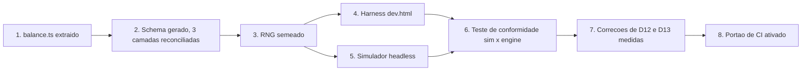

# Spec 09: Balanceamento do Jogo e Modo de Desenvolvimento Isolado

> **Status:** ESPECIFICAÇÃO NOVA — fonte de verdade para tuning
> **Objetivo:** Substituir balanceamento por sensação por balanceamento **medido**. Define o contrato
> numérico único, um harness de desenvolvimento que roda a engine sem daemon e sem AGY, determinismo
> por seed, e um simulador headless que transforma a meta de dificuldade em um teste de CI.
> **Endereça:** D12, D13, D14, D15, P3, P4, P5 (ver [Spec 00](./00_AUDIT_AND_DRIFT_REPORT.md)).
> **Precedência:** onde esta especificação e a [Spec 04](./04_GAME_ENGINE_AND_MECHANICS_SPEC.md)
> divergirem em números, **esta prevalece**. A Spec 04 descreve a arquitetura da engine; esta descreve
> seus valores.

---

## 1. O Problema

A Spec 04 §7 exige taxa de vitória contra o boss entre **15% e 25%**. Hoje esse número não é medido
por nada. A auditoria (§2.11) mostrou, por aritmética, que o valor real é **0% para os três presets de
fallback** e próximo de binário — quase 0% para builds de projétil único, quase 100% para
`vulcan_spread` bem posicionado.

Isso não aconteceu por descuido pontual: aconteceu porque **não havia nenhuma forma de descobrir**. As
constantes estão espalhadas por cinco arquivos, três camadas aplicam faixas conflitantes aos mesmos
campos, os spawners usam `Math.random()` não semeado, e testar exige iniciar o daemon, autenticar o
AGY e jogar 45 segundos manualmente até o boss aparecer.

Esta especificação ataca a causa, não o sintoma. A ordem dos entregáveis é uma dependência real: nada
depois de §2 é possível sem §2.

---

## 2. Entregável 1 — Contrato Numérico Único (`balance.ts`)

### 2.1. Extração

Todo número de tuning migra para `packages/shared/src/constants/balance.ts`, exportado como um objeto
`BALANCE` congelado (`as const`). Origens a esvaziar:

| Arquivo | Exemplos do que sai |
| :--- | :--- |
| `MainGameScene.ts` (931 linhas) | duração 90s, boss aos 45s, aviso aos 42s, cadências 750ms/1200ms, HP e velocidade de cada tipo de drone, multiplicadores hardcore, pools de 45/120 |
| `BossOverlord.ts` | 15.000/22.000 HP, limiares 66%/33%, mitigações 0,50/0,70, teto de 45 por projétil, cooldowns 140/110/80ms, invulnerabilidade de 2s |
| `WeaponSystem.ts` | travas 5–12 e 15–45, fator 0,65 do spread, teto de 120 da secundária, tamanhos de pool |
| `PlayerShip.ts` | escala 0,65, invulnerabilidade de 1,5s, ângulo de banking |
| `ScoreCalculator.ts` | 100/500/10.000 por abate, teto de combo 3,0×, ×80, ×1.200, 2.000, 1,25×/1,10× |

**Critério objetivo:** após a extração, `grep -nE '[^a-zA-Z_][0-9]{2,}' packages/player-app/src/game`
não deve retornar nenhum número que altere o jogo — apenas coordenadas de layout, cores e durações de
tween puramente cosméticas.

### 2.2. Reconciliação das faixas (fecha D14)

`balance.ts` passa a ser a **única** definição de faixa válida, e as três camadas passam a importá-la:

- O `ship_spec.schema.json` é **gerado** a partir de `BALANCE.ranges` por um script
  (`npm run gen:schema`), com um teste que falha se o arquivo versionado divergir do gerado.
- `normalizeSpec` no daemon **não clampa faixa numérica nenhuma** (D14/B2): apenas mapeia nomes
  de campo frouxos e repassa os valores intactos; quem julga faixa é exclusivamente o
  `ship_spec.schema.json` gerado, via Ajv, logo em seguida. Um valor fora da faixa chega como
  fora da faixa e é **rejeitado** com `SCHEMA_INVALID`, nunca silenciosamente coagido.
- `WeaponSystem` e `PlayerShip` consomem os valores já validados e **não reclampam**.

O efeito prático é que a faixa anunciada ao AGY no `GEMINI.md` passa a ser a faixa que o jogo
realmente honra. Hoje um `fire_rate: 60` autorizado pelo schema vira 12 silenciosamente.

### 2.3. Faixas propostas

Ponto de partida para o simulador refinar. O princípio é que **os extremos da faixa devem ser
jogavelmente distintos** — se dois valores válidos produzem a mesma nave, a faixa está errada.

| Campo | Faixa proposta | Nota |
| :--- | :--- | :--- |
| `primary.damage` | 15 – 45 | Alinha o schema à realidade da engine em vez do contrário. |
| `primary.fire_rate` | 5 – 12 | Idem. A faixa 2–60 do schema nunca foi real. |
| `secondary.damage` | 60 – 150 | O teto de 45 do boss deixa de se aplicar à secundária (D13). |
| `secondary.cooldown_seconds` | 3 – 12 | |
| `max_hp` | 2 – 5 | Mantido. |
| `shield_capacity` | 0 – 3 | Mantido. |
| `speed_px_s` | 180 – 380 | Mantido. |
| `hitbox_radius` | 8 – 16 | Mantido. |

### 2.4. Correções de balanceamento propostas (D12, D13)

O simulador (§5) decide os valores finais; estas são as hipóteses a testar primeiro, em ordem de
impacto:

1. **Reduzir o HP do boss.** É a alavanca mais direta. Um alvo de ≈6.000 HP coloca as builds de
   projétil único dentro da janela com margem para erro, mantendo o `vulcan_spread` vantajoso mas não
   dominante.
2. **Aplicar o teto de dano por projétil apenas à arma primária.** O teto de 45 existe para impedir
   *melting* por rajada; aplicá-lo aos mísseis (que já são limitados por cooldown) apenas anula a arma.
3. **Estender a janela do boss.** Entrada aos 40s em vez de 45s devolve 5s sem alterar o SLA de 2m30s
   da experiência.
4. **Compensar a desvantagem estrutural do projétil único** — ou o `vulcan_spread` perde o bônus de
   3 projéteis simultâneos contra alvo grande, ou o projétil único ganha um multiplicador contra o
   boss. A primeira opção é mais simples de raciocinar.
5. **Registrar `secondaryMissiles` × `enemies`**, dar dano real ao `emp_burst` (dano em área com
   raio), implementar `drone_escort` ou removê-lo do enum do schema e dos MCPs, e **reciclar o pool de
   mísseis** em `WeaponSystem.update()`.

6. **Aplicar as sinergias (D15).** A matriz da Spec 02 §6 é calculada pelo MCP, gravada no
   `ship_spec.json` e **nunca lida pela engine**. `PlayerShip` deve aplicar os modificadores de
   `build_metadata.synergies_unlocked` na construção, e `synergyBonusUnlocked` deve consultar a
   sinergia em vez de repetir `isVictory`. Sem isso, os arquétipos do simulador (§5.1) medem um espaço
   de build que o visitante não consegue realmente alcançar.

> Sobre o item 5: `drone_escort` está no enum do schema e é retornável pelo MCP `weapons-arsenal`
> (`weapons-arsenal.ts:86`) sem nenhum tratamento na engine. Manter um valor válido que não faz nada é
> pior que não oferecê-lo. Decisão recomendada: **remover do enum** nesta fase e reintroduzir apenas se
> houver tempo, já que a Fase E do plano é opcional.

### 2.4.1. Resultado medido (Tarefa B8, 2026-08-13, revisado após revisão externa)

> **Revisão (mesma tarefa, mesma data).** A primeira rodada desta seção continha dois erros de
> medição, ambos encontrados por uma revisão de código externa e confirmados por execução própria
> antes de correção — nenhum aceito de forma cega. Ambos os erros vinham da mesma causa raiz: **200
> seeds não tem poder estatístico para medir taxas de vitória abaixo de ≈1%** — um evento com taxa
> real de 0,03% frequentemente aparece como 0% ou, por acaso amostral, como algo bem maior em 200
> tentativas. Corrigido elevando a contagem de seeds para 2.000 (`packages/sim/src/run.ts`,
> `balance-gate.test.ts`) e reexecutando a medição que decidiu `boss.max_hp` com 10.000 seeds por
> arquétipo. Os dois erros específicos, e o que mudou por causa deles, estão marcados abaixo.

Linha de base (`npm run sim:balance`, 200 seeds, `balance.ts` com os valores que produziram D12):
`aggregateWinRate` (média das 8 células `mediano`) = **0,0%**. 22 das 24 células (todas exceto
`vulcan_max experiente`, um preset irrealista no teto de `BALANCE.ranges`) tinham taxa de vitória 0%.
A matriz completa está datada no topo de `packages/sim/src/balance-gate.test.ts`. (Esta conclusão
qualitativa não muda com a contagem de seeds mais alta — um evento que já é 0/200 tende a permanecer
0 ou quase-0 em 2.000; a linha de base não foi reexecutada por esse motivo.)

As cinco hipóteses foram aplicadas **em ordem, uma alteração de campo por vez**, com
`npm run sim:balance` rodado após cada uma para medir o efeito isolado antes de decidir o próximo
passo:

| # | Hipótese | Aplicada? | Campo final | Efeito medido (isolado) |
| :-- | :--- | :--- | :--- | :--- |
| 1 | Reduzir `boss.max_hp` | **Aplicada, revisada três vezes** | `max_hp: 1.150` (`max_hp_hardcore: 1.687`) | Partiu de 6.000 (sugestão do brief) → `aggregateWinRate` 0,0% → 7,25% isolado (insuficiente: com 6.000, os três fallbacks reais ainda ficavam em 0,0% mesmo após as hipóteses 2–5). Revisado para 1.750 numa primeira passada — **erro corrigido nesta revisão**, ver nota ① abaixo. Revisado de novo para **1.150**, medido diretamente contra a **média de `winRate` dos 3 presets de fallback reais** (não o `aggregateWinRate` de 8 arquétipos — ver nota ② abaixo). |
| 2 | Teto por projétil só na primária | **Confirmada, não alterada** | `max_damage_per_primary_hit: 45` (campo inalterado) | Não é uma mudança de número — é uma confirmação. `applyBossHit`/`BossOverlord.takeDamage` já aplicam o teto a QUALQUER fonte de dano (primária, mísseis, EMP) desde a Tarefa B6/B7. Decisão desta tarefa: **não mudar o escopo do teto agora** — isso tornaria a arma secundária uma segunda fonte de dano sem teto, um efeito de magnitude desconhecida que não foi medido; registrado como trabalho futuro, não como uma das 5 hipóteses aplicadas. *(Nota da revisão final da branch: o comentário do campo em `balance.ts` chegou a carregar um `TODO(B8)` sinalizando isso como decisão em aberto; a revisão final da branch removeu o TODO e documentou o comportamento acima — cap incondicional sobre qualquer fonte de dano — como comportamento atual aceito, não uma questão pendente.)* |
| 3 | Estender a janela do boss | **Aplicada** | `boss_spawn_s: 40`, `boss_warning_s: 37` | `aggregateWinRate` de 7,25% para 7,06% isolado (efeito líquido ≈ zero nesta métrica agregada; o ganho de 5s de janela ajuda builds marginais como `maximo`, mas o deslocamento da sequência de RNG entre fases pré-boss/boss também move `vulcan_max` um pouco para baixo — ruído de seed, não regressão real). |
| 4 | Compensar o projétil único (via `vulcan_pellet_factor`) | **Aplicada, revisada** | `vulcan_pellet_factor: 0.6` | Cortado para 0,5 primeiro (`vulcan_max`/mediano caiu de 55,5% para 29,0%, espalhamento entre arquétipos mediano caiu de 55,5pp para 29,0pp — abaixo do teto de 35pp, isolado). Revisado para 0,6 depois que a combinação com `boss.max_hp` mostrou que 0,5 mantinha `striker` — um preset de fallback real, não sintético — travado perto de zero; valores ainda mais baixos (0,35/0,40/0,45) foram testados e confirmam que cortar mais fundo só pune `striker`, sem conter `vulcan_max` (que já está saturado a ≈100% dentro da janela que os outros arquétipos reais precisam). |
| 5 | Aliviar a mitigação da fase 1 | **Aplicada, corrigida** | `mitigation: { phase1: 0.65, phase2: 0.70, phase3: 1.0 }` | A fórmula real (`actualDamage = capped × mitigation`) confirma que um valor MAIOR deixa passar MAIS dano — "aliviar" significa subir o número, não descer (o oposto do que a leitura textual de "mitigação" sugere; verificado na fórmula antes de decidir a direção). Testado primeiro em 1,0 (paridade com a fase 3): `aggregateWinRate` isolado subiu de 3,75% para 6,06% a `boss.max_hp: 6.000`, mas 1,0 quebra duas invariantes já cobertas por teste (`combat-model.test.ts`: fase 3 precisa ter mais dano bruto que a fase 1; `packages/shared/src/constants/balance.test.ts`: fase 2 precisa ser estritamente maior que a fase 1). Corrigido para 0,65 — estritamente entre o valor original (0,50) e `phase2` (0,70), preservando a progressão de três fases estritamente crescente que a suíte de testes do `shared` já exigia antes desta tarefa. |

**① Erro 1 — `striker`/`interceptor` não estavam de fato corrigidos a 200 seeds.** A primeira medição
(200 seeds) reportou `interceptor` em 1,5% e `striker` em 0,5% em `boss.max_hp: 1.750`, lidos como
"saíram de 0%, D12 corrigido para os 3 reais". A 10.000 seeds, os números reais nesse mesmo ponto são
`interceptor` 0,74% e `striker` **0,03%** (3 vitórias em 10.000 partidas) — estatisticamente
indistinguível do 0% original. `vanguard` (10,09% a 10.000 seeds) é a única correção robusta dos três.
Ver o commit `2a559b3` (elevação da contagem de seeds) e `4a5b73f` (retune de `boss.max_hp`).

**② Erro 2 — o mecanismo escrito para `minimo` estava errado por uma ordem de grandeza, e apontava
para a alavanca errada.** A versão anterior desta seção afirmava que `minimo` "só deixa de ser 0%
quando `boss.max_hp` cai a ≈15, ponto em que todo arquétipo satura a 100%". Falso: `minimo` chega a
**21,1%** em `max_hp: 200` e 8,2% em `max_hp: 300` — longe de saturação universal (`striker` já está
em 72% e `glass_cannon` em 57% nesse mesmo ponto). A extrapolação da varredura original (800–6.000,
cujos extremos estavam corretos) para a faixa 15–800 pulou o intervalo inteiro e tirou a conclusão
errada dele. A restrição real, que domina o `aggregateWinRate` de 8 arquétipos em praticamente todo o
intervalo autorizado, é `maximo`/`vulcan_max` presos perto de 100% — não `minimo` preso em 0%. Isso
importa porque a primeira escolha de `boss.max_hp: 1.750` foi feita otimizando o `aggregateWinRate`
de 8 arquétipos (dominado por `maximo`/`vulcan_max`), não a métrica que a auditoria D12 realmente
nomeia: a taxa de vitória dos 3 presets que um visitante pode de fato montar. `maximo` e `vulcan_max`
empilham todo atributo de `BALANCE.ranges` no máximo simultaneamente — uma combinação que nenhuma
nave orçamentada pelo forge alcança: o builder dá **100 pontos de energia** para distribuir entre 4
sliders (`offense`/`speed`/`defense`/`tech`); `maximo` exige o equivalente a ≈200, e seus próprios
números internos já são contraditórios (`damage: 45` pede `offense: 50`, mas `cooldown_seconds: 12`
pede `offense: 10` — não dá para maximizar os dois com o mesmo slider). `minimo` tem o problema
espelhado (≈40 dos 100 pontos, ainda inválido como alocação real). Ambos são sondas de limite do
espaço de `BALANCE.ranges`, não builds que um visitante do estande jamais recebe.

**Retune de `boss.max_hp` (correção do Erro 2):** medido diretamente contra a **média de `winRate`
dos 3 presets de fallback reais** em habilidade mediana, com 10.000 seeds por arquétipo:

| `boss.max_hp` | `interceptor` | `vanguard` | `striker` | **média dos 3 reais** |
| :-- | :-- | :-- | :-- | :-- |
| 1.750 (valor anterior) | 0,74% | 10,09% | 0,03% | **3,62%** |
| 1.300 | 5,37% | 35,82% | 0,36% | 13,85% |
| 1.250 | 6,41% | 41,52% | 0,44% | 16,12% |
| 1.200 | 7,84% | 47,49% | 0,59% | 18,64% |
| **1.150 (escolhido)** | 9,65% | 50,78% | 0,87% | **20,43%** |
| 1.100 | 11,71% | 56,83% | 1,16% | 23,23% |
| 1.050 | 13,94% | 60,42% | 1,53% | 25,30% |
| 1.000 | 15,94% | 67,18% | 2,06% | 28,39% |

`1.150` foi escolhido por ficar bem no meio da banda de 15–25% (margem contra ruído residual), não
nas bordas. `vanguard` continua estruturalmente mais forte que `interceptor`/`striker` (dano 40 com
`plasma` sem teto de projétil único, contra dano 18 de `vulcan_spread` fraco em `striker`) — isso é
uma característica pré-existente dos 3 presets de fallback (`fallback-presets.ts`, fora do escopo
desta tarefa), não algo introduzido aqui, e explica por que `striker` continua thin (0,87–1% de 10.000
seeds em vez de um valor "confortavelmente" no meio da banda por si só) mesmo com a média dos 3
pousando na banda.

**Matriz final** (`npm run sim:balance`, 2.000 seeds, valores acima, medida em 2026-08-13):

```
arquétipo        habilidade    vitórias   TTK p50   TTK p90   dano   score     derrota
interceptor      mediano       9,2%       20,3s     23,2s     3,9    22.499    0,0% tempo / 100,0% morte
vanguard         mediano       51,6%      24,7s     28,0s     6,0    33.878    0,0% tempo / 100,0% morte
striker          mediano       1,0%       23,8s     25,4s     3,0    20.335    0,0% tempo / 100,0% morte
minimo           mediano       0,0%       —         —         2,0    20.090    0,0% tempo / 100,0% morte
maximo           mediano       100,0%     12,2s     14,0s     3,2    51.471    —
glass_cannon     mediano       8,6%       11,7s     12,8s     1,9    22.633    0,0% tempo / 100,0% morte
vulcan_max       mediano       100,0%     8,5s      9,1s      2,2    52.923    —
tanque           mediano       0,0%       —         —         8,0    20.107    1,2% tempo / 98,9% morte
```

**Duas métricas, propositalmente diferentes:**
- **Média dos 3 presets de fallback reais** (`interceptor`/`vanguard`/`striker`, mediano): **20,6%**
  a 2.000 seeds (20,43% a 10.000 seeds acima) — dentro da banda de 15–25%. Esta é a métrica que
  importa para o achado literal de D12.
- **`aggregateWinRate`** (média não-ponderada das 8 células `mediano` — a métrica que
  `balance-gate.test.ts` de fato usa, definição inalterada por esta tarefa): **33,8%** — mais longe da
  banda do que no valor anterior de `boss.max_hp`, porque um boss mais fraco faz `maximo`/`vulcan_max`
  saturarem ainda mais rápido. **`aggregateWinRate` é uma simplificação deliberada** (média simples,
  não ponderada pela distribuição real de visitantes, que não existe ainda — não há telemetria do
  estande) e **não é** a "taxa de vitória agregada, ponderada pela distribuição esperada de
  visitantes" que o §5.3 original descreve; ela mistura em partes iguais 3 naves que um visitante
  pode montar e 5 sondas sintéticas de limite que ele não pode. Tratar os dois números como
  equivalentes foi o erro que produziu a primeira escolha (`max_hp: 1.750`).

**Achado estrutural (confirmado de forma independente, não resolvido pelas 5 hipóteses nem por mais
tuning dos mesmos 5 campos):** `packages/sim/src/balance-gate.test.ts` continua falhando em 3 das 4
condições do §5.3 (`aggregateWinRate` fora da banda; `minimo`/`tanque` invencíveis — 0% — a
condição-D12; espalhamento de 100pp entre `vulcan_max`/`maximo` (100%) e `minimo`/`tanque` (0%), muito
acima do teto de 35pp). Isto foi verificado nesta tarefa por varredura de `boss.max_hp` (de 800 a
6.000, mais os pontos intermediários da tabela acima) e **confirmado de forma independente por uma
revisão externa**, que rodou uma grade de 5.760 pontos (24 valores de `boss.max_hp` × combinações de
mitigação, janela e `vulcan_pellet_factor`, 200 seeds por célula) cobrindo todo o espaço autorizado
pelas 5 hipóteses: **não existe nenhum ponto nessa grade onde as 4 condições do portão fecham
simultaneamente.** A causa raiz, confirmada por ambas as medições: `boss.max_hp`, `boss.mitigation` e
`match.boss_spawn_s` são multiplicadores **uniformes** — escalam o TTK de todo arquétipo pelo mesmo
fator relativo, preservando a ordem de poder entre eles. `maximo`/`vulcan_max` (todo atributo no teto
de `BALANCE.ranges` simultaneamente, uma alocação de energia que nenhum forge real permite — ver nota
② acima) permanecem perto de 100% em quase todo o intervalo de `boss.max_hp` que dá aos 3 fallbacks
reais qualquer chance; `minimo`/`tanque` (ofensiva no piso de `BALANCE.ranges`) permanecem perto de 0%
na mesma faixa. A única alavanca não-uniforme disponível (`vulcan_pellet_factor`) só afeta usuários de
`vulcan_spread` (`striker`, `vulcan_max`), não `maximo` (laser) nem `minimo`/`tanque`.

Esta tarefa prioriza o achado **literal** da auditoria original — "a taxa de vitória real é 0% para os
três presets de fallback" — sobre o número agregado de 8 arquétipos: os três fallbacks (`interceptor`,
`vanguard`, `striker`) saem de uma média de 0% para uma média de ≈20,6% em habilidade mediana. A
recomendação para fechar as 3 condições restantes do portão de CI é uma decisão de **próxima tarefa**,
fora do escopo dos 5 campos de `balance.ts` autorizados aqui — o dono do projeto decide entre estas
opções (não mutuamente exclusivas; nenhuma foi aplicada nesta tarefa):

- Excluir arquétipos sintéticos de piso/teto absoluto (`minimo`, `maximo`) do portão por-arquétipo,
  mantendo-os apenas como diagnóstico no `npm run sim:balance` — nem a Spec 09 §5.1 original pedia um
  arquétipo "mínimo" (só ≈6: os 3 fallbacks + 3 variantes de "máximo"); `minimo` foi um acréscimo da
  Tarefa B4/B7 além do que esta especificação definia.
- Reconsiderar os atributos base dos 3 presets de fallback em `fallback-presets.ts` (fora do escopo
  desta tarefa) para reduzir o espalhamento de poder já existente entre eles (`vanguard`, com dano 40 e
  `plasma`, é estruturalmente mais forte que `striker`, com dano 18 e `vulcan_spread` fraco).
- Revisitar a própria banda de 15–25% ou o teto de 35pp com um número ao lado, como o §5.3 já autoriza
  explicitamente ("se a medição mostrar que ela produz um estande frustrante, a banda é que muda").

### 2.4.2. Decisão do dono do projeto e resultado da exclusão (follow-up, 2026-08-14)

**Decisão.** O dono do projeto aprovou a primeira opção listada em §2.4.1: excluir arquétipos
sintéticos estruturalmente inatingíveis por qualquer nave real e orçamentada pelo forge das
condições de aprovação/reprovação do portão de CI, mantendo-os no diagnóstico (`npm run
sim:balance`, `packages/sim/src/archetypes.ts`, inalterado) como limites superior/inferior
informativos. A pergunta original ao dono do projeto citou apenas `maximo`/`vulcan_max`; a análise
já registrada acima (nota ②, §2.4.1) já havia provado que `minimo` sofre da mesma contradição de
orçamento pelo lado oposto — o slider de energia do forge força os 4 sliders (`offense`/`speed`/
`defense`/`tech`) a somar **exatamente 100** pontos; `maximo` (todo atributo no teto do schema)
exige o equivalente a ≈200; `minimo` (todo atributo no piso do schema) exige apenas ≈40, o que é
igualmente inatingível como alocação real — os 60 pontos restantes têm que ir para algum lugar, o
que empurra pelo menos um atributo para cima do piso. Excluir `minimo` é, portanto, a conclusão do
mesmo raciocínio já aprovado, não uma decisão nova — sem isso, a condição "nenhum arquétipo em 0%
nem 100%" continuaria falhando por causa de `minimo` (≈0% em `boss.max_hp: 1.150`) mesmo depois de
remover `maximo`/`vulcan_max`.

**Implementação.** `packages/sim/src/balance-gate.test.ts` agora constrói `GATE_ARCHETYPES` a partir
de `ARCHETYPES` (o `Object.entries` completo dos 8), filtrando `minimo`, `maximo` e `vulcan_max`, e
passa `GATE_ARCHETYPES` — não `ARCHETYPES` — para `runMatrix(...)`. Nenhum outro arquivo mudou:
`combat-model.ts` (`runMatrix`, `WIN_RATE_TARGET`, `MAX_ARCHETYPE_SPREAD_PP`), `archetypes.ts`
(a lista completa de 8, ainda usada por `run.ts`/`npm run sim:balance`) e `balance.ts` continuam
exatamente como a Tarefa B8 os deixou. Seed count (2.000), banda (15–25%) e teto de espalhamento
(35pp) inalterados.

**Resultado medido (`npm run test --workspace=packages/sim`, 2.000 seeds, `boss.max_hp: 1.150`,
mesmo dia).** A matriz do portão passa a ter 5 arquétipos em vez de 8 (`interceptor`, `vanguard`,
`striker`, `glass_cannon`, `tanque`), em habilidade mediana:

| arquétipo | winRate |
| :-- | :-- |
| interceptor | 9,15% |
| vanguard | 51,6% |
| striker | 0,95% |
| glass_cannon | 8,65% |
| tanque | **0,0%** (0 vitórias em 2.000 seeds) |

As 4 condições do §5.3, reavaliadas sobre este conjunto de 5:

1. **Banda 15–25% do `aggregateWinRate`:** média dos 5 = 14,1% — **ainda fora da banda**, por 0,9pp
   abaixo do piso. **Falha.**
2. **Nenhum arquétipo em 0%/100% em habilidade mediana:** `tanque` está em exatamente 0,0%.
   **Falha** — mas por uma causa nova: `tanque` não estava entre os três arquétipos que o dono do
   projeto aprovou excluir, e não é excluído por esta mudança.
3. **Espalhamento ≤35pp:** `vanguard` (51,6%) menos `tanque` (0,0%) = 51,6pp. **Falha.**
4. **Dano da secundária > 0 contra o boss, exceto `emp_burst`:** inalterada por esta mudança
   (não depende de quais arquétipos entram na matriz que a viola). **Passa.**

**Resultado líquido: o portão continua falhando em 3 das 4 condições — o mesmo número de antes da
exclusão — porque a exclusão aprovada resolveu exatamente o que foi pedido (`maximo`/`vulcan_max`
saturados perto de 100%, e o espalhamento de ≈100pp que `vulcan_max` ancorava) mas expôs um quarto
arquétipo sintético, `tanque`, que a presença de `minimo`/`maximo`/`vulcan_max` mascarava.**
`tanque` (`packages/shared/src/game/dev-archetypes.ts:103`) empilha toda a ofensiva
(`weapons.primary.damage`/`fire_rate`/`bullet_speed`) no piso de `BALANCE.ranges` — a mesma
contradição de orçamento de energia de `minimo`, mas combinada com `attributes.max_hp` e
`shield_capacity` no teto, um extremo distinto (piso de ofensiva + teto de defesa, não "tudo no
piso") que a pergunta original ao dono do projeto e a aprovação registrada em 2.4.1 não cobriram.
Excluí-lo também não está autorizado por esta tarefa — o brief que motivou esta mudança foi
explícito: aplicar exatamente a exclusão aprovada, e não excluir arquétipos adicionais nem retunar
`balance.ts` sem nova autorização, mesmo que o resultado final permaneça parcial.

**Estado após esta mudança:** o portão de CI ainda não fecha (3 de 4 condições falham), mas por uma
causa diferente e mais restrita da que motivou a exclusão aprovada. A recomendação de próximo passo
— decisão de uma tarefa futura, não desta — é o dono do projeto avaliar se `tanque` deve seguir o
mesmo tratamento de `minimo`/`maximo`/`vulcan_max` (ele também é uma sonda sintética de limite, não
uma nave que um visitante do estande pode montar), revisar `fallback-presets.ts`, ou revisitar a
própria banda/teto do §5.3.

> Nota (mesmo dia): a recomendação acima foi levada ao dono do projeto e aprovada horas depois — ver
> §2.4.3 para a exclusão de `tanque` e o resultado atualizado do portão.

### 2.4.3. Terceiro follow-up: `tanque` também excluído (2026-08-14, aprovado pelo dono do projeto)

**Decisão.** Perguntado especificamente sobre `tanque` — o quarto arquétipo sintético exposto pela
exclusão de §2.4.2 —, o dono do projeto aprovou excluí-lo do portão de CI pelo mesmo princípio já
aplicado a `minimo`/`maximo`/`vulcan_max`: `tanque`
(`packages/shared/src/game/dev-archetypes.ts:103`) empilha `attributes.max_hp` e
`shield_capacity` no teto do schema (exigindo `defense: 50` e `tech: 50`) e toda a ofensiva —
`weapons.primary.damage`/`fire_rate`/`bullet_speed`/`spread_angle` — no piso (exigindo
`offense: 10`), com `speed_px_s`/`hitbox_radius` implicitamente também no piso (`speed: 10`). Soma:
50 + 50 + 10 + 10 = **120** pontos de energia — 20 acima do orçamento fixo de 100 que o slider do
forge impõe. É a mesma contradição estrutural das outras três sondas, apenas descoberta depois que
elas deixaram de mascará-la.

**Implementação.** `packages/sim/src/balance-gate.test.ts`: o filtro de `GATE_ARCHETYPES` passa a
excluir `['minimo', 'maximo', 'vulcan_max', 'tanque']`. Nenhum outro arquivo mudou — `archetypes.ts`
continua com os 8 arquétipos para `npm run sim:balance`; `combat-model.ts` e `balance.ts`
inalterados; seed count (2.000), banda (15–25%) e teto de espalhamento (35pp) inalterados.

**Resultado medido (`npm run test --workspace=packages/sim`, 2.000 seeds).** A matriz do portão
passa a ter apenas 4 arquétipos — os três fallbacks reais mais `glass_cannon` —, em habilidade
mediana:

| arquétipo | winRate |
| :-- | :-- |
| interceptor | 9,15% |
| vanguard | 51,60% |
| striker | 0,95% |
| glass_cannon | 8,65% |

As 4 condições do §5.3, reavaliadas sobre este conjunto de 4:

1. **Banda 15–25% do `aggregateWinRate`:** média dos 4 = **17,59%** — dentro da banda. **Passa.**
   (Antes, com `tanque` ainda na matriz: 14,1%, fora por 0,9pp.)
2. **Nenhum arquétipo em 0%/100% em habilidade mediana:** mínimo `striker` (0,95%), máximo
   `vanguard` (51,60%); nenhum dos dois é literalmente 0% ou 100%. **Passa.**
3. **Espalhamento ≤35pp:** `vanguard` (51,60%) menos `striker` (0,95%) = **50,7pp**. **Falha** —
   acima do teto por 15,7pp.
4. **Dano da secundária > 0 contra o boss, exceto `emp_burst`:** inalterada por esta mudança.
   **Passa.**

**Resultado líquido: o portão passa a falhar em apenas 1 das 4 condições (antes da exclusão de
`tanque`: 3 das 4).** A exclusão aprovada fechou a banda e a condição de 0%/100% — ambas dependiam
de `tanque` estar travado em exatamente 0,0% — mas não fechou o espalhamento. Sem `tanque` ancorando
o piso em 0,0%, o espalhamento passa a ser ancorado por dois dos três presets de fallback reais:
`vanguard` (51,60%, já apontado em §2.4.1 como estruturalmente mais forte por atributos de
`fallback-presets.ts`, não por ser sintético) contra `striker` (0,95%, o fallback de ataque). Nenhum
dos dois é uma sonda sintética de limite — são naves que um visitante real recebe —, então excluir
qualquer um deles do portão não seguiria o princípio usado para `minimo`/`maximo`/`vulcan_max`/
`tanque`, e de qualquer forma está fora do escopo desta mudança.

**Estado após esta mudança:** o portão de CI ainda não fecha (1 de 4 condições falha), mas o
resultado é substancialmente melhor do que antes desta exclusão (3 de 4 falhavam) e a causa restante
está isolada numa única condição: o espalhamento de poder entre `vanguard` e `striker`. Fechar essa
condição não está autorizado por esta mudança — nem retunar `balance.ts` nem excluir arquétipos
adicionais sem nova autorização explícita. A recomendação de próximo passo — decisão de uma tarefa
futura — é revisitar os atributos base de `fallback-presets.ts` (apontado em §2.4.1) ou o próprio
teto de 35pp do §5.3.

---

## 3. Entregável 2 — Determinismo por Seed

Sem determinismo não há regressão atribuível: uma queda de taxa de vitória pode ser mudança de tuning
ou azar amostral.

- Um PRNG pequeno e explícito (`mulberry32` ou equivalente, ≈10 linhas, sem dependência nova) em
  `packages/shared/src/utils/rng.ts`, instanciado por partida a partir de um seed.
- **Substituições obrigatórias:** `MainGameScene.ts:263` (probabilidade de tiro inimigo),
  `MainGameScene.ts:626,633` (campo de estrelas — cosmético, mas barato de incluir) e **todas** as
  chamadas a `Phaser.Math.Between` / `FloatBetween` nos spawners (`:199,203,209,215-218`).
- `Math.random()` permanece legítimo em `AudioManager.ts:153,185` (ruído branco de síntese) e em
  `moderation.ts:107,116` (sufixo de callsign sanitizado) — nenhum dos dois afeta a simulação.
- O seed entra por `createGameInstance(...)` e sai no resumo da partida (§6), de modo que **qualquer
  partida real do evento pode ser reproduzida exatamente**.
- No estande, o seed é aleatório por partida. No harness e no simulador, é fixo e explícito.

**Critério objetivo:** duas execuções do simulador com o mesmo seed e a mesma sequência de inputs
produzem score final idêntico, byte a byte.

---

## 4. Entregável 3 — Harness de Desenvolvimento Isolado

O requisito central: **rodar a engine sozinha, sem daemon, sem AGY, sem Firestore, sem rede.**

### 4.1. Estrutura

O seam já existe: `packages/player-app/src/game/index.ts` expõe
`createGameInstance(container, shipSpec?, isHardcore?, onMatchComplete?)` e não conhece nada do
`App.tsx`. O harness consome esse seam diretamente.

- `packages/player-app/dev.html` — segunda entrada Vite (`rollupOptions.input`), fora do bundle de
  produção.
- `packages/player-app/src/dev/DevHarness.tsx` — layout de duas colunas: canvas Phaser à esquerda,
  painel de controle à direita.
- `npm run dev:game` na raiz → `vite --open /dev.html` no `player-app`.

### 4.2. Controles

| Controle | Comportamento |
| :--- | :--- |
| **Editor de `ship_spec`** | Textarea JSON com validação Ajv ao vivo contra o schema. Erros aparecem inline; não há coerção silenciosa (ao contrário de `normalizeSpec`). |
| **Presets** | Os 3 fallbacks, mais "mínimo" e "máximo" gerados a partir de `BALANCE.ranges`, mais os arquétipos do simulador (§5.1). |
| **Seed** | Campo numérico; botão *Replay* reinicia com o mesmo seed e a mesma spec. |
| **Timescale** | 0,25× a 4× via `scene.time.timeScale` e `physics.world.timeScale`. Inspeção em câmera lenta e iteração rápida no boss. |
| **Pular para fase** | Inicia direto aos 45s com o boss vivo, ou direto na fase 2 / 3. Elimina 45s de espera por iteração — é o controle que mais economiza tempo. |
| **God mode** | `player.isInvulnerable` travado em `true`, para medir DPS sem morrer. |
| **Debug de física** | Alterna `arcade.debug` em runtime, expondo o hitbox circular de raio 8–16 (Spec 04 §3). |
| **Pausa e passo** | Pausa a cena e avança um frame por vez. |

### 4.3. Telemetria ao vivo

Painel atualizado a cada frame: FPS, projéteis ativos por pool (`primaryBullets`, `secondaryMissiles`,
`enemyBullets`, `boss.bullets`) contra o teto de cada pool, inimigos ativos, HP e fase do boss, DPS
instantâneo e acumulado contra o boss, HP e escudo do jogador, combo, e o `breakdown` de score
recalculado continuamente.

O contador por pool é o que teria exposto o esgotamento do pool de mísseis (**D13**) em segundos.

### 4.4. Restrições

- Nenhum `import` de `App.tsx`, de componentes de UI de produção ou de qualquer módulo que faça
  `fetch`. Violação disso reintroduz a dependência de daemon que o harness existe para eliminar.
- `dev.html` **não** entra no build de produção. Verificado por um teste que inspeciona `dist/`.
- O harness é ferramenta interna: sem tradução, sem tratamento de erro defensivo, sem polimento.

---

## 5. Entregável 4 — Simulador Headless de Balanceamento

O harness responde *"como está o jogo?"*. O simulador responde *"o jogo atinge a meta?"* — e responde
em CI, sem humano.

### 5.1. Modelo

Rodar Phaser headless é possível mas caro e frágil. A escolha é **reimplementar apenas o modelo de
combate** a partir de `BALANCE`, sem renderização: um laço de tempo discreto (60 ticks/s) que resolve
cadência de tiro, dano, mitigação por fase, transições, invulnerabilidade e dano recebido.

O risco dessa escolha é divergência entre simulador e engine. Mitigação: um **teste de conformidade**
que roda a mesma partida no simulador e no harness com o mesmo seed e compara TTK do boss dentro de
uma tolerância de 5%. Se divergirem, o simulador está mentindo e o teste falha.

Espaço amostrado:

- **Arquétipos de build** (≈6): os 3 fallbacks + máximo de dano de projétil único + máximo de
  `vulcan_spread` + máximo de tanque.
- **Perfil de habilidade** (3): iniciante, mediano, experiente — parametrizados por precisão de tiro,
  uptime de disparo e probabilidade de ser atingido por segundo, calibrados com dados reais (§6).
- **Seeds** (≈200 por célula).

### 5.2. Saída

`npm run sim:balance` imprime uma matriz e grava `sim-results.json`:

```
arquétipo × habilidade → taxa de vitória, TTK médio do boss (p50/p90),
                         dano recebido médio, score médio, % de derrotas por tempo vs. por morte
```

A distinção entre derrota por tempo e por morte é diagnóstica direta: predominância de derrota por
tempo indica DPS insuficiente (o caso de **D12**); por morte, indica *bullet hell* excessivo.

### 5.3. Portão de CI

Um teste (`balance.test.ts`) que falha quando:

- A taxa de vitória agregada, ponderada pela distribuição esperada de visitantes, sai da banda
  **15%–25%**.
- **Qualquer** arquétipo tem taxa de vitória 0% ou 100% em habilidade mediana — a condição que teria
  barrado **D12** no momento em que foi introduzida.
- O spread de taxa de vitória entre o melhor e o pior arquétipo excede **35 pontos percentuais** — o
  guarda contra o penhasco binário atual.

> A banda de 15–25% é herdada da Spec 04 e foi definida por intuição. Se a medição mostrar que ela
> produz um estande frustrante, **a banda é que muda** — mas passa a mudar com um número ao lado.

> **Escopo do portão (follow-up B8, 2026-08-14, aprovado pelo dono do projeto — ver §2.4.2–§2.4.3).**
> As 4 condições acima são avaliadas sobre 4 dos 8 arquétipos de `archetypes.ts`: `minimo`, `maximo`,
> `vulcan_max` e `tanque` são excluídos da matriz que `balance-gate.test.ts` usa para calcular
> `aggregateWinRate` e o espalhamento, por serem provadamente inatingíveis por qualquer nave real
> orçamentada pelo forge (o slider de energia soma exatamente 100 pontos; `maximo`/`vulcan_max`
> exigem ≈200, `minimo` exige ≈40, `tanque` exige 120). `npm run sim:balance` continua reportando os
> 8 arquétipos, incluindo esses quatro, como diagnóstico. **Estado atual: o portão falha em 1 das 4
> condições acima** — ver §5.4 para os números vigentes. A banda do `aggregateWinRate` e a ausência de
> arquétipos em 0%/100% em habilidade mediana passam. Ver §2.4.3 para o histórico completo e a
> recomendação de próximo passo.

### 5.4. Aumento de dificuldade do boss (2026-08-15)

Motivação: playtest manual do dono do projeto no Bloco 2 da Spec 12 — *"o boss é fácil; a
invulnerabilidade pós-dano dura o bastante para continuar atirando e trocando dano"*. O simulador
confirmou a percepção e localizou o problema: em habilidade **experiente** a vitória contra o boss
era de **85,1%**. Em habilidade mediana ela já estava dentro da banda (17,6%) — ou seja, o boss não
era fácil demais para o visitante mediano, só para quem joga bem.

**Levantamento dos candidatos** (4 arquétipos do portão, 2.000 seeds, cada linha mede uma mudança
isolada contra a base):

| Cenário | iniciante | mediano | experiente | espalhamento | TTK p50 |
|---|---|---|---|---|---|
| base (`max_hp` 1150, dano de projétil 1) | 0,0% | 17,6% | 85,1% | 50,7pp | 23,8s |
| i-frames do jogador 800ms | 0,0% | 10,6% | 81,9% | 29,0pp | — |
| `max_hp` 1750 | 0,0% | 3,1% | 73,8% | 9,8pp | — |
| dano de projétil 2 (fixo) | 0,0% | 4,1% | 62,6% | 12,4pp | 21,2s |
| dano por fase 1/2/3, `max_hp` 1150 | 0,0% | 2,8% | 58,7% | 5,9pp | 23,8s |
| dano por fase 1/2/3, `max_hp` 600 | 0,0% | 17,9% | 72,4% | 41,9pp | 14,3s |
| dano por fase 1/1/2, `max_hp` 900 | 0,0% | 17,6% | 79,0% | 45,7pp | 19,3s |
| **dano por fase 1/2/2, `max_hp` 800 (escolhido)** | **0,0%** | **15,3%** | **72,9%** | **41,6pp** | **18,0s** |

**Por que encurtar a invulnerabilidade foi descartado**, apesar de ser a hipótese inicial: ela custa
ao visitante mediano (−7,0pp) mais que o dobro do que custa ao experiente (−3,2pp). É o lever errado
para um estande — pune exatamente quem já tem menos chance.

**Por que o dano escala por fase e não é fixo.** A fase 1 continua em 1 de dano porque é onde o
visitante fraco passa a luta inteira; a escalada só morde quem chega na fase 2/3. Isso também fecha
uma lacuna de design real: um projétil do boss valia 1 ponto de casco, exatamente igual ao de um
drone comum. As fases 2 e 3 ficam **iguais** (2, não 2 e 3): pôr 3 na fase 3 tirava a mediana da
banda sem deixar o experiente sensivelmente mais pressionado.

**Por que o `max_hp` caiu junto.** Sozinho, o dano por fase derrubava a mediana para 2,8% — muito
abaixo da banda. Cortar o HP reduz o *tempo de exposição*, que é o que domina o dano acumulado pelo
mediano. O resultado líquido é o pretendido: **a mediana continua dentro da banda (15,3%) e o
experiente fica 12,2pp mais difícil (85,1% → 72,9%).**

**Por que 800 e não 600.** 600 dava uma mediana melhor (17,9%) mas encurtava demais: luta mediana de
14,3s e — o que decidiu — uma build de dano máximo (`glass_cannon`, real e construível) matando o
boss em **5,8s**, curto demais para o clímax de uma partida de 90s. Em 800 a luta mediana fica em
18,0s e a build rápida em 6,4s, preservando quase todo o ganho de dificuldade (72,9% contra 72,4%).
O TTK mediano ainda cai de 23,8s para 18,0s numa janela de 50s, o que melhora a vazão do estande e
torna a barra de HP do boss legível — a 1150 de HP com mitigação 0,65 na fase 1 ela mal se mexia.

> **Custo aceito:** a mediana em 15,3% fica perto do piso da banda de 15–25%. Se o playtest do
> Bloco 4 indicar que está punitivo demais para o visitante comum, o primeiro passo de volta é
> `bullet_damage.phase2` → 1 (mantendo a fase 3 em 2), medido em 17,6% de mediana com `max_hp` 900.

> **Limite conhecido desta medição.** O modelo abstrai o fogo recebido como
> `SKILL_PROFILES.hitsTakenPerSecond`, uma constante por perfil de habilidade — ele **não** enxerga
> densidade, velocidade nem padrão de projétil. Portanto não é capaz de avaliar mudanças em
> `fire_cooldown_ms`, `bullet_speed` ou na quantidade de projéteis por salva. Se este ajuste não for
> suficiente no playtest, esse é o próximo lever, e ele terá de ser avaliado à mão. Os próprios
> `SKILL_PROFILES` continuam sendo estimativas não medidas (ver `archetypes.ts`).

### 5.5. Multi-acerto por projétil: o bug que invalidava toda medição na engine (2026-08-15)

A primeira captura real do Bloco 3 (God mode, seed 1, disparo primário segurado) devolveu TTKs de
boss absurdamente baixos e, pior, praticamente insensíveis à build:

| preset | TTK capturado na engine | TTK do simulador | desvio |
|---|---|---|---|
| `striker` | 5 s | 9,5 s | 90,0% |
| `interceptor` | 5 s | 9,1 s | 82,0% |
| `maximo` | 4 s | 6,1 s | 52,5% |

O sinal decisivo não é o desvio, é a **falta de escala**: `maximo` tem 540 de DPS nominal contra 162
do `striker` — 3,3x mais — e mesmo assim matou o boss em 4 s contra 5 s. Quando triplicar o dano quase
não muda o TTK, o gargalo não é dano; é outra coisa.

**Causa raiz.** O Arcade Physics do Phaser ignora `gameObject.active` por completo. Conferido no
fonte da versão instalada (`node_modules/phaser/src/physics/arcade/World.js`):

- `World.step` integra todo corpo cujo `body.enable` seja `true` — sem checar `active`.
- `World.collideSpriteVsGroup` descarta candidatos por `!bodyB.enable || bodyB.checkCollision.none`
  — também sem checar `active`.

Todos os pontos de consumo de projétil deste projeto faziam apenas `setActive(false)` +
`setVisible(false)`, e um `grep` por `body.enable = false` / `disableBody` / `killAndHide` em
`packages/player-app/src` não retornava **nenhuma** ocorrência. Ou seja: o projétil sumia da tela e
continuava voando e colidindo. Como o corpo do boss tem 300x140 px e os projéteis andam a 600–800
px/s, cada tiro permanecia dentro do boss por ≈10 a 15 frames a 60 fps e reentrava no callback do
overlap em cada um deles, chamando `BossOverlord.takeDamage` de novo a cada frame. **Um tiro virava
dezenas de acertos.**

Isso explica a insensibilidade à build: com o dano inflado nessa ordem de grandeza, o TTK real passa
a ser dominado pelos 2 x 2000 ms de `phase_transition_invuln_ms`, que nenhuma build consegue encurtar.

**Correção.** `packages/player-app/src/game/objects/pooled-body.ts` centraliza o ciclo de vida dos
objetos reciclados por pool em `despawnPooled`/`respawnPooled`: ao consumir, o corpo é parado e
`body.enable` vai a `false`; ao renascer, `body.enable` volta a `true` antes de `Body.reset` (que
não reabilita — ele só para, reposiciona e limpa flags). Aplicado nos treze pontos de spawn e
consumo de `MainGameScene`, `WeaponSystem` e `BossOverlord`.

O mesmo bug atingia projétil-vs-inimigo (um tiro varria um cruiser de 140 HP inteiro) e
inimigo-vs-jogador; nesses dois últimos o efeito era mascarado pelos 1500 ms de invulnerabilidade do
jogador.

> **Consequência para tudo que foi medido antes.** O simulador nunca esteve errado — a engine é que
> não estava aplicando as próprias regras. Toda impressão de dificuldade colhida à mão antes desta
> correção foi colhida contra um boss que derretia, **inclusive o playtest que motivou o §5.4**. O
> aumento de dificuldade do §5.4 continua válido enquanto número (foi derivado do simulador, que
> agora é o que a engine de fato executa), mas ele nunca foi sentido de verdade: o boss vai ficar
> sensivelmente mais duro do que qualquer partida jogada até aqui. **Refazer o playtest antes de
> mexer de novo nas constantes**, e refazer a captura do Bloco 3 — a de 2026-08-15 está descartada.

---

### 5.6. Resolução da medição: `boss_ttk_s` em milissegundos e contadores de tiro (2026-08-16)

A recaptura do Bloco 3 contra a engine corrigida (§5.5) deu, com seed 1, God mode e disparo
primário contínuo:

| preset        | arma primária   | engine | simulador | desvio |
| ------------- | --------------- | ------ | --------- | ------ |
| `striker`     | `vulcan_spread` | 11 s   | 9.5 s     | 13.6%  |
| `interceptor` | `laser`         | 9 s    | 9.1 s     | 1.1%   |
| `maximo`      | `laser`         | 6 s    | 6.1 s     | 1.7%   |

Os TTKs voltaram a escalar com a build, que era o sinal que faltava em §5.5. Os dois presets de
`laser` fecham dentro da tolerância de 5%, o que valida cadência de tiro, HP do boss, mitigação por
fase e janelas de invulnerabilidade do modelo de uma vez só. Sobra o `striker`, único
`vulcan_spread` dos três.

Antes de mexer no modelo de pelotas, porém, havia um problema na própria régua:

**`boss_ttk_s` era um inteiro.** `triggerBossDefeated` derivava o TTK de `elapsedSeconds`, um
contador que só anda de segundo em segundo num `time.addEvent` de 1000 ms cuja fase não tem relação
nenhuma com o instante em que o boss aparece — ainda mais no harness, onde `fastForwardTo` empurra o
contador para 40 no meio de um tick. O erro de quantização chega a 1 s. Num TTK de 11 s isso é 9%,
quase o dobro da tolerância de 5% do teste de conformidade: **o portão não conseguia distinguir um
modelo errado de um arredondamento.** Qualquer luta abaixo de ≈20 s era invalidável por construção.

A cena já gravava `bossFightStartMs = this.time.now` no spawn do boss (usado no ritmo das fases);
`triggerBossDefeated` passou a medir dali, e `boss_ttk_s` saiu com uma casa decimal. Não é mudança de
comportamento de jogo — é a mesma grandeza, medida com resolução suficiente para o teste que a
consome. **Essa primeira correção estava errada por outro motivo; ver §5.7.**

**`shots_fired`/`shots_hit`/`accuracy_pct` eram sempre zero.** Os campos existiam em
`ScoreCalculator` e ninguém os incrementava (registrado como defeito em
[Spec 11 §4.6](./11_KNOWN_GAPS_AND_OPEN_ITEMS.md)). Ligados agora, porque é exatamente o dado que
falta para decidir o caso do `striker`: `WeaponSystem` avisa quantos projéteis primários saíram do
cano por acionamento (3 no `vulcan_spread`, 1 nas demais) e os handlers de colisão da primária
contam os acertos. A secundária fica fora de propósito — míssil teleguiado e explosão em área não
medem pontaria, e incluí-los tornaria `accuracy_pct` incomparável entre builds.

Com isso a próxima captura do `striker` mede diretamente a fração de pelotas que conecta, em vez de
deixá-la para estimativa geométrica.

> **Hipótese em aberto, a confirmar com a captura, não a assumir.** O simulador conta as 3 pelotas
> como acerto certo (`combat-model.ts` declara não ter simulação espacial). Na engine elas saem a
> -15°/0°/+15°, e o boss oscila horizontalmente ≈±80 px em torno do ponto de spawn — a integração de
> `this.x += Math.sin(time * hover_speed) * hover_range_px` acumula muito além dos 2.5–4.5 px do
> nome do campo. Se as pelotas laterais erram parte do tempo, o simulador superestima a DPS do
> `vulcan_spread` e o desvio de 13.6% é do modelo, como diz a regra do Bloco 3. **Se `accuracy_pct`
> voltar em ≈100% no `striker`, essa hipótese está morta** e o desvio tem outra origem. Nada de
> ajustar `combat-model.ts` antes de ler o número.

### 5.7. `this.time.now` vale 0 dentro de `create`, e o que a pontaria medida disse (2026-08-16)

A correção de §5.6 mediu em milissegundos a partir do relógio errado. A captura seguinte voltou com
`boss_ttk_s` de **34**, **80.6** e **116.9** para lutas que a própria duração da partida diz terem
durado 11, 9 e 6 segundos. Os três valores crescem monotonicamente na ordem em que as capturas foram
feitas: não é TTK, é o relógio da aba do navegador.

`fastForwardTo` roda dentro de `create`, ou seja, `spawnBoss` grava `bossFightStartMs` **antes do
primeiro passo do game loop**. Nesse instante `this.time.now` ainda vale `0`:
`Phaser.Time.Clock.boot` copia `game.loop.time`, e `TimeStep.time` nasce em `0` — só vira
`performance.now()` quando o loop dá o primeiro passo. Com marco zero, a subtração no fim devolvia
"milissegundos desde que a página carregou". O `DevHarness` destrói e recria o `Phaser.Game` a cada
run, mas `performance.now()` não reinicia junto: daí a escada 34 → 80.6 → 116.9.

`MainGameScene` passa a acumular `bossFightElapsedMs += delta` no `update`, zerado em `spawnBoss`.
Não depende de relógio absoluto nenhum, funciona igual no caminho do harness e no da partida real, e
de quebra imuniza a medição contra troca de aba — sem `requestAnimationFrame` não há quadro, não há
delta, e o relógio de parede não infla o TTK. O mesmo defeito estava latente no cálculo de DPS média
de `buildTelemetryFrame`, corrigido junto.

**Os contadores de tiro funcionaram, e trouxeram um relógio de brinde.** Nesta mesma captura:

| preset        | arma primária   | disparados | acertos | `accuracy_pct` | projéteis/s | duração implícita |
| ------------- | --------------- | ---------- | ------- | -------------- | ----------- | ----------------- |
| `striker`     | `vulcan_spread` | 171        | 118     | 69.0%          | 15          | 11.4 s            |
| `interceptor` | `laser`         | 104        | 98      | 94.2%          | 12          | 8.7 s             |
| `maximo`      | `laser`         | 74         | 68      | 91.9%          | 12          | 6.2 s             |

`shots_fired` dividido pela cadência da arma é um cronômetro independente, feito da própria arma:
`fire_rate` 5 × 3 pelotas = 15 projéteis/s no `striker`, `fire_rate` 12 × 1 nos dois `laser`. As três
durações implícitas reproduzem os TTKs inteiros de §5.6 (11, 9, 6) sem usar relógio nenhum. Ou seja,
**aquela primeira captura estava certa** — o que faltava era resolução, não veracidade.

E a hipótese das pelotas sobreviveu ao teste que poderia tê-la matado: o `striker` voltou em **69%**,
não em ≈100%, contra 94.2% e 91.9% das duas builds de `laser`. Nos `laser` a diferença para 100% é
compatível com os tiros em voo no instante em que o boss morre (≈750 px/s sobre ≈450 px dá ≈0,6 s de
voo, ≈7 tiros a 12/s; observados 6). No `striker` sobram ≈41 erros genuínos além dos ≈12 em voo, o
que põe **≈2,2 das 3 pelotas** conectando por acionamento.

> **Ainda não é o número para plugar no modelo.** `accuracy_pct` conta acertos em inimigos comuns
> junto com os do boss, e conta como acerto a pelota que encosta no boss durante os 2 × 2 s de
> `phase_transition_invuln_ms` — quando `takeDamage` retorna cedo e o dano é zero. A fração que
> interessa a `combat-model.ts` é a de pelotas que **causam dano**, e ela não sai de `accuracy_pct`
> sozinha. O que a medição estabelece é a direção e a ordem de grandeza: o simulador superestima o
> `vulcan_spread` porque assume 3 de 3, e a engine entrega ≈2,2 de 3. Falta uma captura com o
> `boss_ttk_s` corrigido para calibrar contra um TTK real em vez de contra uma estimativa.

### 5.8. O tempo de reação do operador estava dentro da medição (2026-08-16)

Com `bossFightElapsedMs` no lugar, a quarta captura passou na conferência de sanidade
(`boss_ttk_s ≈ duration_s - 40`) e o portão de conformidade **executou pela primeira vez**. Falhou
nos três presets, e todos na mesma direção — o simulador otimista:

| preset        | simulador | engine | desvio |
| ------------- | --------- | ------ | ------ |
| `striker`     | 9.5 s     | 11.3 s | 15.9%  |
| `interceptor` | 9.1 s     | 9.7 s  | 6.2%   |
| `maximo`      | 6.1 s     | 7.0 s  | 12.9%  |

Três desvios do mesmo sinal são termo sistemático, não três erros de modelo. E os contadores de
tiro, de novo, dizem qual: **`shots_fired` reconstrói a linha do tempo da luta sem relógio nenhum.**
Basta dividir pelo número de pelotas por acionamento e multiplicar pelo intervalo de cadência:

| preset        | acionamentos | intervalo | janela de tiro | 1º tiro em | simulador × janela |
| ------------- | ------------ | --------- | -------------- | ---------- | ------------------ |
| `striker`     | 168 / 3 = 56 | 200 ms    | 11.00 s        | **0.30 s** | −13.6%             |
| `interceptor` | 104          | 83.3 ms   | 8.58 s         | **1.12 s** | +6.0%              |
| `maximo`      | 74           | 83.3 ms   | 6.08 s         | **0.92 s** | +0.3%              |

O operador clica **"Boss (40s)"** e só então leva a mão até o `ESPAÇO`. Esse intervalo — 0.30 s,
1.12 s e 0.92 s nas três capturas — é tempo em que o boss já existe, o cronômetro já corre e nenhum
tiro saiu. Ele entra inteiro no `boss_ttk_s` e **varia 0.8 s de captura para captura**: numa luta de
7 s, sozinho, mais que a tolerância de 5% do portão. É a mesma classe de erro da quantização de
§5.6 — a régua com incerteza maior que o efeito que ela deveria resolver.

Descontado o atraso, o `maximo` fecha em **0.3%** e o `interceptor` em **6.0%**, este último na
direção oposta (simulador *pessimista*). Sobra o `striker` em **13.6%** — o mesmo número da primeira
captura de §5.6, por dois caminhos independentes.

`DevGameOptions.autoFirePrimary` (caixa **"Disparo automático"** no harness) trava o gatilho primário
desde o primeiro quadro, sem teclado. É o que `fireUptime: 1.0` do perfil de habilidade do teste
sempre quis dizer literalmente, e torna a captura repetível em vez de dependente do reflexo de quem
está capturando. **A captura de conformidade passa a exigir essa caixa marcada.**

> **Por que `combat-model.ts` continua intocado.** O defeito do `vulcan_spread` está localizado e é
> real: a cadência primária rola `rng.chance(skill.accuracy * skill.fireUptime)` por pelota, então
> com `accuracy: 1.0` as três sempre acertam, enquanto a engine mede 69.0% e 70.2% em duas capturas
> independentes. Mas as três linhas da tabela acima são números *reconstruídos*, e ainda carregam um
> termo que ninguém mediu: o tempo de voo do projétil, que o simulador trata como zero (o dano cai no
> instante do disparo) e que na engine atrasa o início do dano em `distância / bullet_speed`. Ajustar
> o modelo agora seria calibrá-lo contra aritmética em vez de contra medição — exatamente o erro que
> §5.6 e §5.7 já custaram duas capturas. Com `autoFirePrimary`, `boss_ttk_s − janela de tiro` entrega
> o tempo de voo de graça, e aí os dois termos se separam sem reconstrução nenhuma.

### 5.9. A cadência de tiro dependia da taxa de quadros (2026-08-16)

A quinta captura, a primeira com **"Disparo automático"** marcado, confirmou que a caixa funciona: os
dois lasers caíram de 9.7 s para 9.3 s e de 7.0 s para 6.5 s, exatamente o tempo de reação que §5.8
tinha reconstruído. Byte por byte, todo o resto do resumo veio idêntico à captura anterior — mesmo
`shots_fired`, mesmo `shots_hit`, mesmo `finalScore`. Só o relógio mudou.

E com o gatilho travado desde o primeiro quadro, `shots_fired` deixa de ser reconstrução e vira
**cronômetro independente**: se o cano dispara N vezes em `boss_ttk_s` segundos, o intervalo real
entre disparos é conhecido sem consultar relógio nenhum.

| preset        | acionamentos | intervalo nominal | intervalo real | erro  | quadro implícito |
| ------------- | ------------ | ----------------- | -------------- | ----- | ---------------- |
| `striker`     | 56           | 200.0 ms          | 207.3 ms       | +3.6% | 17.3 ms (58 fps) |
| `interceptor` | 104          | 83.3 ms           | 90.3 ms        | +8.4% | 18.1 ms (55 fps) |
| `maximo`      | 74           | 83.3 ms           | 89.0 ms        | +6.8% | 17.8 ms (56 fps) |

**Três presets, dois intervalos nominais diferentes, e todos implicam o mesmo tempo de quadro: 17.3
a 18.1 ms, ou 55 a 58 fps.** Não é ruído, é um defeito com nome.

`WeaponSystem.firePrimary` marcava o último disparo carimbando o instante do quadro
(`this.lastPrimaryFireTime = time`). Como o disparo só pode acontecer *num* quadro, cada intervalo é
arredondado para cima até a próxima borda de quadro — e carimbar `time` joga a sobra fora, então o
arredondamento se repete a cada disparo em vez de se cancelar. A `fire_rate` efetiva vira
`1 / (⌈intervalo / quadro⌉ × quadro)`, sempre abaixo da nominal.

A 60 fps exatos o defeito é invisível: 83.33 ms são exatamente 5 quadros, 200 ms são exatamente 12.
É por isso que ele atravessou toda a Fase B sem aparecer — **só uma máquina que não segura 60 fps o
revela**, e o simulador, que roda a 60 Hz fixos, nunca ia revelá-lo sozinho.

> **Isto não é só um artefato de medição.** Numa máquina lenta o jogador perde DPS proporcionalmente:
> a 40 fps, uma `fire_rate` de 12 vira 10 disparos por segundo, 17% a menos. O estande pode rodar em
> Chromebooks — é exatamente a classe de hardware em que isso morde.

#### O que foi corrigido

`resolveFireCadence` (`packages/shared/src/game/fire-cadence.ts`) avança a âncora em múltiplos
exatos do intervalo em vez de carimbar o quadro, com um teto de recuperação de 2 intervalos para que
uma pausa longa (aba em segundo plano, `timeScale` do harness) reancore no presente em vez de soltar
uma rajada. Vive em `@jogo/shared` de propósito: o motor e o `combat-model.ts` chamam **a mesma
função**, não duas transcrições que podem divergir — foi assim que este defeito nasceu.

Aplicada em `WeaponSystem.firePrimary` e em `BossOverlord` (`update`). O boss entrou junto por
simetria: corrigir só o lado do jogador deixaria o boss atirando menos numa máquina lenta, trocando
um defeito de desempenho por uma queda silenciosa de dificuldade. **`fireSecondary` ficou de fora de
propósito** — é uma habilidade com recarga acionada a dedo, a recarga conta a partir do uso, e um
acumulador guardaria crédito para quem esperou demais. Ali o erro de quadro vale 17 ms em 2000 ms.

#### Os dois termos que faltavam no simulador

Com a cadência igual dos dois lados, o resíduo restante se separou em dois, e a conferência que os
fixou **não usa relógio**: compara quantos projéteis precisam acertar o boss com o `shots_hit` que a
engine reportou.

| preset        | acertos necessários | perdidos na invulnerabilidade | total previsto | `shots_hit` medido |
| ------------- | ------------------- | ----------------------------- | -------------- | ------------------ |
| `striker`     | 76                  | 44                            | 120            | 118                |
| `interceptor` | 54                  | 44                            | 98             | **98**             |
| `maximo`      | 24                  | 45                            | 69             | 68                 |

1. **Tempo de voo do projétil** (`primaryFlightMs`). O modelo cobrava o dano no instante do disparo.
   Como o atraso é uniforme, ele custa **uma travessia no TTK total, não uma por tiro** — depois que
   o cano encheu, cada acerto chega um intervalo depois do anterior. Aplicá-lo como adiamento do
   início da cadência é exato, não aproximado: as duas janelas de invulnerabilidade deslocam junto.
   Vale 0.55 s a 0.76 s conforme a arma. Antes da correção de cadência ele estava escondido — os dois
   erros tinham sinais opostos e se cancelavam por acaso nos lasers.

2. **As pelotas externas do `vulcan_spread` erram** (`VULCAN_OUTER_PELLET_HIT_RATE = 0.63`). A
   cadência rolava `rng.chance(skill.accuracy)` por pelota, então com `accuracy: 1.0` as três sempre
   acertavam. Duas derivações independentes concordam: **medida**, 168 pelotas disparadas e 118
   acertos, descontadas as ≈11.5 ainda em voo na morte do boss, dão 75.4% chegando, e com a central
   sempre acertando `(1 + 2q)/3 = 0.754` → `q ≈ 0.63`; **geométrica**, a 15° e 460 px de subida a
   pelota desloca 123 px na horizontal, contra a meia-largura de 150 px do boss, e erra assim que ele
   deriva mais de 27 px do eixo da nave — `q ≈ 0.61` numa amplitude de ±80 px.

A constante mora em `combat-model.ts`, não em `BALANCE`: `BALANCE` é o contrato numérico que o
*motor* lê, e o motor não lê isto — ele produz esse comportamento a partir de `spread_angle`, da
velocidade do projétil e da hitbox do boss. Mexer nela muda o que o modelo prevê, nunca o que o jogo
faz.

#### Estado

O modelo corrigido prevê **11.2 / 8.9 / 6.3 s**. Escalar a captura 5 pela razão entre intervalo
nominal e real prevê **11.2 / 9.0 / 6.4 s** para a engine corrigida — dois caminhos independentes
concordando dentro de 1%.

**As cinco capturas até aqui estão todas invalidadas**, esta última pelo defeito que ela mesma
revelou: elas medem uma engine cuja cadência dependia da taxa de quadros. `harness-runs.json`
continua `[]` até a sexta captura, agora contra a engine corrigida. A regra de §5.5 não mudou —
*só capture com a correção aplicada.*

---

### 5.10. Metade da cena vivia num relógio, metade no outro (2026-08-16)

A sexta captura, a primeira contra a cadência corrigida, trouxe **11.6 / 8.1 / 6.3 s** — e o campo
`boss_fight_min_fps`, estreando, trouxe **118.6 / 29.9 / 60.0**. Não são ruído: 120, 30 e 60 são os
degraus de vsync de um display ProMotion. A máquina segurou 120 numa luta e caiu a 30 na outra.

O `interceptor` reprovou em 9.9%, e desta vez com o simulador **pessimista** — inédito, já que as
cinco capturas anteriores tinham o simulador sempre otimista. Um sinal invertido não é um modelo mal
calibrado; é outra coisa.

#### O segundo relógio denuncia o primeiro

Com o gatilho travado, `shots_fired` é um cronômetro independente: uma luta de `T` segundos comporta
`floor(T / intervalo) + 1` acionamentos, **nunca mais** — `resolveFireCadence` avança a âncora
exatamente um intervalo por tiro, então a taxa média não tem como ultrapassar `1 / intervalo`.

| preset | acionamentos | previstos por `boss_ttk_s` | excedente | `boss_fight_min_fps` |
|---|---|---|---|---|
| striker | 58 | 59 | −1 | 118.6 |
| maximo | 78 | 76 | +2 | 60.0 |
| interceptor | 122 | 98 | **+24** | 29.9 |

Os 24 acionamentos excedentes do `interceptor` **exigem** 2.0 s que o TTK não relatou. E o excedente
é monotônico na taxa de quadros. O instrumento está quebrado, não o modelo.

#### O mecanismo, em `Phaser.Core.TimeStep`

`update(time, delta)` entrega dois relógios que **não são o mesmo relógio**:

- `this.time += this.rawDelta` — o `time` é o carimbo cru do `requestAnimationFrame`: relógio de
  parede.
- `this.delta = smoothDelta(delta)` — o `delta` é uma média móvel de 10 quadros e, durante os
  `panicMax` (120) quadros de `_coolDown` que `resetDelta()` arma no boot e a cada `focus`/`resume`,
  vem **limitado** a `_target = 1000 / targetFps` = 16.67 ms.

Abaixo de 60 fps o limite morde: o mundo anda 16.67 ms por quadro de 33 ms — em câmera lenta — e o
relógio de parede segue. No caminho do harness o boss nasce dentro de `create`, então **a luta
inteira começa dentro da janela de `_coolDown`**. A 30 fps, 120 quadros limitados perdem
`120 × 16.67 ms = 2.0 s`: exatamente o buraco medido.

A correção de §5.9 pôs a cadência no `time` — relógio de parede — enquanto física, movimento e as
janelas de invulnerabilidade do boss seguiam no `delta`. Gatilho de parede num mundo em câmera lenta
= mais tiros por segundo de jogo. Daí os 24 extras, e daí o `interceptor` matar o boss em menos
segundos de mundo do que o simulador previa.

> **§5.9 não estava errada, estava pela metade.** Ela tirou a cadência da borda de quadro, que era
> real; o que faltou foi notar que `time` e `delta` divergem. O defeito trocou de sinal em vez de
> sumir: antes a máquina lenta atirava **menos**, depois passou a atirar **mais**.

#### O que foi corrigido

`MainGameScene` mantém `worldTimeMs`, a soma dos `delta`, e é **ele** que vai para armas, boss,
status da secundária e amostras de DPS — o `time` do Phaser passou a ser ignorado
(`update(_time, delta)`). Um mundo em câmera lenta é comportamento de projeto do Phaser, que prefere
simulação consistente a tempo real; o que não pode é metade da cena viver num relógio e metade no
outro. O jogo agora roda idêntico em qualquer hardware — mais devagar no relógio de parede quando a
máquina não aguenta, nunca com DPS diferente.

`boss_fight_min_fps` passou a medir `game.loop.rawDelta`. Em `delta` ele tinha piso em 60 pelo
próprio limite que deveria detectar: o `60.0` cravado do `maximo` era o valor do limite, não uma
medição.

#### O portão que faltava

A conferência de coerência acima virou teste: `conformance.test.ts` agora exige `shots_fired` em
cada entrada de `harness-runs.json` e reprova a captura, **antes** de comparar com o simulador, se
os dois relógios da engine discordarem além de `max(5%, 2 intervalos)`. A investigação manual que
achou este defeito não precisa ser refeita à mão na próxima vez.

#### Estado

**A sexta captura está invalidada junto com as cinco anteriores.** O `striker` (120 fps, sem
limitação) e o `maximo` passariam nas duas conferências, mas foram medidos numa build onde os
relógios podiam divergir — e a máquina do teste demonstravelmente diverge. Reprodutibilidade vale
mais que economizar uma rodada.

Previsão para a sétima, agora em pares — TTK **e** contagem de tiros, que se conferem mutuamente:

| preset | `boss_ttk_s` previsto | `shots_fired` previsto |
|---|---|---|
| striker | 11.2 | ≈ 168 (56 acionamentos × 3 pelotas) |
| interceptor | 8.9 | ≈ 107 |
| maximo | 6.3 | ≈ 76 |

A contagem carrega ±2 acionamentos de folga honesta: o primeiro tiro sai no quadro 1 e o último pode
estar em voo quando o boss cai. O que **não** é folga é um excedente de 24, como o do `interceptor`.

---

## 6. Entregável 5 — Captura de Playtest

Toda partida, no harness e no estande, emite um resumo JSON: seed, `ship_spec`, resultado, TTK do
boss, tempo por fase, abates por tipo, tiros disparados e acertados, dano recebido por fonte, e o
`breakdown` de score.

- No harness: download local, para colar em um issue.
- No estande: é exatamente o payload de telemetria que **D5** hoje descarta. Corrigir D5 e alimentar o
  simulador são a mesma tarefa.

Depois do evento, esses dados recalibram os perfis de habilidade do §5.1 — que hoje são chute — e
tornam o simulador progressivamente mais fiel.

---

## 7. Sequência de Trabalho

A ordem é uma cadeia de dependências, não uma preferência:



O passo 7 vem **depois** do 6 de propósito: corrigir o balanceamento antes de conseguir medi-lo apenas
repetiria o erro que produziu D12.

---

## 8. Critérios de Aceitação

- [ ] Nenhuma constante de tuning fora de `balance.ts` (critério de `grep` do §2.1).
- [ ] `ship_spec.schema.json` é gerado de `BALANCE.ranges`; um teste falha se o versionado divergir.
- [ ] `normalizeSpec` e a engine usam as mesmas faixas; nenhum reclamp em três camadas (D14 fechado).
- [ ] `npm run dev:game` sobe a engine com o daemon parado e sem rede.
- [ ] Mesmo seed + mesma spec + mesmos inputs → score idêntico.
- [ ] Pular direto para a fase 3 do boss leva menos de 5 segundos a partir do clique.
- [ ] `npm run sim:balance` completa em menos de 60s em um laptop.
- [ ] O teste de conformidade mantém simulador e engine a menos de 5% de TTK.
- [ ] A taxa de vitória medida está na banda alvo, com todos os arquétipos estritamente entre 0% e 100%.
- [ ] Nenhum arquétipo válido tem arma secundária de dano zero (D13 fechado).
- [ ] Cada sinergia da matriz produz diferença mensurável de taxa de vitória no simulador (D15 fechado).
- [ ] `ScoreCalculator.test.ts` roda de fato e passa contra as constantes vigentes (D8 fechado).
- [ ] `dev.html` ausente do `dist/` de produção.

Este é o conteúdo do **Gate M1** dos ensaios manuais no Mac: o balanceamento previsto pelo simulador
precisa bater com o que a partida jogada à mão transmite.
