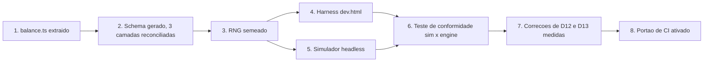

# Spec 09: Balanceamento do Jogo e Modo de Desenvolvimento Isolado

> **Status:** ESPECIFICAÇÃO NOVA — fonte de verdade para tuning
> **Objetivo:** Substituir balanceamento por sensação por balanceamento **medido**. Define o contrato
> numérico único, um harness de desenvolvimento que roda a engine sem daemon e sem AGY, determinismo
> por seed, e um simulador headless que transforma a meta de dificuldade em um teste de CI.
> **Endereça:** D12, D13, D14, D15, P3, P4, P5 (ver [Spec 00](./00_AUDIT_AND_DRIFT_REPORT.md)).
> **Precedência:** onde esta especificação e a [Spec 04](./04_GAME_ENGINE_AND_MECHANICS_SPEC.md)
> divergirem em números, **esta prevalece**. A Spec 04 descreve a arquitetura da engine; esta descreve
> seus valores.

---

## 1. O Problema

A Spec 04 §7 exige taxa de vitória contra o boss entre **15% e 25%**. Hoje esse número não é medido
por nada. A auditoria (§2.11) mostrou, por aritmética, que o valor real é **0% para os três presets de
fallback** e próximo de binário — quase 0% para builds de projétil único, quase 100% para
`vulcan_spread` bem posicionado.

Isso não aconteceu por descuido pontual: aconteceu porque **não havia nenhuma forma de descobrir**. As
constantes estão espalhadas por cinco arquivos, três camadas aplicam faixas conflitantes aos mesmos
campos, os spawners usam `Math.random()` não semeado, e testar exige iniciar o daemon, autenticar o
AGY e jogar 45 segundos manualmente até o boss aparecer.

Esta especificação ataca a causa, não o sintoma. A ordem dos entregáveis é uma dependência real: nada
depois de §2 é possível sem §2.

---

## 2. Entregável 1 — Contrato Numérico Único (`balance.ts`)

### 2.1. Extração

Todo número de tuning migra para `packages/shared/src/constants/balance.ts`, exportado como um objeto
`BALANCE` congelado (`as const`). Origens a esvaziar:

| Arquivo | Exemplos do que sai |
| :--- | :--- |
| `MainGameScene.ts` (931 linhas) | duração 90s, boss aos 45s, aviso aos 42s, cadências 750ms/1200ms, HP e velocidade de cada tipo de drone, multiplicadores hardcore, pools de 45/120 |
| `BossOverlord.ts` | 15.000/22.000 HP, limiares 66%/33%, mitigações 0,50/0,70, teto de 45 por projétil, cooldowns 140/110/80ms, invulnerabilidade de 2s |
| `WeaponSystem.ts` | travas 5–12 e 15–45, fator 0,65 do spread, teto de 120 da secundária, tamanhos de pool |
| `PlayerShip.ts` | escala 0,65, invulnerabilidade de 1,5s, ângulo de banking |
| `ScoreCalculator.ts` | 100/500/10.000 por abate, teto de combo 3,0×, ×80, ×1.200, 2.000, 1,25×/1,10× |

**Critério objetivo:** após a extração, `grep -nE '[^a-zA-Z_][0-9]{2,}' packages/player-app/src/game`
não deve retornar nenhum número que altere o jogo — apenas coordenadas de layout, cores e durações de
tween puramente cosméticas.

### 2.2. Reconciliação das faixas (fecha D14)

`balance.ts` passa a ser a **única** definição de faixa válida, e as três camadas passam a importá-la:

- O `ship_spec.schema.json` é **gerado** a partir de `BALANCE.ranges` por um script
  (`npm run gen:schema`), com um teste que falha se o arquivo versionado divergir do gerado.
- `normalizeSpec` no daemon clampa usando `BALANCE.ranges`, não literais próprios.
- `WeaponSystem` e `PlayerShip` consomem os valores já validados e **não reclampam**.

O efeito prático é que a faixa anunciada ao AGY no `GEMINI.md` passa a ser a faixa que o jogo
realmente honra. Hoje um `fire_rate: 60` autorizado pelo schema vira 12 silenciosamente.

### 2.3. Faixas propostas

Ponto de partida para o simulador refinar. O princípio é que **os extremos da faixa devem ser
jogavelmente distintos** — se dois valores válidos produzem a mesma nave, a faixa está errada.

| Campo | Faixa proposta | Nota |
| :--- | :--- | :--- |
| `primary.damage` | 15 – 45 | Alinha o schema à realidade da engine em vez do contrário. |
| `primary.fire_rate` | 5 – 12 | Idem. A faixa 2–60 do schema nunca foi real. |
| `secondary.damage` | 60 – 150 | O teto de 45 do boss deixa de se aplicar à secundária (D13). |
| `secondary.cooldown_seconds` | 3 – 12 | |
| `max_hp` | 2 – 5 | Mantido. |
| `shield_capacity` | 0 – 3 | Mantido. |
| `speed_px_s` | 180 – 380 | Mantido. |
| `hitbox_radius` | 8 – 16 | Mantido. |

### 2.4. Correções de balanceamento propostas (D12, D13)

O simulador (§5) decide os valores finais; estas são as hipóteses a testar primeiro, em ordem de
impacto:

1. **Reduzir o HP do boss.** É a alavanca mais direta. Um alvo de ≈6.000 HP coloca as builds de
   projétil único dentro da janela com margem para erro, mantendo o `vulcan_spread` vantajoso mas não
   dominante.
2. **Aplicar o teto de dano por projétil apenas à arma primária.** O teto de 45 existe para impedir
   *melting* por rajada; aplicá-lo aos mísseis (que já são limitados por cooldown) apenas anula a arma.
3. **Estender a janela do boss.** Entrada aos 40s em vez de 45s devolve 5s sem alterar o SLA de 2m30s
   da experiência.
4. **Compensar a desvantagem estrutural do projétil único** — ou o `vulcan_spread` perde o bônus de
   3 projéteis simultâneos contra alvo grande, ou o projétil único ganha um multiplicador contra o
   boss. A primeira opção é mais simples de raciocinar.
5. **Registrar `secondaryMissiles` × `enemies`**, dar dano real ao `emp_burst` (dano em área com
   raio), implementar `drone_escort` ou removê-lo do enum do schema e dos MCPs, e **reciclar o pool de
   mísseis** em `WeaponSystem.update()`.

6. **Aplicar as sinergias (D15).** A matriz da Spec 02 §6 é calculada pelo MCP, gravada no
   `ship_spec.json` e **nunca lida pela engine**. `PlayerShip` deve aplicar os modificadores de
   `build_metadata.synergies_unlocked` na construção, e `synergyBonusUnlocked` deve consultar a
   sinergia em vez de repetir `isVictory`. Sem isso, os arquétipos do simulador (§5.1) medem um espaço
   de build que o visitante não consegue realmente alcançar.

> Sobre o item 5: `drone_escort` está no enum do schema e é retornável pelo MCP `weapons-arsenal`
> (`weapons-arsenal.ts:86`) sem nenhum tratamento na engine. Manter um valor válido que não faz nada é
> pior que não oferecê-lo. Decisão recomendada: **remover do enum** nesta fase e reintroduzir apenas se
> houver tempo, já que a Fase E do plano é opcional.

---

## 3. Entregável 2 — Determinismo por Seed

Sem determinismo não há regressão atribuível: uma queda de taxa de vitória pode ser mudança de tuning
ou azar amostral.

- Um PRNG pequeno e explícito (`mulberry32` ou equivalente, ≈10 linhas, sem dependência nova) em
  `packages/shared/src/utils/rng.ts`, instanciado por partida a partir de um seed.
- **Substituições obrigatórias:** `MainGameScene.ts:263` (probabilidade de tiro inimigo),
  `MainGameScene.ts:626,633` (campo de estrelas — cosmético, mas barato de incluir) e **todas** as
  chamadas a `Phaser.Math.Between` / `FloatBetween` nos spawners (`:199,203,209,215-218`).
- `Math.random()` permanece legítimo em `AudioManager.ts:153,185` (ruído branco de síntese) e em
  `moderation.ts:107,116` (sufixo de callsign sanitizado) — nenhum dos dois afeta a simulação.
- O seed entra por `createGameInstance(...)` e sai no resumo da partida (§6), de modo que **qualquer
  partida real do evento pode ser reproduzida exatamente**.
- No estande, o seed é aleatório por partida. No harness e no simulador, é fixo e explícito.

**Critério objetivo:** duas execuções do simulador com o mesmo seed e a mesma sequência de inputs
produzem score final idêntico, byte a byte.

---

## 4. Entregável 3 — Harness de Desenvolvimento Isolado

O requisito central: **rodar a engine sozinha, sem daemon, sem AGY, sem Firestore, sem rede.**

### 4.1. Estrutura

O seam já existe: `packages/player-app/src/game/index.ts` expõe
`createGameInstance(container, shipSpec?, isHardcore?, onMatchComplete?)` e não conhece nada do
`App.tsx`. O harness consome esse seam diretamente.

- `packages/player-app/dev.html` — segunda entrada Vite (`rollupOptions.input`), fora do bundle de
  produção.
- `packages/player-app/src/dev/DevHarness.tsx` — layout de duas colunas: canvas Phaser à esquerda,
  painel de controle à direita.
- `npm run dev:game` na raiz → `vite --open /dev.html` no `player-app`.

### 4.2. Controles

| Controle | Comportamento |
| :--- | :--- |
| **Editor de `ship_spec`** | Textarea JSON com validação Ajv ao vivo contra o schema. Erros aparecem inline; não há coerção silenciosa (ao contrário de `normalizeSpec`). |
| **Presets** | Os 3 fallbacks, mais "mínimo" e "máximo" gerados a partir de `BALANCE.ranges`, mais os arquétipos do simulador (§5.1). |
| **Seed** | Campo numérico; botão *Replay* reinicia com o mesmo seed e a mesma spec. |
| **Timescale** | 0,25× a 4× via `scene.time.timeScale` e `physics.world.timeScale`. Inspeção em câmera lenta e iteração rápida no boss. |
| **Pular para fase** | Inicia direto aos 45s com o boss vivo, ou direto na fase 2 / 3. Elimina 45s de espera por iteração — é o controle que mais economiza tempo. |
| **God mode** | `player.isInvulnerable` travado em `true`, para medir DPS sem morrer. |
| **Debug de física** | Alterna `arcade.debug` em runtime, expondo o hitbox circular de raio 8–16 (Spec 04 §3). |
| **Pausa e passo** | Pausa a cena e avança um frame por vez. |

### 4.3. Telemetria ao vivo

Painel atualizado a cada frame: FPS, projéteis ativos por pool (`primaryBullets`, `secondaryMissiles`,
`enemyBullets`, `boss.bullets`) contra o teto de cada pool, inimigos ativos, HP e fase do boss, DPS
instantâneo e acumulado contra o boss, HP e escudo do jogador, combo, e o `breakdown` de score
recalculado continuamente.

O contador por pool é o que teria exposto o esgotamento do pool de mísseis (**D13**) em segundos.

### 4.4. Restrições

- Nenhum `import` de `App.tsx`, de componentes de UI de produção ou de qualquer módulo que faça
  `fetch`. Violação disso reintroduz a dependência de daemon que o harness existe para eliminar.
- `dev.html` **não** entra no build de produção. Verificado por um teste que inspeciona `dist/`.
- O harness é ferramenta interna: sem tradução, sem tratamento de erro defensivo, sem polimento.

---

## 5. Entregável 4 — Simulador Headless de Balanceamento

O harness responde *"como está o jogo?"*. O simulador responde *"o jogo atinge a meta?"* — e responde
em CI, sem humano.

### 5.1. Modelo

Rodar Phaser headless é possível mas caro e frágil. A escolha é **reimplementar apenas o modelo de
combate** a partir de `BALANCE`, sem renderização: um laço de tempo discreto (60 ticks/s) que resolve
cadência de tiro, dano, mitigação por fase, transições, invulnerabilidade e dano recebido.

O risco dessa escolha é divergência entre simulador e engine. Mitigação: um **teste de conformidade**
que roda a mesma partida no simulador e no harness com o mesmo seed e compara TTK do boss dentro de
uma tolerância de 5%. Se divergirem, o simulador está mentindo e o teste falha.

Espaço amostrado:

- **Arquétipos de build** (≈6): os 3 fallbacks + máximo de dano de projétil único + máximo de
  `vulcan_spread` + máximo de tanque.
- **Perfil de habilidade** (3): iniciante, mediano, experiente — parametrizados por precisão de tiro,
  uptime de disparo e probabilidade de ser atingido por segundo, calibrados com dados reais (§6).
- **Seeds** (≈200 por célula).

### 5.2. Saída

`npm run sim:balance` imprime uma matriz e grava `sim-results.json`:

```
arquétipo × habilidade → taxa de vitória, TTK médio do boss (p50/p90),
                         dano recebido médio, score médio, % de derrotas por tempo vs. por morte
```

A distinção entre derrota por tempo e por morte é diagnóstica direta: predominância de derrota por
tempo indica DPS insuficiente (o caso de **D12**); por morte, indica *bullet hell* excessivo.

### 5.3. Portão de CI

Um teste (`balance.test.ts`) que falha quando:

- A taxa de vitória agregada, ponderada pela distribuição esperada de visitantes, sai da banda
  **15%–25%**.
- **Qualquer** arquétipo tem taxa de vitória 0% ou 100% em habilidade mediana — a condição que teria
  barrado **D12** no momento em que foi introduzida.
- O spread de taxa de vitória entre o melhor e o pior arquétipo excede **35 pontos percentuais** — o
  guarda contra o penhasco binário atual.

> A banda de 15–25% é herdada da Spec 04 e foi definida por intuição. Se a medição mostrar que ela
> produz um estande frustrante, **a banda é que muda** — mas passa a mudar com um número ao lado.

---

## 6. Entregável 5 — Captura de Playtest

Toda partida, no harness e no estande, emite um resumo JSON: seed, `ship_spec`, resultado, TTK do
boss, tempo por fase, abates por tipo, tiros disparados e acertados, dano recebido por fonte, e o
`breakdown` de score.

- No harness: download local, para colar em um issue.
- No estande: é exatamente o payload de telemetria que **D5** hoje descarta. Corrigir D5 e alimentar o
  simulador são a mesma tarefa.

Depois do evento, esses dados recalibram os perfis de habilidade do §5.1 — que hoje são chute — e
tornam o simulador progressivamente mais fiel.

---

## 7. Sequência de Trabalho

A ordem é uma cadeia de dependências, não uma preferência:



O passo 7 vem **depois** do 6 de propósito: corrigir o balanceamento antes de conseguir medi-lo apenas
repetiria o erro que produziu D12.

---

## 8. Critérios de Aceitação

- [ ] Nenhuma constante de tuning fora de `balance.ts` (critério de `grep` do §2.1).
- [ ] `ship_spec.schema.json` é gerado de `BALANCE.ranges`; um teste falha se o versionado divergir.
- [ ] `normalizeSpec` e a engine usam as mesmas faixas; nenhum reclamp em três camadas (D14 fechado).
- [ ] `npm run dev:game` sobe a engine com o daemon parado e sem rede.
- [ ] Mesmo seed + mesma spec + mesmos inputs → score idêntico.
- [ ] Pular direto para a fase 3 do boss leva menos de 5 segundos a partir do clique.
- [ ] `npm run sim:balance` completa em menos de 60s em um laptop.
- [ ] O teste de conformidade mantém simulador e engine a menos de 5% de TTK.
- [ ] A taxa de vitória medida está na banda alvo, com todos os arquétipos estritamente entre 0% e 100%.
- [ ] Nenhum arquétipo válido tem arma secundária de dano zero (D13 fechado).
- [ ] Cada sinergia da matriz produz diferença mensurável de taxa de vitória no simulador (D15 fechado).
- [ ] `ScoreCalculator.test.ts` roda de fato e passa contra as constantes vigentes (D8 fechado).
- [ ] `dev.html` ausente do `dist/` de produção.

Este é o conteúdo do **Gate M1** dos ensaios manuais no Mac: o balanceamento previsto pelo simulador
precisa bater com o que a partida jogada à mão transmite.
