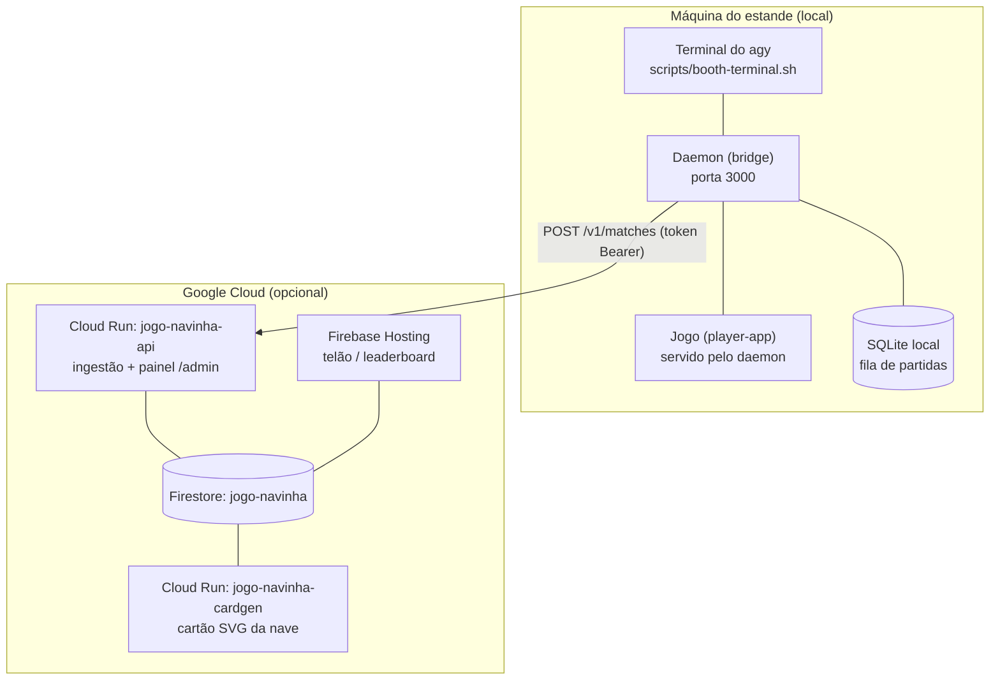

# 14 — Guia de instalação

> **Para quem é este documento:** alguém que recebeu este repositório e precisa colocá-lo no ar,
> sem ter participado do desenvolvimento. Ele é prático: pré-requisitos, comandos, onde cada senha
> mora e como conferir que funcionou. Não explica o funcionamento interno — para isso, as specs
> `01`–`09`.
>
> **Se você só quer ver o jogo rodando na sua máquina**, faça a [Parte A](#parte-a--instalação-local)
> e pare. A nuvem é opcional.

---

## 1. O que você está instalando

Uma experiência de estande de evento: o visitante conversa com o agente `agy` num terminal, o
agente forja uma nave, o visitante joga 90 segundos, e a pontuação vai para um placar.



| Peça | Onde roda | Obrigatória? |
| :--- | :--- | :--- |
| `daemon` | Máquina do estande, porta **3000** | Sim — é o coração |
| `player-app` (o jogo) | Servido pelo daemon, no mesmo 3000 | Sim |
| `agy` (CLI do Antigravity) | Máquina do estande | Sim |
| Os 3 servidores MCP | Iniciados pelo próprio `agy` | Sim |
| `cloud-api` (Cloud Run) | GCP | Não — sem ela o estande roda 100% local |
| `admin-app` (painel) | Servido pela `cloud-api` em `/admin` | Não |
| `leaderboard-app` (telão) | Firebase Hosting | Não |
| `cardgen` (cartão SVG) | GCP, disparado por evento | Não |

**Decida agora qual dos dois modos você quer.** O resto do guia se ramifica aqui:

- **Modo local puro** — só a Parte A. Sem GCP, sem contas, sem custo. A moderação de nomes fica só
  na camada local (lista de palavras), a sincronização de partidas fica enfileirada para sempre e o
  telão lê o placar direto do daemon. É o modo certo para desenvolver e para demonstrar.
- **Modo completo** — Partes A + B + C. Placar global no telão, painel de admin, moderação por
  Gemini, cartão SVG da nave.

---

## 2. Pré-requisitos

### 2.1 Software, em qualquer modo

| O quê | Versão | Como conferir |
| :--- | :--- | :--- |
| **Node.js** | 20.x ou 22.x LTS (a CI usa 22.x) | `node -v` |
| **npm** | 10 ou superior | `npm -v` |
| `git`, `curl`, `jq`, `lsof` | qualquer | `jq --version` |
| **`agy`** (CLI do Antigravity) | 1.1.23 ou superior | `agy --version` |

> **Nenhum `package.json` do monorepo declara `engines`, e não há `.nvmrc`.** Nada trava a versão
> errada de Node — a verificação é humana. Node 18 (o que o Debian bookworm entrega por padrão) é
> velho demais.

Em Linux/Crostini, instale o Node pelo **NodeSource**, não pelo `nvm`: é o `agy` — não o seu shell —
quem faz o spawn dos servidores MCP, e um `node` que só existe no PATH de shell interativo é uma
armadilha. Detalhes em [`13 §6.3`](./13_CHROMEBOOK_AND_CROSTINI_SPEC.md).

Em máquinas sem prebuild do `better-sqlite3`, tenha compilador: `build-essential` e `python3`.

### 2.2 Só para o modo completo

| O quê | Para quê |
| :--- | :--- |
| **Conta Google Cloud com faturamento** | Cloud Run, Firestore, Vertex AI, Eventarc |
| **`gcloud` CLI** autenticado | `gcloud auth login && gcloud config set project <PROJECT_ID>` |
| **`firebase` CLI** autenticado | `npx firebase login` (não precisa instalar global) |
| **`openssl`** | o `deploy.sh` gera as senhas com ele |
| Papel de **Owner** ou equivalente no projeto | criar service accounts, segredos e conceder IAM |

### 2.3 A conta do `agy`

O `agy` precisa estar no sabor **Vertex AI / Gemini Enterprise**, com `gemini-3.7-flash` na região
`global`. **Nunca com chave de API.** Depois de `agy` e do login pelo navegador, confira:

```bash
jq '.gcp' ~/.gemini/antigravity-cli/settings.json
# esperado: { "project": "<seu-projeto>", "location": "global" }
```

> **Armadilha conhecida:** a auto-atualização do `agy` já derrubou o login em silêncio (1.1.22 →
> 1.1.23). Um `agy` deslogado não falha de forma visível — ele só não consegue forjar, e **todo
> visitante recebe nave de preset de emergência**. Faça o teste de forja em branco (§6.2) antes de
> abrir o estande, todo dia.

---

## 3. Parte A — Instalação local

Vale para os dois modos.

### 3.1 Clonar e construir

```bash
git clone <URL do repositório>
cd jogo-de-navinha-agy-summit-26
npm install        # node_modules ≈ 607 MB
npm run build      # OBRIGATÓRIO na primeira vez — veja o aviso abaixo
```

> **Não pule o `npm run build`.** O `npm run start:daemon` reconstrói apenas `shared`, `daemon` e
> `player-app` — ele **não** constrói `packages/mcps`. Num clone novo, os três servidores MCP não
> existem em `dist/`, o `agy` falha ao iniciá-los e toda sessão termina em preset de emergência.
> Isso só acontece uma vez: depois do build inicial, `start:daemon` basta.

### 3.2 Rodar a suíte de testes

```bash
npm test
```

Há **uma falha conhecida e esperada** em `packages/sim` (`balance-gate.test.ts`, espalhamento entre
arquétipos). Ela aborta a suíte antes dos workspaces seguintes — para ver o resto, rode workspace a
workspace:

```bash
npm test --workspace=packages/shared
npm test --workspace=packages/daemon
npm test --workspace=packages/mcps
npm test --workspace=packages/player-app
```

Antes de aceitar qualquer outra falha como esperada, leia
[`11_KNOWN_GAPS_AND_OPEN_ITEMS.md`](./11_KNOWN_GAPS_AND_OPEN_ITEMS.md).

### 3.3 Configurar o estande

Copie o exemplo e edite:

```bash
cp packages/daemon/.env.example packages/daemon/.env
```

Em **modo local puro**, deixe `BOOTH_CLOUD_API_BASE` e `BOOTH_INGEST_TOKEN` vazios. O daemon
detecta a ausência e desliga nuvem e moderação de camada 2 sem erro — `/api/sync/status` mostra
`"state": "disabled"`, que é o correto nesse modo, não um defeito.

**Empresas do evento.** Em **modo local puro**, o catálogo é `config/companies.json`: edite o arquivo
e reinicie o daemon; não precisa rebuildar. Para usar outro caminho, aponte `BOOTH_COMPANIES_FILE`.
Em **modo completo**, esse arquivo vira só a semente do primeiro boot — a fonte de verdade passa a
ser o documento que o painel edita, e o daemon o espelha (§5.1).

**Qual estande é este.** Com mais de uma máquina jogando contra o mesmo placar, defina
`BOOTH_STATION_ID` (ex.: `booth-a` e `booth-b`). Ausente, o daemon usa o hostname e avisa no boot.

**Relógios do fallback do `agy`.** Os quatro `AGY_*_TIMEOUT_MS` no `.env.example` já vêm com os
defaults do código. Se mexer em um, mexa no conjunto: existe uma invariante — o teto rígido tem que
ser maior ou igual à soma das fases (`AGY_PRE_MCP_SILENCE_TIMEOUT_MS + AGY_POST_AUDIT_TIMEOUT_MS`).

### 3.4 O `agy` precisa confiar no diretório da sessão — **obrigatório**

Na primeira execução em `/tmp/booth_session`, o `agy` pergunta *"Do you trust the contents of this
project?"* e **espera tecla**. No estande, isso significa o primeiro visitante do dia encarando um
prompt que ninguém do público sabe responder.

```bash
S=~/.gemini/antigravity-cli/settings.json
jq '.trustedWorkspaces = ((.trustedWorkspaces // []) + ["/tmp/booth_session"] | unique)' "$S" > "$S.tmp" \
  && mv "$S.tmp" "$S"
jq -r '.trustedWorkspaces | index("/tmp/booth_session")' "$S"   # esperado: um índice, não null
```

O caminho é **absoluto e sem barra final**. Não confunda com `~/.gemini/trustedFolders.json`, que é
do Gemini CLI — produto diferente, não lido pelo `agy`.

### 3.5 Subir

Dois processos, dois terminais:

```bash
npm run start:daemon     # terminal 1 — bridge + jogo, porta 3000
npm run start:terminal   # terminal 2 — supervisor do agy (a tela do visitante)
```

Abra `http://localhost:3000` no navegador: é a tela do visitante (registro → briefing → sliders →
pré-voo → jogo → debrief).

**Portas usadas:**

| Porta | Quem | Quando |
| :--- | :--- | :--- |
| 3000 | daemon (API + jogo servido) | sempre |
| 5173 | Vite do `player-app` | só `npm run dev:player` |
| 5174 | Vite do `leaderboard-app` | só `npm run dev:leaderboard` |
| 5175 | Vite do `admin-app` | só `npm run dev:admin` |
| 8080 | `cloud-api` local / emulador do Firestore | só em desenvolvimento |

Para derrubar tudo: `npm run kill:all`. Para zerar o banco local: `npm run reset:db`.

---

## 4. Parte B — Instalação na nuvem (GCP)

Um script faz tudo, e é idempotente — rodar de novo sobre um projeto já provisionado não duplica
nada e não sobrescreve segredos:

```bash
npm run deploy:gcp
# equivale a: bash scripts/deploy.sh
```

### 4.1 Antes de rodar

O script assume defaults, todos sobrescrevíveis por variável de ambiente:

```bash
PROJECT_ID=meu-projeto REGION=southamerica-east1 npm run deploy:gcp
```

| Variável | Default | Nunca mude sem motivo |
| :--- | :--- | :--- |
| `PROJECT_ID` | `vibe-cabral` | — |
| `REGION` | `southamerica-east1` | Cloud Run **e** Firestore, na mesma região |
| `FIRESTORE_DATABASE` | `jogo-navinha` | banco **nomeado**, nunca o `(default)` |
| `SERVICE_NAME` | `jogo-navinha-api` | — |
| `CARDGEN_SERVICE_NAME` | `jogo-navinha-cardgen` | — |
| `BOOTH_TOKEN_SECRET` | `booth-ingest-token` | — |
| `ADMIN_PASSWORD_SECRET` | `admin-panel-password` | — |

> **O projeto pode ser compartilhado com outras aplicações.** Por isso nada aqui reivindica um
> recurso padrão: o Firestore é um banco **nomeado**, o Hosting é um **site nomeado**
> (`jogo-navinha-telao`), e cada serviço tem service account própria. Se você for instalar num
> projeto exclusivo, os defaults continuam corretos — só deixe de se preocupar com colisão.

### 4.2 O que o script faz (11 passos)

| Passo | O quê |
| :--- | :--- |
| 1/11 | Habilita as APIs (Run, Firestore, Secret Manager, Vertex AI, Eventarc, Pub/Sub, …) |
| 2/11 | Cria o banco Firestore nomeado |
| 3/11 | Publica `firestore.rules` e `firestore.indexes.json` |
| 4/11 | Service account do serviço de ingestão + papéis |
| 5/11 | **Cria os dois segredos e imprime os valores — uma única vez** |
| 6/11 | Registra o app Web do Firebase (config do SDK cliente) |
| 7/11 | Build local de `shared`, `admin-app`, `leaderboard-app` e vendorização da `cloud-api` |
| 8/11 | Deploy do Cloud Run de ingestão (`jogo-navinha-api`) |
| 9/11 | Deploy do `cardgen` (mesma imagem, `CARDGEN_ENABLED=1`) + gatilho Eventarc |
| 10/11 | Deploy do telão no Firebase Hosting |
| 11/11 | Nota sobre IAP (ver §4.4) |

### 4.3 **Guarde os segredos agora** — o passo 5 só mostra uma vez

O script gera dois valores com `openssl rand -base64 32` e os imprime **na criação, uma única vez**.
São credenciais **separadas**, com propósitos diferentes:

| Segredo | Serve para | Quem usa |
| :--- | :--- | :--- |
| `booth-ingest-token` | `Authorization: Bearer` em `POST /v1/matches` e `/v1/moderate` | O daemon, no estande |
| `admin-panel-password` | senha HTTP Basic de `/admin` e `/v1/admin/*` | Você, no navegador |

Copie os dois para um lugar seguro **fora do repositório** assim que aparecerem. Se perder, releia:

```bash
gcloud secrets versions access latest --secret=booth-ingest-token
gcloud secrets versions access latest --secret=admin-panel-password
```

> **Rotação:** trocar o valor de um segredo **não** afeta o serviço em execução. O Cloud Run resolve
> `:latest` no momento em que cria a revisão, não a cada requisição. Depois de rotacionar, **force
> uma revisão nova** (rode `npm run deploy:gcp` de novo) e só então atualize o `.env` do estande.

### 4.4 Autenticação do painel: só HTTP Basic, por desenho

O serviço sobe com `--allow-unauthenticated` **de propósito**. As duas credenciais deste projeto são
autenticação de **aplicação** — só funcionam se a plataforma deixar o tráfego chegar ao código.

O IAP não é uma opção aqui: no Cloud Run ele é **por serviço, não por rota**. Ligá-lo protegeria
`/v1/admin/*` mas bloquearia `/v1/matches` junto, e o estande — que carrega o token Bearer e nenhuma
identidade Google — tomaria 403. O `deploy.sh` recusa `--with-iap` explicitamente, com essa
explicação. Consequência prática: **a senha do painel é a única camada**. Use o valor gerado pelo
script (32 bytes aleatórios) e não anuncie a URL.

### 4.5 O que o script **não** faz

- **Não** instala nada na máquina do estande.
- **Não** configura o `.env` do daemon — isso é a Parte C.
- **Não** roda o backfill do cartão SVG das partidas antigas (§5.3).

---

## 5. Parte C — Ligar o estande à nuvem

Este é o único ponto de acoplamento entre as duas metades, e ele é deliberadamente estreito.

### 5.1 As duas linhas que importam

No fim do deploy, o script imprime exatamente o que colar em `packages/daemon/.env`:

```
BOOTH_CLOUD_API_BASE=https://jogo-navinha-api-xxxxx.run.app
BOOTH_INGEST_TOKEN=<valor do segredo booth-ingest-token>
```

Reinicie o daemon (`npm run kill:daemon && npm run start:daemon`) e confirme:

```bash
curl -s localhost:3000/api/sync/status | jq
```

Esperado: `"state"` diferente de `"disabled"`. Se continuar `"disabled"`, o `.env` não foi lido —
confira que o arquivo está em `packages/daemon/.env` (não na raiz) e que o Node é ≥ 20.12.

### 5.2 Regra de credenciais na máquina do estande

**Nenhum arquivo de chave de service account deve existir na máquina do estande.** A única
credencial de nuvem que ela carrega é o `BOOTH_INGEST_TOKEN`, que dá acesso a exatamente dois
endpoints e nada mais. O `gcloud` **não é obrigatório** no estande — ele serve para operação e
deploy, que você faz da sua máquina.

### 5.3 Cartão SVG das partidas anteriores (opcional)

O gatilho Eventarc só enxerga partidas criadas **depois** dele. Para dar cartão às antigas, da sua
máquina de operação:

```bash
gcloud auth application-default login
npm run backfill:cards              # dry-run: conta e mostra o primeiro SVG, não escreve
npm run backfill:cards -- --apply   # grava
```

O script recusa rodar se `GOOGLE_APPLICATION_CREDENTIALS` estiver definida — é ADC do operador ou
nada. Rodar `--apply` duas vezes grava 0 na segunda: é idempotente.

### 5.4 Rodar as apps de nuvem localmente (desenvolvimento)

Só se você for desenvolver. Preencha `VITE_FIREBASE_*` nos `.env` de `leaderboard-app` e
`admin-app` (Console do Firebase → Configurações do projeto → Seus apps) e:

```bash
npm run dev:leaderboard   # 5174
npm run dev:admin         # 5175
```

Em produção esses valores são preenchidos pelo próprio `deploy.sh` no build. Eles **não** são
segredos — são identificadores públicos do app Web; a proteção real são as `firestore.rules`.

---

## 6. Post-flight: conferir que funcionou

Rode na ordem. Cada item tem um critério objetivo.

### 6.1 Local

```bash
curl -s localhost:3000/api/health | jq        # 1. daemon vivo
```

2. Abra `http://localhost:3000` — a tela de atração aparece.
3. `agy --version` devolve 1.1.23 ou superior.
4. `jq -r '.trustedWorkspaces | index("/tmp/booth_session")' ~/.gemini/antigravity-cli/settings.json`
   devolve um índice, não `null`.

### 6.2 Forja em branco — **o teste que mais importa**

Faça um ciclo completo de visitante você mesmo: registro → sliders → responda as quatro perguntas do
`agy` → pré-voo → jogue → debrief.

```bash
jq '.build_metadata.selected_mcps' /tmp/booth_session/ship_spec.json
```

**Critério:** a nave é **forjada**, não de preset de emergência (a tela do pré-voo avisa quando é
preset). Se saiu preset, o `agy` provavelmente está deslogado ou os MCPs não construíram — volte ao
§2.3 e ao §3.1.

Confira também que a auditoria de MCP gravou:

```bash
wc -l /tmp/booth_session/mcp_audit.log   # esperado: não-vazio
```

### 6.3 Nuvem

```bash
BASE=<URL do Cloud Run>

curl -s -o /dev/null -w '%{http_code}\n' "$BASE/v1/health"        # 200
curl -s -o /dev/null -w '%{http_code}\n' "$BASE/admin"            # 401 sem senha
curl -s localhost:3000/api/sync/status | jq '.pending'            # 0 depois de uma partida
```

4. Abra `$BASE/admin` no navegador; qualquer usuário + a senha do `admin-panel-password`. As quatro
   telas (Partidas, Empresas, Saúde, Rankings) respondem.
5. Abra a URL do Hosting numa TV/monitor: o telão mostra a partida que você acabou de jogar.
6. Alguns segundos depois, a coluna **Nave** da tela Partidas mostra a miniatura do cartão SVG. Um
   traço (`—`) significa que o cartão ainda não foi gerado — normal logo após a ingestão, e
   permanente para partidas anteriores ao gatilho.

**O roteiro completo e cronometrado está em
[`12_MANUAL_TEST_PLAN_MAC.md`](./12_MANUAL_TEST_PLAN_MAC.md)** — Blocos 11–15 (nuvem) e 25 (cartão
SVG). Este §6 é o mínimo; aquele é o gate.

---

## 7. Operação no dia

| Tarefa | Como |
| :--- | :--- |
| Subir o estande | `npm run start:daemon` + `npm run start:terminal` |
| Derrubar tudo | `npm run kill:all` |
| Zerar o banco local | `npm run reset:db` |
| Corrigir/anular uma partida | Painel `/admin` → Partidas |
| Trocar as empresas | painel `/admin` → Empresas (os estandes espelham em até 2 min). Só em modo local puro é que se edita `config/companies.json` |
| Ver o catálogo que o estande aplicou | `curl -s localhost:3000/api/catalog/status \| jq '.catalog'` |
| Ver a fila de sincronização | `curl -s localhost:3000/api/sync/status \| jq` |
| Forçar uma tentativa de sync | reinicie o daemon (zera o backoff) ou jogue mais uma partida |

**Sobre o backoff:** se a rede cair por alguns minutos, o intervalo entre tentativas cresce
exponencialmente até o teto de 5 minutos. Não existe endpoint de "sincronizar agora"; o único
gatilho é o fim de um `POST /api/matches`. Reiniciar o daemon é o atalho.

---

## 8. Desinstalar

**Local:** `npm run kill:all`, apague o diretório do repositório e `/tmp/booth_session`.

**Nuvem:**

```bash
npm run undeploy:gcp
```

Remove, nesta ordem: o gatilho Eventarc (antes dos serviços — um gatilho órfão continua tentando
entregar), os **dois** serviços Cloud Run e as **duas** service accounts. Ele pede confirmação.

**Não remove** o banco Firestore, os segredos nem o site do Hosting — apagar dados e credenciais é
decisão deliberada, não efeito colateral de um script.

---

## 9. Problemas comuns

| Sintoma | Causa provável | Solução |
| :--- | :--- | :--- |
| Toda nave sai como preset de emergência | `agy` deslogado, ou `packages/mcps` nunca construído | §2.3 e `npm run build` |
| O `agy` pede confirmação de confiança na tela do visitante | `trustedWorkspaces` não pré-populado | §3.4 |
| `/api/sync/status` diz `"disabled"` com o `.env` preenchido | arquivo no lugar errado, ou Node < 20.12 | §5.1 |
| Cloud Run recusa a revisão: *"Permission denied on secret"* | falta `secretAccessor` no segredo | rode `npm run deploy:gcp` de novo (o passo 5 concede sempre) |
| Rotacionei a senha e o painel não mudou | `:latest` só re-resolve numa revisão nova | §4.3 |
| ≈20 falhas nos testes da `cloud-api`, `405` em `clearFirestore` | a porta 8080 está ocupada por outro processo | veja `packages/cloud-api/README.md`, "Testes locais" |
| Uma falha em `packages/sim` no `npm test` | conhecida e esperada | §3.2 |
| `gcloud eventarc triggers create` falha com mensagem obscura | falta `serviceAccountTokenCreator` no agente do Pub/Sub | o passo 9/11 concede; rode o deploy de novo |
| `invalid value for trigger.event_data_content_type: ""` | `gcloud` antigo, sem o `--event-data-content-type` do passo 9/11 | atualize o repo; o deploy é idempotente e retoma direto no gatilho |

---

## 10. Referência cruzada

| Precisa de | Vá para |
| :--- | :--- |
| **Montar e operar os dois estandes no evento** | [`15_EVENT_RUNBOOK_TWO_BOOTHS.md`](./15_EVENT_RUNBOOK_TWO_BOOTHS.md) |
| Instalar num **Chromebook** (Crostini) | [`13_CHROMEBOOK_AND_CROSTINI_SPEC.md`](./13_CHROMEBOOK_AND_CROSTINI_SPEC.md) §6 |
| **Testar** a instalação a fundo | [`12_MANUAL_TEST_PLAN_MAC.md`](./12_MANUAL_TEST_PLAN_MAC.md) |
| Entender a **topologia** de nuvem | [`08_DEPLOYMENT_TOPOLOGY_AND_CLOUD_SPLIT.md`](./08_DEPLOYMENT_TOPOLOGY_AND_CLOUD_SPLIT.md) |
| **Operar** o estande no dia a dia | [`../USER_GUIDE.md`](../USER_GUIDE.md) |
| Detalhes da **API de nuvem** | [`../packages/cloud-api/README.md`](../packages/cloud-api/README.md) |
| **Falhas conhecidas** | [`11_KNOWN_GAPS_AND_OPEN_ITEMS.md`](./11_KNOWN_GAPS_AND_OPEN_ITEMS.md) |
