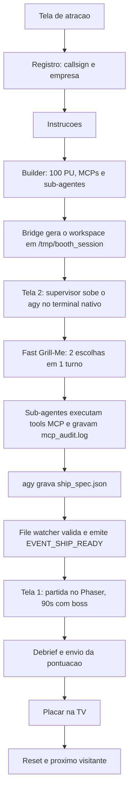
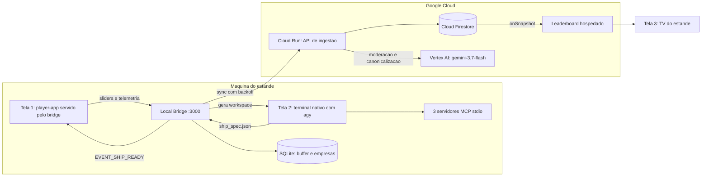

# Especificações: GRAVIDADE ZERO (Google Cloud Summit 2026)

## 1. Visão geral

Ativação interativa de estande: um shmup arcade vertical cuja nave é **forjada pelo Antigravity CLI
(`agy`)** na frente do visitante, a partir das escolhas que ele faz num builder web. O visitante
registra um callsign, distribui 100 unidades de energia, escolhe servidores MCP e sub-agentes, assiste
o agente construir a nave num terminal real, pilota essa nave por 90 segundos e vê sua pontuação
aparecer num placar corporativo.

### 1.1. Fluxo do visitante

---

## 2. Como ler estas especificações

**Comece pela [Spec 00](./00_AUDIT_AND_DRIFT_REPORT.md).** As especificações 01–07 foram escritas
antes da implementação e divergiram dela ao longo de 44 commits. A Spec 00 audita essa divergência
item a item, com evidência em `arquivo:linha`, e atribui um ID estável a cada achado — **D** para
defeito, **P** para pivô aceito, **U** para não construído, **L** para requisito perdido. As demais
especificações e o plano de implementação referenciam esses IDs.

As especificações 01–07 foram **reconciliadas com a implementação em 2026-08-10**. Onde o código
divergiu por decisão deliberada, a especificação foi reescrita e a mudança marcada com uma nota de
correção. Onde a especificação definia uma salvaguarda que nunca foi construída, o requisito
permanece e ganhou um ID de defeito.

| Especificação | Escopo | Estado |
| :--- | :--- | :--- |
| **[00 Auditoria](./00_AUDIT_AND_DRIFT_REPORT.md)** | Todos os achados, com evidência e IDs | Base de tudo |
| **[01 Estande & Experiência](./01_BOOTH_AND_EXPERIENCE_SPEC.md)** | Três superfícies, fluxo de 7 etapas, SLA de ciclo, handoff, reset | Reconciliada |
| **[02 Builder & Componentes](./02_BUILDER_AND_BUDGET_MECHANICS_SPEC.md)** | Sliders de 100 PU, 1–3 MCPs, sub-agentes, matriz de sinergias | Reconciliada |
| **[03 Harness AGY](./03_AGY_HARNESS_AND_INTEGRATION_SPEC.md)** | Terminal nativo, geração de workspace, contrato de `ship_spec.json`, contenção de processos | Reconciliada |
| **[04 Engine & Mecânicas](./04_GAME_ENGINE_AND_MECHANICS_SPEC.md)** | Phaser 3, texturas, balística, pacing, boss, score | Reconciliada |
| **[05 Placar & Nuvem](./05_LEADERBOARD_AND_CLOUD_SPEC.md)** | Firestore, ingestão no Cloud Run, normalização de empresas, TV | Reconciliada; subsistema não construído |
| **[06 Resiliência & Segurança](./06_RELIABILITY_FAILOVER_AND_SECURITY_SPEC.md)** | Fallbacks, watchdogs, modo offline, moderação, runbook | Reconciliada; scripts ausentes |
| **[07 Stack & Validação](./07_IMPLEMENTATION_ROADMAP_AND_TASKS_SPEC.md)** | Stack real, build, testes, Definition of Done | Reconciliada |
| **[08 Topologia & Nuvem](./08_DEPLOYMENT_TOPOLOGY_AND_CLOUD_SPLIT.md)** | O que roda local e o que roda em GCP, e por quê | Nova |
| **[09 Balanceamento & Dev Mode](./09_GAME_BALANCE_AND_DEV_MODE.md)** | Fonte única de tuning, harness isolado, simulador de dificuldade | Nova |
| **[10 Plano de Implementação](./10_IMPLEMENTATION_PLAN.md)** | Sequenciamento por fases e gates de ensaio manual | Nova |
| **[11 Lacunas Conhecidas](./11_KNOWN_GAPS_AND_OPEN_ITEMS.md)** | O que está quebrado, não verificado ou adiado — lista honesta | Fases A+B mergeadas |
| **[12 Plano de Teste Manual (Mac)](./12_MANUAL_TEST_PLAN_MAC.md)** | Roteiro passo a passo que fecha os gates M1 e M2 | Pendente de execução |
| **[13 Chromebook & Crostini](./13_CHROMEBOOK_AND_CROSTINI_SPEC.md)** | O que muda se o hardware do estande for um Chromebook: bloqueadores, instalação e testes que só o hardware fecha | Nova; hardware não confirmado |
| **[14 Guia de Instalação](./14_INSTALLATION_GUIDE.md)** | Do zero ao ar, local e em GCP: pré-requisitos, segredos, sincronia estande↔nuvem e conferências pós-instalação | Nova |
| **[15 Runbook do Evento (2 estandes)](./15_EVENT_RUNBOOK_TWO_BOOTHS.md)** | Execução pura, sem explicação: montar os dois Macs, conferir o deploy, cadastrar as empresas na véspera, pre-flight diário, operação e a virada do dia 1 para o dia 2 | Nova |

---

## 3. Arquitetura-alvo

A decisão de topologia está na [Spec 08](./08_DEPLOYMENT_TOPOLOGY_AND_CLOUD_SPLIT.md): **o `agy` e o
bridge de sessão são locais; todo o resto vai para a nuvem.** O `agy` é o único componente que não
degrada graciosamente — se ele cai, o estande para — e por isso não depende da rede do evento.

**Modelo:** `gemini-3.7-flash`, consumido **exclusivamente** pelo flavor Vertex AI / Gemini Enterprise
Agent Platform, com credencial de conta de serviço. Nenhuma chave de API de modelo existe neste
projeto, em nenhum ambiente.

---

## 4. Estado do projeto

- [x] Especificações iniciais 01–07
- [x] Implementação do núcleo: builder, harness AGY, MCPs, engine, placar local
- [x] Auditoria de divergência entre especificação e código ([Spec 00](./00_AUDIT_AND_DRIFT_REPORT.md))
- [x] Reconciliação das especificações 01–07
- [x] Decisão de topologia local/nuvem ([Spec 08](./08_DEPLOYMENT_TOPOLOGY_AND_CLOUD_SPLIT.md))
- [x] Estratégia de balanceamento e modo de desenvolvimento isolado ([Spec 09](./09_GAME_BALANCE_AND_DEV_MODE.md))
- [ ] Execução do [plano de implementação](./10_IMPLEMENTATION_PLAN.md)
  - [x] **Fase A** — correções de integração, harness, daemon, failover (Gate M0 fechado)
  - [x] **Fase B** — balanceamento medido, simulador, modo dev, sinergias reais
  - [ ] Gates **M1** e **M2** — exigem um humano num Mac: [Spec 12](./12_MANUAL_TEST_PLAN_MAC.md)
  - [ ] **Fase C** — nuvem (Firestore, Cloud Run, Vertex AI)
  - [ ] **Fase D** — ensaio operacional, soak (Gates M3-M5)
- Lacunas, falhas conhecidas e itens adiados: [Spec 11](./11_KNOWN_GAPS_AND_OPEN_ITEMS.md)
