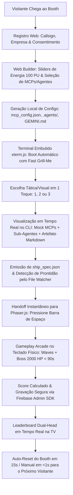
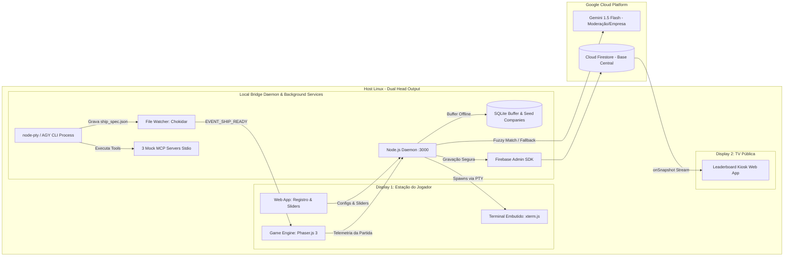

# Especificações do Projeto: Jogo de Navinha (Google Cloud Summit 2026)

## 1. Visão Geral do Projeto
Este repositório contém o ecossistema completo para a ativação interativa no **Google Cloud Summit**: um jogo arcade de navinha vertical (*retro space shooter / shmup*) com visual retrô-moderno integrado com o **Antigravity CLI (AGY)** como gerador inteligente e determinístico das naves dos jogadores.

### 1.1. Resumo da Experiência do Visitante (Booth Flow Calibrado)

---

## 2. Estrutura Modular de Especificações
As especificações estão organizadas em 7 módulos detalhados e integrados:

| Arquivo de Especificação | Escopo & Tópicos Principais |
| :--- | :--- |
| **[01_BOOTH_AND_EXPERIENCE_SPEC.md](./01_BOOTH_AND_EXPERIENCE_SPEC.md)** | Fluxo UX (2m30s SLA), Terminal Embutido (`xterm.js`), Teclado Físico, Dual-Head, Fast Grill-Me, Autoplay de Áudio e Pipeline de Reset (Automático + Manual). |
| **[02_BUILDER_AND_BUDGET_MECHANICS_SPEC.md](./02_BUILDER_AND_BUDGET_MECHANICS_SPEC.md)** | Sliders de Energia (100 PU), Catálogo Unificado de Armas Primárias/Secundárias, 3 MCP Servers mockados (`@modelcontextprotocol/sdk`), 3 Sub-Agentes e Matriz de Sinergias. |
| **[03_AGY_HARNESS_AND_INTEGRATION_SPEC.md](./03_AGY_HARNESS_AND_INTEGRATION_SPEC.md)** | Terminal Embutido (`xterm.js` + `node-pty`), `GEMINI.md` com diretivas visuais, Contrato Estrito Draft-07 de `ship_spec.json`, File Watcher e Controle de Processos (`SIGKILL -PGID`). |
| **[04_GAME_ENGINE_AND_MECHANICS_SPEC.md](./04_GAME_ENGINE_AND_MECHANICS_SPEC.md)** | Engine Phaser.js 3, Renderização SVG $\rightarrow$ Textura 2x, Colisão Circular no Cockpit (Arcade Physics), Balanceamento do Boss (2.000 HP em 3 Fases), Áudio Sound Sprites e Fórmula de Score sem Exploits. |
| **[05_LEADERBOARD_AND_CLOUD_SPEC.md](./05_LEADERBOARD_AND_CLOUD_SPEC.md)** | Gravação Segura via Firebase Admin SDK no Daemon, Pipeline de Normalização de Empresas (SQLite Seed + Levenshtein + Gemini Flash 600ms), Display 2 TV em Kiosk Mode com `onSnapshot`. |
| **[06_RELIABILITY_FAILOVER_AND_SECURITY_SPEC.md](./06_RELIABILITY_FAILOVER_AND_SECURITY_SPEC.md)** | 3 Presets Fallback (<50ms), Buffer Offline SQLite Idempotente, Shell Lockdown, Hotkey Global `Ctrl+Shift+F12`, Scripts Host (`setup_monitors.sh`, `launch_kiosks.sh`, `reset_booth.sh`) e Autoteste. |
| **[07_IMPLEMENTATION_ROADMAP_AND_TASKS_SPEC.md](./07_IMPLEMENTATION_ROADMAP_AND_TASKS_SPEC.md)** | Stack Tecnológica Oficial, Fases de Desenvolvimento por Prioridade (P0, P1, P2), Estratégia de Testes de Carga e Critérios Formais de Aceitação (Definition of Done). |

---

## 3. Matriz de Dependências Técnicas & Arquitetura do Host

---

## 4. Status do Projeto
- [x] Estrutura Inicial de Especificações
- [x] Refinamento de Fluxo UX, Dual-Head e Sliders
- [x] Auditoria Crítica via Sub-Agente Owl
- [x] Unificação Contratual e Blindagem Técnica de Todas as Especificações
- [ ] Fase de Implementação (P0 $\rightarrow$ P1 $\rightarrow$ P2)
